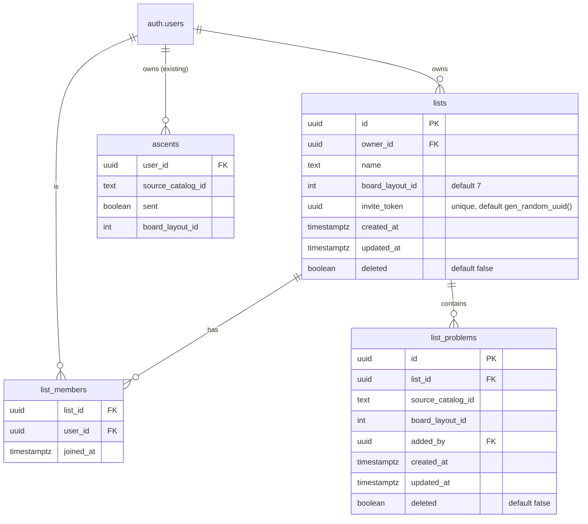
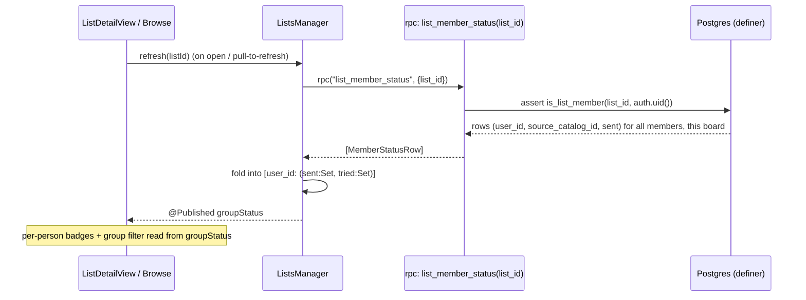

# Collaborative Lists - Plan

**Product Contract preservation:** unchanged — the Product Contract below is carried
verbatim from the requirements-only brainstorm. Planning added the Planning Contract,
Implementation Units, and Verification Contract; it did not alter product scope.

> **Scope confirmation:** the three plan-level decisions (KTD1 projection-RPC, KTD2
> cloud-only lists, U1 solo-filter-rework-first) were auto-confirmed when the user
> stepped away mid-review. They are reversible — flag KTD2 especially if offline list
> access turns out to matter.

---

## Summary

Build **collaborative lists**: a list is *people + a shared pile of problems*, and its
payoff is a **per-person group filter** over the catalog that surfaces problems **nobody
in the group has sent** — especially shared projects (tried-but-not-sent). Membership is
the unit of sharing (no friend graph); people join via a **share-link**. Group status is
read **refresh-first** through a minimal-projection RPC that exposes only each member's
sent/tried catalog IDs — nothing else. Lists are **cloud-only in v1** (no offline mirror).
A prerequisite solo change reworks the existing catalog status filters.

---

## Problem Frame

During a session each climber browses the catalog on their own phone and manually
cross-checks "has anyone here sent / tried this?" to find a problem the group can climb
**together**. This intersection math is done verbally today and no app assists it. The
prime targets are **shared projects** — problems the group has tried but nobody has sent.

**Primary actor:** a climber in a small group (2–6) on the same board.
**Core outcome:** in a few taps, see the catalog annotated with the whole group's status
and filter to "problems none of us has sent."

---

## Product Contract

*(Carried verbatim from the brainstorm — the WHAT. Planning does not modify this.)*

### The primitive

A **list** = **its people + its shared pile of problems**.

- **People:** whoever joined. Membership is the unit of sharing — **no separate friend
  graph**. Joining a list grants read-access to co-members' status.
- **Shared pile:** problems someone added (e.g. curated the night before), each showing
  per-person status. Persistent, everyone sees the same set.

### Key product decisions (resolved in brainstorm)

1. **Membership is the sharing unit — no friend graph.**
2. **Join via share-link.** Tapping a link joins instantly ("anyone with the link").
   Handle-search + accept is deferred.
3. **Joining shares your sent + tried sets, list-scoped.** Co-members read which catalog
   problems (that board) you've **sent** and **tried**. Nothing else crosses — no
   comments, grades, dates, tries-count, or other lists. Leaving revokes it.
4. **List screen = people + pile with per-person badges** (✅ sent / 🔴 tried / ⚪ untouched).
5. **Browse & add opens unfiltered; the group filter is an optional toggle.** Adding a
   problem there drops it into the shared pile everyone sees.
6. **Reworked status filters (solo *and* list):** **Completed** (sent) / **Projects**
   (tried-not-sent) / **Not completed** (anything not sent = projects + never-touched,
   the merged `!sent` bucket, absorbing the old "Not logged"). In a list each bucket gains
   **per-person chips**; combine rule = **more people = stricter (AND across people); more
   buckets under one person = looser (OR)**. Headline query `Not completed → [everyone]`.
7. **Refresh-first, not realtime.** Fetch on list-open + pull-to-refresh.
8. **All members equal.** Anyone can add problems, share the link, or leave; creator can
   delete the list. *(Assumption — confirm during planning.)*
9. **One board per list** (default Mini 2025, `board_layout_id = 7`).

### Requirements

- **R1** — Create a list (name + board); creator becomes first member.
- **R2** — Share a list via an unguessable link/QR; anyone with it joins instantly.
- **R3** — Joining exposes the joiner's sent + tried catalog-ID sets (that board) to
  co-members, and only those — no other logbook fields.
- **R4** — List screen shows members + the shared problem pile with per-person badges.
- **R5** — From a list, "Browse & add" opens the full catalog **unfiltered**; the group
  filter is a toggle; adding a problem writes it to the shared pile.
- **R6** — Solo status filters reworked to Completed / Projects / Not completed.
- **R7** — In a list, status filters gain per-person chips with the AND-across /
  OR-within combine rule; `Not completed → [all members]` returns problems nobody sent.
- **R8** — Group status is refresh-first (fetch on open + pull-to-refresh).
- **R9** — Members are equal (add problems, share, leave); creator can delete.
- **R10** — Leaving a list revokes both the joiner's exposure and their read access.

### Success criteria

- Two users: A creates a list, shares a link, B taps it and joins.
- Once both joined, each sees the other's sent/tried badges on the pile and in the
  group-filtered browse.
- `Not completed → [all members]` returns exactly the problems none has sent (projects +
  never-touched) and excludes anything any member sent.
- Group filter off ⇒ the normal unfiltered catalog.
- A member who leaves no longer exposes or reads status for that list.

### Out of scope (later phases)

Friend graph; realtime live updates; handle-search invites; multi-board lists; standalone
"never-touched only" filter; sharing anything beyond sent/tried sets; offline access to
lists (see KTD2).

---

## Planning Contract

### Key Technical Decisions

**KTD1 — Cross-user reads go through a minimal-projection `security definer` RPC, not
raw-row RLS on `ascents`.** A `list_member_status(list_id)` RPC returns only
`(user_id, source_catalog_id, sent)` rows for members of a list the caller belongs to, on
that list's board. Rationale: a raw SELECT policy on `ascents` would let a member's client
read *every* column (comments, grades, dates) even if the UI hides them; the RPC enforces
R3's "only sent/tried leak" at the server. Resolves the brainstorm's open question
(projection vs raw rows) in favor of projection. (`ascents` keeps its owner-only RLS
untouched.)

**KTD2 — Lists are cloud-only in v1; no SwiftData mirror, no offline.** Lists, members,
pile, and group status are fetched live (on open + pull-to-refresh). Rationale: this
avoids the *entire* offline sync machinery (`needsSync` dirty tracking, tombstones,
per-table cursors, reconciliation, cross-account cache guards) that `LogbookSyncManager`
carries — none of it is needed when the data is read-through. Matches decision 7
(refresh-first). **Trade-off:** no list access without a network. The user's own logbook
stays local-first and offline as today; only the social layer requires connectivity.

**KTD3 — Membership RLS uses a `security definer` helper to avoid recursion.**
`is_list_member(list_id, uid) returns boolean` (definer, `set search_path = ''`) is called
from the `select` policies on `lists` / `list_members` / `list_problems`. A policy on
`list_members` that itself queries `list_members` would recurse; a definer function breaks
the cycle. Standard Supabase pattern.

**KTD4 — Join via `security definer` `join_list_by_token(token uuid)` RPC.** A not-yet-member
cannot see the list under RLS, so cannot insert their own `list_members` row directly. The
RPC validates the unguessable `invite_token` and inserts the caller as a member. Mirrors
the `delete_user()` RPC idiom (`0001_profiles.sql:72`).

**KTD5 — The filter enum rework changes persisted `@AppStorage` tokens; migrate once.**
`CatalogFilter` raw values are both the UI labels *and* the persisted `catalogFilters` CSV
tokens (`CatalogListView.swift:79`). Renaming/removing cases orphans stored selections.
A one-time normalization (map `"My ascents"→"Completed"`, drop `"Not logged"`, keep
`"Not completed"` token but under its new `!sent` meaning) runs guarded by a UserDefaults
flag, mirroring `LogbookMigration.runIfNeeded` (`Models/LogbookMigration.swift:23`).

**KTD6 — Per-person group chips are a parallel dynamic collection, not new enum cases.**
`CatalogFilter` is a static `CaseIterable` enum and can't hold runtime member chips. The
group context passes a `[member: (sent: Set<String>, tried: Set<String>)]` snapshot,
threaded through the off-main `filter` static func exactly like the existing
`sent`/`logged` params (`CatalogListView.swift:278-284`), plus a parallel selection state
for which (member, bucket) chips are active.

**KTD7 — Board scoping.** A list carries `board_layout_id int not null default 7`; group
status is board-scoped; the app resolves it via `Board.with(layoutId:)` (`Board.swift:94`).

**KTD8 — The status RPC returns no timestamps, sidestepping the timestamp-decoding trap.**
`list_member_status` returns booleans + text catalog IDs only. This deliberately avoids
Trap 1 from the sync-learnings doc (Postgres 6-digit `timestamptz` vs 3-digit
`ISO8601DateFormatter`) — there is no cursor and no date to decode on the group-status path.

### Alternatives Considered

- **Raw-row cross-user RLS on `ascents`** (rejected, KTD1): simpler policy, but leaks the
  full logbook row to co-members' clients, violating R3.
- **Full offline sync for lists** (rejected for v1, KTD2): consistent with the app's
  offline-first stance, but re-implements the whole sync engine for a feature that is
  inherently networked. Revisit if offline list access is requested.
- **Realtime (Supabase Realtime) for live status** (deferred, decision 7): great "we're
  climbing together" feel, but a whole subscription layer; refresh-first covers the moment
  since sends are announced verbally at the wall.

### System-Wide Impact

- **New Supabase migrations** `0003` (tables + RLS) and `0004` (RPCs); both cascade off
  `auth.users`, so the existing `delete_user()` sweeps list data on account deletion — no
  RPC change needed. Migrations must be applied to the live project (per
  `docs/social-accounts-login-SETUP.md` step 2).
- **New iOS surface** (a `RootTab`) and a new `ListsManager` environment object wired in
  `MoonBoardApp.swift` / `RootTabView.swift` alongside `auth`/`sync`.
- **Existing solo filter behavior changes** (U1) — visible to every current user; the
  one-time token migration resets stale saved selections once.
- **`ascents` table and `LogbookSyncManager` are untouched** — the group filter reads via
  the new RPC, not by extending sync.

### Dependencies / Prerequisites

- **Cloud logbook sync (PR #8, merged)** provides the `ascents` data the RPC reads.
  Migration `0002_logbook_sync.sql` must already be applied.
- **`profiles` table (merged)** — members are rendered by handle/avatar via `profiles`.
- **Supabase client configured** (`Supabase.xcconfig`); when unconfigured, the Lists tab
  follows the existing "inert, local-only, never crash" convention (`isConfigured` gate).

---

## High-Level Technical Design

### Data model (new tables, migration 0003)

`list_members` PK is `(list_id, user_id)`. `ascents` is read **only** via the RPC below.

### Group-status read path (refresh-first, KTD1)

`tried` = a member has a row for the catalog ID; `sent` = that row's `sent = true`. The
combine rule (R7) is applied client-side over these sets.

---

## Implementation Units

### U1. Rework solo catalog status filters

- **Goal:** Rename "My ascents"→"Completed", redefine "Not completed" to mean `!sent`, add
  "Projects" (tried-not-sent), drop "Not logged". Independent of all backend — ships value
  alone and is the prerequisite vocabulary for the group filter (R6).
- **Requirements:** R6.
- **Dependencies:** none.
- **Files:**
  - `ios/MoonBoardLED/Views/CatalogListView.swift` (edit `CatalogFilter` enum ~L51-64,
    `statusCases` ~L63, `matchesFilters` ~L305-323, active-filter chip label ~L626).
  - `ios/MoonBoardLED/Models/CatalogFilterMigration.swift` (new — one-time
    `@AppStorage("catalogFilters")` token normalization).
  - `ios/MoonBoardLEDTests/CatalogFilterTests.swift` (new).
- **Approach:** New status cases: `.completed` = `sent.contains(id)`; `.projects` =
  `logged.contains(id) && !sent.contains(id)`; `.notCompleted` = `!sent.contains(id)`.
  Keep OR semantics within `statusCases`. Per KTD5, run a UserDefaults-guarded migration on
  the persisted CSV before first read (map old tokens, drop `"Not logged"`), mirroring
  `LogbookMigration.runIfNeeded` (`Models/LogbookMigration.swift:23`); invoke it where
  `LogbookMigration` is invoked in `RootTabView.swift:89`.
- **Patterns to follow:** `LogbookMigration` idempotent UserDefaults-flag migration;
  existing `matchesFilters` static-func shape.
- **Test scenarios:**
  - Covers R6. A sent problem matches Completed, not Projects, not Not-completed.
  - A tried-not-sent problem matches Projects *and* Not-completed, not Completed.
  - A never-touched problem matches Not-completed only.
  - Selecting Completed + Not-completed returns all problems (OR).
  - Migration: a stored CSV `"My ascents|Not logged"` normalizes to `"Completed"` once and
    sets the guard flag; a second run is a no-op.
- **Verification:** Solo catalog filters show the three new labels; selecting each yields
  the sets above; a device upgrading over saved filters doesn't crash and shows sensible
  selections.

### U2. Migration 0003 — lists, list_members, list_problems + RLS

- **Goal:** Create the three tables with owner/member RLS, `updated_at` triggers, and the
  `is_list_member` definer helper (R1, R2 storage, R4, R9, KTD3, KTD7).
- **Requirements:** R1, R2, R4, R9.
- **Dependencies:** none (DB-side).
- **Files:** `supabase/migrations/0003_collaborative_lists.sql` (new).
- **Approach:** Follow `0002_logbook_sync.sql` style exactly: aligned columns, leading
  doc-comment, `comment on table`, `alter table ... enable row level security`, the RLS
  quartet. FKs to `auth.users(id) on delete cascade` (so `delete_user()` sweeps).
  `invite_token uuid not null unique default gen_random_uuid()`.
  `is_list_member(l uuid, u uuid) returns boolean language sql security definer set
  search_path = ''` = `exists(select 1 from public.list_members where list_id = l and
  user_id = u)`. Policies:
  - `lists`: select `using (owner_id = auth.uid() or public.is_list_member(id, auth.uid()))`;
    insert `with check (owner_id = auth.uid())`; update/delete `using (owner_id = auth.uid())`.
  - `list_members`: select `using (public.is_list_member(list_id, auth.uid()))`; delete
    (leave) `using (user_id = auth.uid())`; **no direct insert policy** — joins go through
    U3's RPC.
  - `list_problems`: select/insert/update `using`/`with check
    (public.is_list_member(list_id, auth.uid()))` (any member edits the pile — R9);
    soft-delete via `deleted` column.
  - `set_updated_at` trigger reused (already defined in 0002) on `lists` and `list_problems`.
- **Patterns to follow:** `0002_logbook_sync.sql:46-65,119-133`; `0001_profiles.sql:39-49,72-84`.
- **Test scenarios:** (SQL-level, run against a local Supabase / documented manual checks)
  - Covers R9. A member can select the list, its members, and its pile.
  - A non-member's select of any of the three tables returns zero rows (RLS denies).
  - A member can insert/soft-delete `list_problems`; a non-member cannot.
  - Only the owner can delete/rename the list.
  - `delete_user()` on a member removes their `list_members` and owned lists via cascade.
- **Verification:** Applying 0003 in the Supabase SQL editor succeeds; the RLS checks above
  hold with two test accounts.
- **Execution note:** Prove RLS with two real accounts against the live/local backend —
  "the migration applied" is not evidence the policies scope correctly (sync-doc gate).

### U3. Migration 0004 — join + group-status RPCs

- **Goal:** The two `security definer` RPCs: `join_list_by_token(token)` (R2) and
  `list_member_status(list_id)` (R3, R8, KTD1, KTD8).
- **Requirements:** R2, R3, R8, R10.
- **Dependencies:** U2.
- **Files:** `supabase/migrations/0004_list_rpcs.sql` (new).
- **Approach:** Mirror `delete_user()` (`0001:72-84`): `security definer`,
  `set search_path = public`, `revoke all ... from public`, `grant execute ... to
  authenticated`.
  - `join_list_by_token(token uuid) returns uuid`: look up the list by `invite_token`
    (and `deleted = false`); insert `(list_id, auth.uid())` into `list_members`
    `on conflict do nothing`; return the list id. Raises if the token is unknown.
  - `list_member_status(l uuid) returns table(user_id uuid, source_catalog_id text, sent
    boolean)`: guard `if not public.is_list_member(l, auth.uid()) then raise ...`; select
    `a.user_id, a.source_catalog_id, a.sent from public.ascents a join public.list_members
    m on m.user_id = a.user_id where m.list_id = l and a.board_layout_id = (select
    board_layout_id from public.lists where id = l) and a.deleted = false and
    a.source_catalog_id is not null`. Returns **only** those three columns (KTD1). No
    timestamps (KTD8). R10 falls out: a member who left has no `list_members` row, so they
    neither appear in nor can call the RPC for that list.
- **Patterns to follow:** `0001_profiles.sql:72-84` (definer RPC + grant/revoke);
  `AuthManager.swift:141` (`client.rpc(...)`).
- **Test scenarios:**
  - Covers R2. `join_list_by_token` with a valid token adds the caller; a second call is a
    no-op (conflict).
  - `join_list_by_token` with a bogus token raises / returns no membership.
  - Covers R3. `list_member_status` returns exactly `(user_id, source_catalog_id, sent)` —
    assert no comment/grade/date columns are present.
  - A non-member calling `list_member_status` is rejected.
  - Covers R10. After a member leaves (`list_members` delete), they no longer appear in the
    result and their own call is rejected.
  - Rows are scoped to the list's `board_layout_id` only.
- **Verification:** Both RPCs callable via `client.rpc` with two test accounts; the
  projection contains no extra columns.

### U4. ListsDTO + ListsManager (cloud CRUD)

- **Goal:** A `@MainActor ObservableObject` `ListsManager` mirroring `AuthManager`, plus
  Codable DTOs, doing all list CRUD against Supabase — cloud-only (KTD2).
- **Requirements:** R1, R2 (token), R4, R9.
- **Dependencies:** U2, U3.
- **Files:**
  - `ios/MoonBoardLED/Services/Supabase/ListsDTO.swift` (new — `ListRow`,
    `ListMemberRow`, `ListProblemRow`, `MemberStatusRow`, snake_case + CodingKeys like
    `LogbookDTO.swift`).
  - `ios/MoonBoardLED/Services/Supabase/ListsManager.swift` (new).
  - `ios/MoonBoardLEDTests/ListsDTOTests.swift` (new — decode fixtures).
- **Approach:** `private let client = SupabaseClientProvider.shared`; `requireClient()`
  throwing `notConfigured`; `@Published private(set) var myLists`, `currentDetail`.
  Methods: `createList(name:board:)` (insert, returns id), `loadMyLists()`
  (select lists where member), `loadDetail(listId:)` (list + members joined to `profiles`
  for handle/avatar + `list_problems`), `addProblem(listId:catalogID:)`,
  `removeProblem(...)` (soft-delete), `leaveList(listId:)` (delete own `list_members`),
  `deleteList(listId:)` (owner). Use the `.from().select().eq().execute().value` and
  `.upsert(payload).execute()` patterns. No SwiftData, no `needsSync` (KTD2).
- **Patterns to follow:** `AuthManager.swift:167-172,214-220` (upsert/select),
  `LogbookDTO.swift` (row struct shape), `LogbookSession.userID` bridge for the current uid.
- **Test scenarios:**
  - DTO decode: a `list_member_status` JSON fixture decodes to `[MemberStatusRow]`; a
    `profiles`-joined member row decodes handle + avatar.
  - `createList` returns the new id and the creator appears as a member.
  - `leaveList` removes only the caller's membership.
  - Manager is inert (no crash, empty state) when `client == nil`.
- **Verification:** Against the live backend, create/list/add/leave round-trip; two
  accounts see the same pile.
- **Execution note:** DTO decode tests can run offline with fixtures; CRUD round-trips need
  the live backend + two accounts.

### U5. Group-status read (per-member sent/tried sets)

- **Goal:** `ListsManager.refreshGroupStatus(listId:)` calls `list_member_status` and folds
  the rows into `[userID: (sent: Set<String>, tried: Set<String>)]` published state (R8).
- **Requirements:** R3, R8.
- **Dependencies:** U3, U4.
- **Files:**
  - `ios/MoonBoardLED/Services/Supabase/ListsManager.swift` (extend).
  - `ios/MoonBoardLEDTests/GroupStatusFoldTests.swift` (new).
- **Approach:** `client.rpc("list_member_status", params:
  ["list_id": listId]).execute().value` → `[MemberStatusRow]`; fold: every row's catalog ID
  → member's `tried`; rows with `sent == true` → member's `sent`. Store `@Published
  private(set) var groupStatus: [UUID: MemberStatus]`. Called on detail open and
  pull-to-refresh. Clear `groupStatus` on account switch / sign-out (reuse the auth-status
  transition hook, per Trap 3 — even though cloud-only, stale in-memory status from a
  previous account must not render).
- **Patterns to follow:** `AuthManager.swift:141` rpc call; the auth-transition clearing in
  `LogbookSyncManager` cross-account guard.
- **Test scenarios:**
  - Covers R3. Fold of rows for two members yields correct per-member sent/tried sets;
    `sent ⊆ tried` for each member.
  - A member with no ascent rows folds to empty sets (untouched everywhere).
  - `groupStatus` is cleared when auth status leaves `signedInWithProfile`.
- **Verification:** Opening a list with two seeded accounts shows both members' status; pull
  to refresh re-fetches.

### U6. Lists surface — tab, list index, detail with pile

- **Goal:** A new `RootTab` for Lists: an index of my lists, create-list, and a
  `ListDetailView` showing members + the shared pile with per-person badges + leave/delete
  (R1, R4, R9).
- **Requirements:** R1, R4, R8, R9.
- **Dependencies:** U4, U5.
- **Files:**
  - `ios/MoonBoardLED/Views/RootTabView.swift` (add `RootTab.lists` + `Tab`, iOS-18/17
    paths ~L48-76,111).
  - `ios/MoonBoardLED/Views/Lists/ListsView.swift` (new — index + create).
  - `ios/MoonBoardLED/Views/Lists/ListDetailView.swift` (new — members row, pile, actions).
  - `ios/MoonBoardLED/Views/Lists/MemberBadgeRow.swift` (new — per-person badge cluster,
    reusing `TryBadge.swift`).
  - `ios/MoonBoardLED/MoonBoardApp.swift` (construct `ListsManager` as `@StateObject`,
    inject as `.environmentObject` ~L17,23-25).
  - `ios/MoonBoardLEDTests/...` — none (UI scaffolding; logic is in U5).
- **Approach:** Inject `ListsManager` alongside `auth`/`sync`. `ListsView` lists
  `myLists`, a "＋" creates one (name + board picker defaulting to Mini 2025). `ListDetailView`
  shows member avatars (from `profiles`), the pile (each row = `CatalogProblemRow` +
  per-member badges from `groupStatus`), a "Browse & add" button (→ U7), share (→ U8),
  leave/delete. Refresh `groupStatus` on `.task` and pull-to-refresh. Follow the
  single-`.sheet(item:)` pattern from `SettingsView.swift:86,112` for create/share sheets.
  Gate the whole tab on `isConfigured` like the Account section.
- **Patterns to follow:** `RootTabView` tab wiring; `SettingsView` single-sheet + status
  gating; `CatalogProblemRow` (`CatalogProblemDetailView.swift:58-105`); `TryBadge.swift`.
- **Test scenarios:** `Test expectation: none -- UI composition; badge/status logic covered
  in U5, filter logic in U1/U8.` Manual: create a list, see it in the index, open detail,
  see members + empty pile.
- **Verification:** Lists tab appears when signed in + configured; create → appears in
  index → detail shows members and (empty) pile; pull-to-refresh works.

### U7. Share-link invite + join

- **Goal:** Share a list as a deep link/QR and join by tapping it (R2).
- **Requirements:** R2.
- **Dependencies:** U3, U6.
- **Files:**
  - `ios/MoonBoardLED/Views/Lists/ListDetailView.swift` (extend — share sheet building the
    URL from `invite_token`).
  - `ios/MoonBoardLED/MoonBoardApp.swift` (extend `.onOpenURL` ~L28-30 to route
    `join` links).
  - `ios/MoonBoardLED/Services/Supabase/ListsManager.swift` (extend — `join(token:)`
    calling the RPC).
  - `ios/MoonBoardLEDTests/JoinLinkParsingTests.swift` (new — URL parse).
- **Approach:** Share URL `com.boardly://join?token=<invite_token>` (reuse the registered
  `com.boardly` scheme from `SupabaseConfig.redirectURL`). `.onOpenURL` distinguishes
  `auth-callback` (existing) from `join` and hands the token to `ListsManager.join(token:)`
  → `join_list_by_token` RPC → on success load the joined list's detail and switch to the
  Lists tab (via `TabRouter`). A `UIActivityViewController`/`ShareLink` presents the URL; an
  optional QR renders the same string.
- **Patterns to follow:** `AuthManager.handleCallback` + `.onOpenURL` (`MoonBoardApp.swift:28-30`);
  `TabRouter` for the post-join tab switch (`RootTabView.swift:116`).
- **Test scenarios:**
  - Covers R2. A valid `join` URL parses to the token; an `auth-callback` URL is *not*
    routed to join; a malformed URL is ignored (no crash).
  - After `join`, the list appears in `myLists` (integration, live backend).
- **Verification:** On device B, tapping A's shared link joins the list and lands on its
  detail; a second tap is a harmless no-op.

### U8. Group-aware catalog browse + per-person badges

- **Goal:** The payoff. From a list, "Browse & add" opens the full catalog **unfiltered**
  with an optional per-person group filter and per-person badges; adding a problem writes to
  the pile (R5, R7).
- **Requirements:** R5, R7.
- **Dependencies:** U1, U5, U6.
- **Files:**
  - `ios/MoonBoardLED/Views/CatalogListView.swift` (add an optional "list context":
    members + `groupStatus` snapshot + the parallel per-member chip selection; thread
    per-member sets through `computeDisplayed`/`filter` ~L246-284; extend `matchesFilters`
    with the combine rule; render group chips in the filter sheet ~L900-913 and per-person
    badges on rows).
  - `ios/MoonBoardLED/Views/Lists/ListDetailView.swift` (extend — "Browse & add" presents
    `CatalogListView` in list-context mode; tap-to-add writes `list_problems`).
  - `ios/MoonBoardLEDTests/GroupFilterCombineTests.swift` (new — the AND/OR rule).
- **Approach:** Add an optional `listContext: ListFilterContext?` to `CatalogListView`
  (`nil` = today's solo behavior, unchanged). When present: the group filter is **off by
  default** (opens unfiltered, R5); per-member chips are a dynamic collection (KTD6) whose
  selection state is `[(memberID, bucket)]`; `matchesFilters` gains a group branch applying
  **OR within a member's selected buckets, AND across members** (R7) over the snapshot sets.
  Extend `computeSignature` (~L220) with the group-selection + status hash so recompute
  fires. Per-person badges render in the `ProblemRow` name HStack (reuse `TryBadge.swift`).
  "Browse & add" is `CatalogListView(listContext:)` in a sheet; tapping a problem calls
  `ListsManager.addProblem`.
- **Patterns to follow:** the existing `sent`/`logged` snapshot threading
  (`CatalogListView.swift:246-284`); `matchesFilters` static func; `ProblemRow` badge HStack
  (`ProblemRow.swift:36-49`); `TryBadge.swift`.
- **Test scenarios:**
  - Covers R7. `Not completed → [A,B,C]` returns problems none of A/B/C has sent (projects
    + never-touched); excludes any problem any of them sent. (The brainstorm's Crimpy/Slab
    table is the fixture.)
  - AND across people: `Projects → [A,B]` returns only problems both A and B tried-not-sent.
  - OR within a person: `Not completed + Projects` both selected for A behaves as "A hasn't
    sent it" (union).
  - Covers R5. With `listContext` set and no chips selected, the result equals the plain
    unfiltered catalog.
  - `listContext == nil` leaves solo filtering byte-identical to U1 behavior (regression).
  - Adding a problem from browse inserts one `list_problems` row and it appears in the pile.
- **Verification:** From a two-member list, Browse & add opens unfiltered; enabling
  `Not completed → both` narrows to un-sent-by-either; per-person badges match the RPC data;
  tapping adds to the shared pile visible on the other device after refresh.

### UX refinements (post-U6/U7) — 2026-07-04

Design/UX pass once the collaborative-lists surface was live, making it read cleanly whether
a list is solo (no other members yet) or shared. Mostly
`ios/MoonBoardLED/Views/Lists/ListDetailView.swift`; the catalog group-bar item touches
`ios/MoonBoardLED/Views/CatalogListView.swift`. No `ListsManager`/DTO/migration change.

- **Member-agnostic "Browse & add".** The old "Browse together" button (two-person icon +
  "group lens" footer) read wrong on a personal list. Renamed to **"Browse & add problems"**
  with a neutral icon and a footer that describes the action, not the group. The
  `browseTogether()` navigation is unchanged.
- **Member-agnostic invite copy.** The "Share invite link" footer dropped "with the group"
  so it doesn't imply an existing group on a solo list.
- **Invite section moved below Members** (order: Browse → Members → Share invite link →
  Problems), so the roster reads first and inviting sits under it.
- **Swipe-to-delete pile rows.** Trailing `swipeActions` Delete on each pile row (mirroring
  the catalog swipe-to-add), calling `removeProblem` then `reloadPile`. All-members-equal —
  no owner gate.
- **Solo owner gets Delete-only.** When the owner is the only member
  (`members.count <= 1`), the toolbar hides "Leave list" and shows only "Delete list"
  (leaving a member-less list you own is nonsensical). Owner-with-others and non-owner
  menus are unchanged.
- **Hide the catalog group bar for a single-member list.** The group lens control at the top
  of the catalog (`CatalogListView.groupBarSection` — the "Just me / [list]" segmented toggle
  plus per-member status chips) is meaningless when you are the only member: there is nobody
  to compare against, so it is pure clutter on a personal list. **But that lens also gates
  swipe-to-add-to-pile, which must keep working on a solo list** (it is the "Browse & add"
  flow), so the fix splits the two concepts rather than gating everything on member count:
  - `lensActive` (list context → swipe-to-add) becomes
    `activeList != nil && (members.count <= 1 || !showMine)`: a solo list has no visible
    "Just me" toggle, so `showMine` can't turn add-to-pile off there; a multi-member list
    still respects it.
  - `isGroupList` (`activeList != nil && members.count > 1`) gates `groupBarSection`
    visibility (independent of `showMine`, so the toggle can't hide itself).
  - `groupFilterActive` (`isGroupList && !showMine`) gates the group **filtering** data
    (`groupMembers`/`groupStatus`/`appliedGroupSelection`), the per-member chips, the
    per-person row badges, and the recompute signature.

  This is **stateless** — a stale `groupSelection`/`showMine` from a previously-viewed
  multi-member list simply can't apply to a solo list (the group getters return empty), so no
  mutate-on-collapse reset is needed. `activeList`'s slot-belongs guard means `lists.members`
  is already scoped to the active list here, so the count is reliable (unlike the
  `ListDetailView` transient). Refines U1/U8 (R7). *(Known limitation, pre-existing and out of
  scope: switching between two multi-member lists without tapping "Leave" can carry a stale
  chip for a member absent from the new roster, silently narrowing to zero results — track
  separately.)*

### Pile round-trip + phantom-chip fixes (post-U8) — 2026-07-04

A second refinement pass making the pile visible and editable from every problem surface, and
fixing the stale-chip bug the previous pass flagged as out of scope. Touches
`CatalogListView.swift`, `CatalogProblemDetailView.swift` (the pager + `CatalogProblemRow`),
and `ListDetailView.swift`. No `ListsManager`/DTO/migration change — reuses the existing
`addProblem`/`removeProblem`/`reloadPile` and `pile`/`activeList`/`currentList` surface.

- **Fix the multi→multi phantom-chip bug.** `CatalogListView`: reset `groupSelection = []`
  and `showMine = false` when `activeList?.id` changes (a fresh list starts clean in group
  view, mirroring what "Leave" already does), **and** defensively filter
  `appliedGroupSelection` to the current roster (`chip.memberID ∈ lists.members`). Net: a
  member leaving mid-session silently drops their chip and the filter *relaxes* rather than
  snapping to zero results; switching lists no longer carries the previous roster's chips.
- **"In pile" indicator + swipe-toggle on catalog rows.** Add an `inPile` flag to
  `CatalogProblemRow` → a passive glyph (`tray.and.arrow.down.fill`) after the name, shown in
  lens context (`lensActive`) when `pileIDs` contains the problem. The row's trailing
  `swipeActions` becomes a **toggle**: green **Add** (`plus`) when not in pile, red **Remove**
  (`trash`, `removeProblem` + `reloadPile`) when in pile. Row-tap still opens the detail.
- **Add/remove from the problem-detail screen.** `CatalogProblemPager` gains
  `@EnvironmentObject lists` and a `pileListId: UUID?` parameter. A **row-1 circle button next
  to the heart** toggles add ⇄ remove (`tray.and.arrow.down` ⇄ filled + tinted), visible only
  when `pileListId != nil` **and** the pager's `board` matches. "In pile" is read from
  `lists.pile`; add/remove target `pileListId` then `reloadPile`. The logbook entry point
  passes `pileListId: nil` → no button. The catalog lens passes `activeList?.id`.
- **Tappable pile rows in `ListDetailView`.** Tapping a *resolved* pile row (one present in
  the already-loaded `catalogByID`) opens `CatalogProblemPager` seeded with the whole resolved
  pile (current = tapped), `board` = the list's board, `source = .catalog(angle:
  defaultAngle)`, `pileListId = listId`. Unresolved raw-id rows stay non-tappable. **No global
  `activeListId` mutation** — the explicit `pileListId` carries the pile context, so tapping a
  pile row is a pure view action with no catalog-lens side effect.

  *Shared piece:* `pileListId` unifies the detail's add/remove across both entry points
  (catalog-from-list and pile-tap). Both paths already load that list into
  `currentList`/`pile`, so the "in pile" state and the remove target stay consistent; the
  board-match guard keeps a stale `currentList` slot from mis-attributing a pile control on an
  unrelated board.

### Lens lifecycle — no-leak + always-dismissible (post-U8) — 2026-07-04

`activeListId` is a persistent global set only by "Browse & add" (`ListDetailView`) and
cleared only by the group bar's "Leave" (or sign-out). The single-member change hides the
group bar — and its "Leave" — for a solo list, so a solo "Browse & add" leaves the lens on
forever, leaking the pile glyph/swipe/detail-button into *normal* catalog + detail browsing
on that board. Fix the lifecycle so the lens is scoped to a deliberate browse session.

- **Auto-clear on leaving the browse tab.** In `RootTabView`, add
  `onChange(of: router.selection)` that sets `lists.activeListId = nil` whenever the
  selection moves away from `.search`. `browseTogether` sets `activeListId` *then* routes to
  `.search`, so entry never clears; switching to any other tab does. Clearing cascades:
  `activeList` → nil → the existing `onChange(of: activeList?.id)` in `CatalogListView` resets
  `groupSelection`/`showMine`. One hook, full reset. (`ProblemListView` is dead code; the live
  catalog is only the Search tab.)
- **Always-dismissible (solo exit).** `groupBarSection` renders whenever `activeList != nil`
  (not only `isGroupList`): a multi-member list keeps the "Just me / [list]" picker + per-member
  chips; a **solo list shows only a minimal exit** (list name + a "Leave" button) — no filter
  UI, but never a dead end, so a solo browse can be ended in-place without a tab switch.
- **Detail parity holds automatically.** The detail pile button already keys off
  `pileListId = lensActive ? activeList?.id : nil` (catalog path), so once `activeListId` is
  cleared the normal catalog and its detail show no pile control. The pile-tap pager (#4) is
  unaffected — it passes `pileListId = listId` explicitly and never reads `activeListId`.
- **Removal reflects in place (residual A).** With the pile-tap pager seeded from the frozen
  `pagerPile` snapshot and the button reading live `lists.pile` via `currentInPile`, removing
  the on-screen problem (by you, or seen after a refresh) flips the button to "Add" without
  shrinking the pager or jumping — chosen over literal auto-dismiss (kicking the user out
  mid-view is more jarring). Refresh-first means remote removals surface on the next refresh,
  not mid-view. Verify; no code change expected.

  Files: `RootTabView.swift` (auto-clear hook), `CatalogListView.swift` (solo exit in
  `groupBarSection`). No `ListsManager`/DTO/migration change.
- **Hide "Recently viewed" during a list browse.** The catalog's recently-viewed section is
  gated on `activeList == nil`, so during a list browse (solo or multi, including "Just me"
  view) the pile context isn't cluttered by personal recent history; it returns on the normal
  catalog once the lens clears.

---

## Scope Boundaries

**In scope:** U1–U8 above.

### Deferred to Follow-Up Work

- Realtime live status (Supabase Realtime) — phase 2 polish over the refresh-first base.
- Offline access to lists (SwiftData mirror + sync) — revisit KTD2 if requested.
- Handle-search invites and a "recent people" convenience.
- Multi-board lists; per-list "hide completed" toggles beyond the group filter.
- Aggregate badge collapse ("+N") when a list exceeds ~6 members (render naively for v1;
  see Open Questions).

### Outside this feature's identity

- A friend graph / social feed. Membership stays list-scoped by design.
- Sharing any logbook field beyond sent/tried (comments, grades, dates never cross).

---

## Open Questions (deferred to implementation)

- **Badge density past ~6 members:** how to render per-person badges when a pile row has
  many members (collapse to "+N"?). Render naively first; revisit if lists get large.
- **Permission granularity (R9 assumption):** all-members-equal is assumed; if abuse
  (someone clearing the pile) shows up, add owner-only destructive actions. Not built now.
  *Partially resolved (2026-07-04, UX refinements):* pile removal is all-members-equal
  (swipe-to-delete any row); a solo owner is offered Delete-only rather than Leave.
- **Invite-link revocation:** rotating `invite_token` to revoke an old link is a cheap
  follow-up; v1 ships a single stable token per list.
- **QR rendering:** whether to ship QR in v1 or just the share sheet — decide during U7.

---

## Verification Contract

- **RLS is proven with two real accounts against the live/local backend**, not by "the
  migration applied" (U2/U3 execution notes). A non-member reads zero rows and cannot call
  `list_member_status`.
- **The projection leaks nothing extra:** assert `list_member_status` returns exactly
  `(user_id, source_catalog_id, sent)` (R3).
- **The combine rule is unit-tested** against the brainstorm's Crimpy/Slab table (U8):
  AND-across-people, OR-within-person, and the headline `Not completed → everyone` query.
- **Solo filtering is unchanged when `listContext == nil`** (U8 regression) and behaves per
  U1 otherwise.
- **The two-device round-trip** (create → share → join → add → see on the other device
  after refresh) passes end-to-end.
- Existing gate from the sync-learnings doc applies: builds-and-launches is not evidence;
  the social paths need the live backend + a second device.

## Definition of Done

- U1–U8 landed; migrations `0003`/`0004` applied to the configured Supabase project.
- All listed test scenarios pass; the two-device round-trip verified manually.
- Success criteria (Product Contract) all demonstrably hold.
- `docs/social-accounts-plan.md` / `CONTEXT.md` social-features note updated to reflect
  that collaborative lists are built (per repo doc-discipline).
