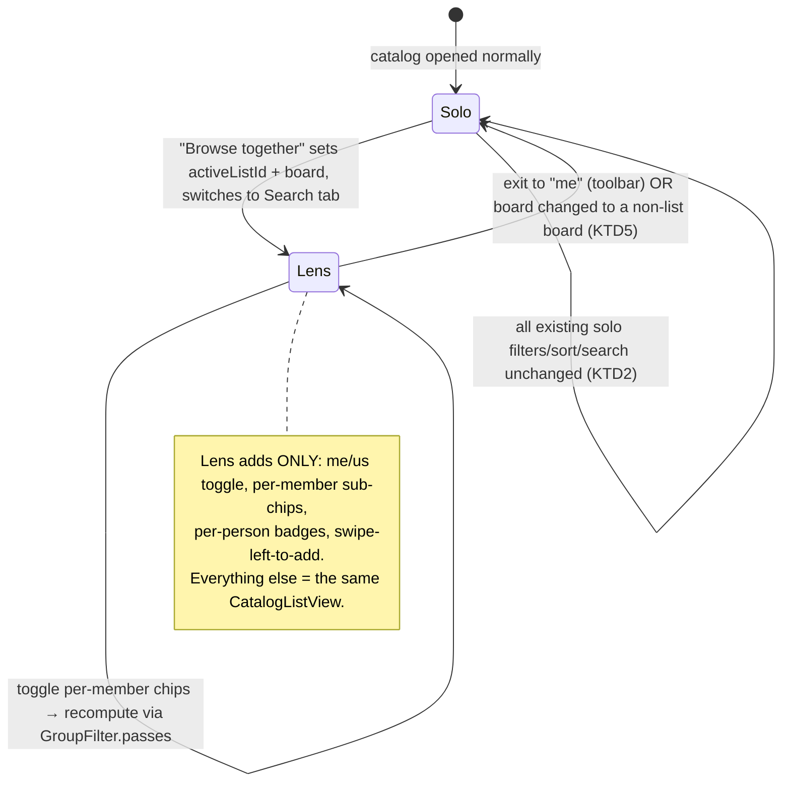

# Catalog-Native Group View - Plan

**Product Contract preservation:** unchanged — the Product Contract below is carried
verbatim from the brainstorm. Planning added the Planning Contract, Implementation Units,
and Verification Contract; it did not alter product scope.

---

## Summary

Fold the collaborative group filter **into the main catalog browser** (`CatalogListView`),
replacing the standalone `ListBrowseView` screen built as the U8 shortcut. When a list is
active, the catalog's existing status filters gain **per-member sub-chips**, rows show
**per-person badges**, and **swipe-left adds** a problem to the list's pile. With no list
active the catalog is byte-for-byte as today. Client-side only — no schema, RLS, or data-layer
change. Supersedes U8 of `docs/plans/2026-07-03-002-feat-collaborative-lists-plan.md`.

---

## Problem Frame

The collaborative-lists feature put the group filter in a **separate "Browse & add" screen**
(`ListBrowseView`) — a deliberate U8 shortcut to avoid editing the ~900-line `CatalogListView`.
The original vision (and the fix for the owner's design dissatisfaction) is that the group
filter should be an **extension of the catalog's own filters** — a lens flipped on while
browsing normally, not a destination. Climbers already live in the catalog; group-awareness
should be a mode of it.

**Actor:** a member of a collaborative list, browsing the catalog.
**Outcome:** while browsing the normal catalog, flip to a group's view and see inline who's
sent/tried each problem, filter to "nobody in the group has sent," and swipe to add — no
separate screen.

---

## Product Contract

*(Carried verbatim from the brainstorm — the WHAT. Planning does not modify this.)*

### Key product decisions (resolved)

1. **Pure relocation — keep the pile.** *(owner)* Groups, the saved pile, and share/join stay
   as built. Only the group-aware **browsing** moves into the catalog.
2. **Slim the Lists tab; retire the standalone Browse & add screen.** *(agent-recommended,
   reversible)* The Lists tab keeps your lists (members + pile + share). `ListBrowseView` is
   deleted; "Browse together" opens the main catalog in that list's lens.
3. **The catalog gains a "Just me / [list]" lens.** Active-list mode adds per-member sub-chips
   to the status filters (Completed / Projects / Not completed), per-person badges on rows, and
   **swipe-left-to-add** (native iOS trailing swipe; no persistent "＋" button). The per-person
   combine rule already built (OR within a member's buckets, AND across members) is reused.
4. **Entry and active-list state.** "Browse together" from a list opens the catalog on that
   list's board with the list active; the toolbar shows the active list with a way to switch or
   exit to "me". Active-list state is session-scoped (like the current active-board selection).
5. **Board-scoped lens.** A list is one board; the lens applies only on the list's board;
   changing boards reverts to "me".
6. **Solo path untouched.** With no list active, the catalog behaves byte-for-byte as today.
   Hard requirement.

### Requirements

- **R1** — The catalog offers a "Just me / [list]" control that activates a group lens.
- **R2** — In the lens, status filters expose per-member sub-chips applying the OR-within /
  AND-across combine rule, so `Not completed → all members` returns problems nobody has sent.
- **R3** — In the lens, each row shows per-person badges (sent / tried / untouched) and supports
  **swipe-left-to-add** to the list's pile. No persistent add button.
- **R4** — "Browse together" opens the catalog in the list's lens on the list's board; the
  toolbar shows the active list and lets the user switch or return to "me".
- **R5** — The lens applies only on the list's board; changing boards reverts to "me".
- **R6** — With no list active, the catalog is behaviorally identical to the solo catalog
  (regression requirement).
- **R7** — `ListBrowseView` is removed; no separate group-browse screen remains.
- **R8** — The Lists tab, saved pile, members, share/join, and the pile's badges are unchanged.

### Success criteria

- From a two-member list, "Browse together" opens the catalog with the list active; per-member
  sub-chips appear under each status filter and per-person badges on rows.
- `Not completed → both members` narrows to problems neither has sent; exiting to "me" restores
  the full solo catalog identically.
- Swipe-left on a row adds it to the shared pile, visible to the other member after refresh.
- No standalone Browse & add screen exists anywhere.
- A solo user who never touches a list sees zero change in the catalog.

### Out of scope

Deriving/dropping the pile (ideation #2); ephemeral sessions (#4); realtime (#5); a friend
graph; multi-board lists. **No Supabase schema, RLS, or `ListsManager` data-layer change** —
this is a client-side surface relocation only.

---

## Planning Contract

### Key Technical Decisions

**KTD1 — Reuse the existing `GroupFilter` combine logic unchanged.** `GroupFilter.passes` /
`matches` and `MemberStatus` (built for 002/U8, in `ios/MoonBoardLED/Views/Lists/GroupFilter.swift`)
already encode the OR-within / AND-across rule and are standalone-verified. The lens is a new
*presentation* over that same rule; do not reimplement it.

**KTD2 — The lens is strictly additive; the solo path stays byte-identical (R6).** Every group
branch in `CatalogListView` is guarded on an active list being present. When none is,
`computeDisplayed`, the off-main `filter`, the rows, and the filter sheet run exactly as today.
This is the load-bearing safety property; it also lets the change land incrementally.

**KTD3 — Per-member chips are a parallel dynamic `@State` selection (`Set<GroupChip>`), not new
`CatalogFilter` enum cases.** Same reasoning as 002/KTD6: the enum is static `CaseIterable`. The
member `sent`/`tried` sets (from `ListsManager.groupStatus`) plus the chip selection are threaded
through the off-main filter snapshot exactly like the existing `sent`/`logged` params
(`CatalogListView.swift` `computeDisplayed` ~L246-273, `filter` ~L278-301). Extend
`computeSignature` (~L220) with the group state so recompute fires on chip toggles.

**KTD4 — Active-list state lives on `ListsManager` (`@Published var activeListId: UUID?`),
session-scoped.** The Search-tab `CatalogListView` reads it (plus `members`/`groupStatus`) to
enter lens mode. "Browse together" sets it, sets the active board to the list's board, and
switches to the Search tab via `TabRouter`. Mirrors the existing session-scoped active-board
selection; not persisted (matches decision 4).

**KTD5 — Board-scoped lens (R5).** When the catalog's board ≠ the active list's board, the lens
is inactive and reverts to "me". Because the Search tab is keyed per board, entering via a
different board simply clears `activeListId`. Pure, unit-checkable predicate.

**KTD6 — Swipe-left-to-add via native `.swipeActions` (R3).** In lens mode each row gets a
trailing swipe action calling `ListsManager.addProblem`. Replaces `ListBrowseView`'s "+" button;
no persistent per-row control, so solo rows are visually unchanged. An already-in-pile row shows
no add action (or an "Added" state).

### Alternatives Considered

- **Present `CatalogListView` in a sheet from the list** (rejected): simpler wiring, but it
  re-creates "a place you go" — the exact anti-pattern #1 exists to remove. Switching the real
  Search tab into lens mode delivers the vision. (If tab-switching proves awkward in
  implementation, a full-screen cover is an acceptable fallback — noted, not chosen.)
- **Retrofit the group filter as literal new `CatalogFilter` cases** (rejected, KTD3): the enum
  can't hold per-member dynamic chips; a parallel selection is the clean seam.

### System-Wide Impact

- **`CatalogListView`** gains an optional lens mode — the one complex, high-traffic file this
  touches. KTD2's byte-identical-solo guard is what keeps the daily solo catalog safe.
- **`ListsManager`** gains `activeListId` + setter/clear (data layer otherwise untouched).
- **`ListDetailView`** "Browse & add" becomes "Browse together" (tab switch, not sheet).
- **`ListBrowseView` is deleted**; `GroupFilter` / `MemberInitial` survive (now used by the catalog).
- No backend, schema, or RLS change.

### Dependencies / Prerequisites

Builds directly on the merged/branch work of plan 002 (U1 filter rework, U4/U5 `ListsManager` +
group status, U6 Lists tab, `GroupFilter`, `MemberInitial`). No new external dependencies.

---

## High-Level Technical Design

### Lens lifecycle

### Group state read path (reuses 002)

`ListDetailView`/Search tab → `ListsManager.refreshGroupStatus(listId)` → `list_member_status`
RPC → `groupStatus: [UUID: MemberStatus]`. The catalog reads `groupStatus` + `members` for the
active list; `GroupFilter.passes(catalogID:selection:status:)` filters, and
`memberStatusColor(_:catalogID:)` colors the badges. No new data flow — this plan consumes what
002 already produces.

---

## Implementation Units

### U1. Catalog group-lens core — me/us toggle + per-member sub-chips + combine rule

- **Goal:** Give `CatalogListView` an optional active-list lens: a "Just me / [list]" toggle and,
  when "us", per-member sub-chips under each status filter that apply the reused combine rule.
  Solo path unchanged when inactive (R1, R2, R6).
- **Requirements:** R1, R2, R6.
- **Dependencies:** none (reuses 002's `GroupFilter`/`ListsManager`).
- **Files:**
  - `ios/MoonBoardLED/Views/CatalogListView.swift` (read `ListsManager` via `@EnvironmentObject`;
    add `activeListId` read + `Set<GroupChip>` selection state; me/us toggle; per-member chips in
    the filter sheet ~L900-913; thread member sets + selection through `computeDisplayed`/`filter`
    ~L246-301 and extend `computeSignature` ~L220; apply `GroupFilter.passes` in the group branch).
  - `ios/MoonBoardLED/Services/Supabase/ListsManager.swift` (add `@Published var activeListId: UUID?`
    + set/clear; clear in existing `clear()`).
  - `ios/MoonBoardLEDTests/GroupLensFilterTests.swift` (new — see note on test target).
- **Approach:** When `activeListId` is nil the view is today's view (guard every group branch,
  KTD2). When set, read `lists.members` + `lists.groupStatus`; render the toggle; in "us" mode
  render per-member chips per status bucket; fold the chip selection + status into the off-main
  filter snapshot and call `GroupFilter.passes`. Reuse `StatusBucket`/`GroupChip`/`GroupFilter`.
- **Patterns to follow:** the existing `sent`/`logged` snapshot threading (`CatalogListView.swift`
  L246-301); `matchesFilters` static func; `GroupFilter` (`Views/Lists/GroupFilter.swift`); the
  deleted `ListBrowseView`'s chip UI is the reference for the sub-chip control.
- **Test scenarios:**
  - Covers R2. `Not completed → [all members]` returns problems nobody has sent (reuse the
    Crimpy/Slab fixture from 002/U8); AND-across and OR-within cases hold. *(This is the same
    `GroupFilter` already proven; re-assert at the lens boundary.)*
  - Covers R6. With `activeListId == nil`, the displayed set equals the pre-change solo result for
    the same filters/sort/search (regression).
  - Toggling a member chip changes `computeSignature`, triggering recompute.
- **Verification:** With a list active, per-member chips appear and narrow the catalog per the
  rule; with no list active, the catalog is identical to before.
- **Execution note:** Keep the solo path a strict guarded no-op; verify the regression scenario
  before wiring the group branch.

### U2. Per-person badges on catalog rows

- **Goal:** In lens mode, each catalog row shows per-person badges (sent / tried / untouched);
  solo rows unchanged (R3 badges).
- **Requirements:** R3 (badge half).
- **Dependencies:** U1.
- **Files:**
  - `ios/MoonBoardLED/Views/CatalogProblemDetailView.swift` (`CatalogProblemRow` ~L58-105 — add
    optional members + groupStatus params; render a `MemberInitial` cluster when present).
  - `ios/MoonBoardLED/Views/CatalogListView.swift` (pass the active list's members/groupStatus to
    rows at the call sites ~L414/452/782 only in lens mode).
- **Approach:** Extend `CatalogProblemRow` with an optional `[(Profile, color)]`-style input;
  when nil, render exactly as today. Reuse `MemberInitial` + `memberStatusColor`
  (`Views/Lists/MemberInitial.swift`).
- **Patterns to follow:** the pile's per-person badges in `ListDetailView`; `ProblemRow` badge
  HStack (`ProblemRow.swift:36-49`).
- **Test scenarios:** `Test expectation: none -- UI composition; badge color logic is
  memberStatusColor, already exercised. Manual: badges match the RPC data in lens mode; absent in
  solo mode.`
- **Verification:** Lens rows show correct per-person dots; solo rows visually unchanged.

### U3. Swipe-left-to-add

- **Goal:** In lens mode, a trailing swipe on a catalog row adds the problem to the active list's
  pile; no persistent button; solo rows have no such action (R3 add).
- **Requirements:** R3 (add half).
- **Dependencies:** U1.
- **Files:**
  - `ios/MoonBoardLED/Views/CatalogListView.swift` (attach `.swipeActions(edge: .trailing)` to
    rows only when a list is active; call `ListsManager.addProblem`; reflect already-in-pile).
- **Approach:** Native `.swipeActions` trailing "Add"; guarded on `activeListId != nil` so solo
  rows are unaffected (KTD6). Determine already-added from `lists.pile` and suppress/label the
  action. On tap, `try await lists.addProblem(listId:sourceCatalogID:boardLayoutId:)`.
- **Patterns to follow:** `ListBrowseView`'s add flow (`lists.addProblem` + `pile` membership);
  standard SwiftUI `.swipeActions`.
- **Test scenarios:**
  - Covers R3. Swiping an unadded row inserts one `list_problems` row; it appears in the pile
    after refresh. *(Integration — live backend + a list.)*
  - An already-in-pile row offers no add action (or an "Added" state).
  - In solo mode (no active list), rows have no add swipe action.
- **Verification:** Swipe adds to the pile on a real list; solo rows have no add affordance.

### U4. Entry, active-list state, and board scoping

- **Goal:** Wire "Browse together" from a list to enter the catalog lens on the list's board, and
  enforce board-scoping (R4, R5).
- **Requirements:** R4, R5.
- **Dependencies:** U1.
- **Files:**
  - `ios/MoonBoardLED/Views/Lists/ListDetailView.swift` ("Browse together": set active board to
    the list's board, set `lists.activeListId`, switch to Search tab via `TabRouter`; remove the
    `ListBrowseView` sheet presentation).
  - `ios/MoonBoardLED/Views/CatalogListView.swift` (a toolbar affordance showing the active list
    with switch/exit-to-me; clear `activeListId` when this view's `board.id` ≠ the active list's
    board — KTD5).
  - `ios/MoonBoardLED/Views/RootTabView.swift` (if needed, expose active-board setting / tab
    switch for the entry).
  - `ios/MoonBoardLEDTests/BoardScopeTests.swift` (new — the board-match predicate).
- **Approach:** "Browse together" sets `activeBoardId = list.board_layout_id`,
  `lists.activeListId = list.id`, `router.selection = .search`. `CatalogListView` shows the active
  list in the toolbar with switch/exit; a board mismatch clears `activeListId` (revert to "me").
- **Patterns to follow:** `TabRouter` tab switching (`RootTabView.swift`); the active-board
  `@AppStorage`/`ActiveBoard` pattern; `Board.with(layoutId:)`.
- **Test scenarios:**
  - Covers R5. The board-match predicate: active list on board 7, catalog on board 7 → lens on;
    catalog on a different board → lens off (activeListId cleared).
  - Covers R4. After "Browse together", the Search tab is active, on the list's board, with the
    list active in the toolbar.
  - Exit-to-me clears `activeListId` and restores the solo catalog.
- **Verification:** "Browse together" lands on the catalog in lens mode on the right board;
  switching boards reverts to "me".

### U5. Retire ListBrowseView

- **Goal:** Delete the standalone group-browse screen now that the catalog owns the lens (R7).
- **Requirements:** R7.
- **Dependencies:** U1, U2, U3, U4 (the catalog must fully cover its function first).
- **Files:**
  - `ios/MoonBoardLED/Views/Lists/ListBrowseView.swift` (delete).
  - `ios/MoonBoardLED/Views/Lists/ListDetailView.swift` (remove any residual references —
    superseded by U4's entry).
- **Approach:** Remove the file and all references; confirm the project still builds (synchronized
  folders auto-drop it). `GroupFilter` and `MemberInitial` remain (now used by the catalog).
- **Patterns to follow:** n/a (deletion).
- **Test scenarios:** `Test expectation: none -- deletion. Verification is a clean build + grep
  for residual references.`
- **Verification:** No `ListBrowseView` references remain; the app builds; group browse works
  entirely from the catalog.

---

## Scope Boundaries

**In scope:** U1–U5 (the catalog lens + entry + deletion of the standalone screen).

### Deferred to Follow-Up Work

- Making the group lens reachable from a **list picker in the catalog toolbar** (browse-first,
  not list-first entry) — decision 4 chose list-first entry for v1.
- Aggregate/collapsed badges for large member counts (the badge-scaling question from ideation).
- Search-tab-native persistence of the active list beyond the session.

### Outside this feature's identity

Deriving/dropping the pile (#2), ephemeral sessions (#4), realtime (#5), friend graph — these are
separate ideation directions, not this change.

---

## Open Questions (deferred to implementation)

- Exact placement of the me/us toggle and per-member chips within the catalog's filter UI (the
  filter sheet vs the radial FAB menu vs a new inline bar) — a layout call best made with the app
  running; U1 picks one and the others become follow-ups.
- Whether "Browse together" switches the Search tab (chosen) or, if that proves awkward, uses a
  full-screen cover (documented fallback in Alternatives).
- Badge density on a dense catalog row at larger member counts (deferred above).

---

## Verification Contract

- **Solo regression is the gate:** with no active list, the catalog is behaviorally identical to
  pre-change (U1 scenario) — verified before the group branch is trusted.
- **The combine rule holds at the lens boundary:** `Not completed → all members` returns
  nobody-sent (reuse the 002/U8 `GroupFilter` fixture).
- **Board-scoping predicate** is unit-checkable and correct (U4).
- **Swipe-add** inserts one pile row and shows on a second device after refresh (U3, live backend).
- **No `ListBrowseView` references remain** and the app builds (U5).
- **Environment reality (this repo):** there is no XCTest target, so the plan's `*Tests.swift`
  cannot run as-is. Substitute the proven pattern from plan 002's execution: **compile-verify via
  `xcodebuild`** for every unit, **standalone `swift`** runs for pure logic (the board-scope
  predicate; `GroupFilter` reuse), and **manual/device + two-account** verification for the UI and
  backend-touching flows. Full unit-test execution needs a test target (a separate follow-up).

## Definition of Done

- U1–U5 landed; the app compiles (`xcodebuild`) and the solo-regression scenario is confirmed.
- Success criteria (Product Contract) all demonstrably hold on a real two-member list.
- `ListBrowseView` is gone; group browse works entirely from the catalog.
- `docs/plans/2026-07-03-002-...` U8 is noted as superseded by this plan (cross-reference kept).
