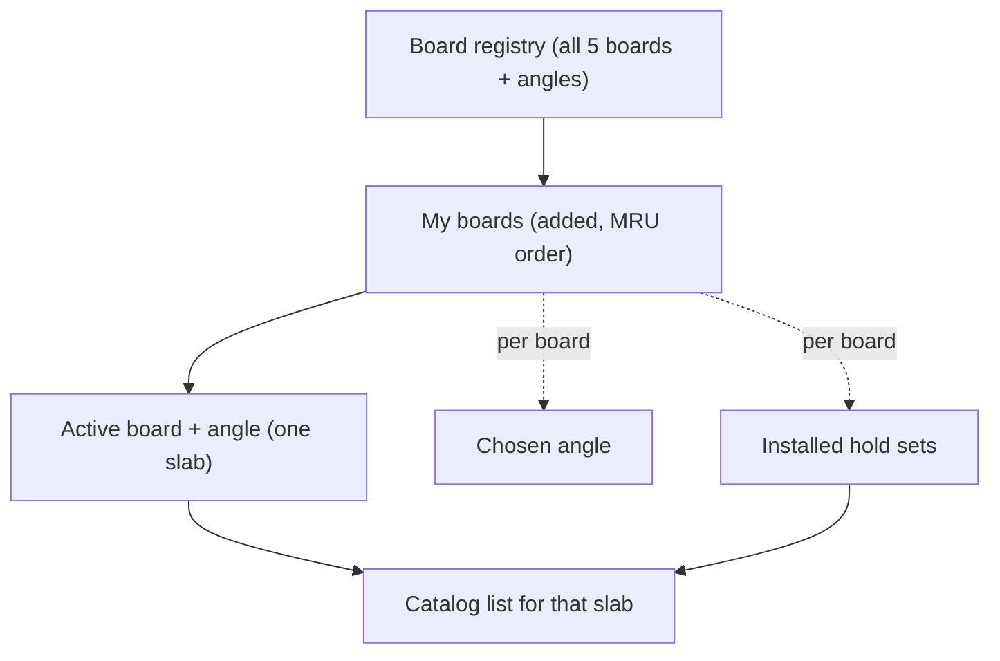
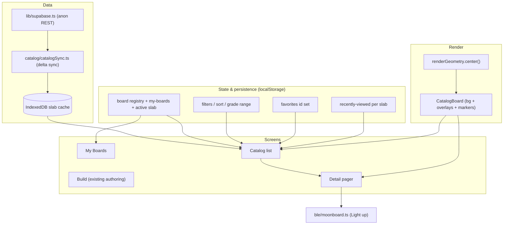

# PWA Catalog Browser - Plan

**Target repo area:** `web/` (the Web Bluetooth PWA). All paths below are repo-relative.

**Product Contract preservation:** unchanged — planning added the Planning Contract, Implementation Units, Verification Contract, and Definition of Done below the existing Product Contract; no R-IDs were altered.

## Goal Capsule

- **Objective:** Bring the iOS official-catalog browsing experience to the Web Bluetooth PWA — pick any of the five boards and angle, browse/search/filter/sort that slab's problems, open a problem to a full board render, and light it on a connected board.
- **Product authority:** Aligns to the shipped iOS behavior. Where the PWA can't match iOS (no accounts), the iOS feature is deferred, not reinvented.
- **Open blockers:** Whether this ships as one PR or phased is answered here as **phased delivery** (see Planning Contract); the phase split is the natural iteration boundary.

---

## Product Contract

### Summary

Port the iOS catalog browser to the PWA. Today the PWA only builds-and-lights a single hardcoded Mini 2025 board; the catalog data layer exists (`web/src/catalog/catalogSync.ts`, `web/src/lib/supabase.ts`) but is imported nowhere. This feature wires that layer into a full multi-board browsing UI that matches iOS: board/angle selection, the complete filter and sort set, layered board art, read-only problem preview, and light-up over Web Bluetooth. Favorites and recents are device-local, matching iOS. Anything that depends on account sync (logbook) is deferred.

### Problem Frame

The PWA is a partial port of the iOS app: it can connect to a board and author-and-light holds, but it cannot browse any of the ~22k official problems the iOS app carries. A climber at the wall with a laptop or Bluefy-capable phone has no way to find and light a real problem — the core reason to have the catalog on the wall device at all. The data plumbing to fix this was already built (server-distributed `catalog_problems`, per-slab delta sync, IndexedDB cache) but never surfaced, so it sits as dead code while the PWA stays authoring-only.

### Key Decisions

- **Full iOS parity, not a lean MVP.** The browser ports iOS's complete surface: five boards, installed-hold-set filtering, layered art, and the full filter/sort set — rather than a stripped-down list. The user chose fidelity over a smaller first cut.
- **Read-only preview, no editing.** A catalog problem can be previewed, lit, favorited, and (later) logged against, but never edited or converted into a custom problem. This mirrors iOS's hard split between the read-only catalog and the separate authoring surface.
- **Favorites stay device-local.** iOS itself stores favorites as local-only state with no account sync, so a device-local PWA implementation is aligned behavior, not a compromise.
- **Reuse the existing data layer.** `catalogSync.syncSlab` / `readSlab` and the anon REST helper are the source of truth for catalog data; this feature consumes them rather than rebuilding sync.

### Actors

- A1. Climber — browses, filters, favorites, and lights problems on the PWA.
- A2. Connected MoonBoard — BLE peripheral that receives light-up commands over Web Bluetooth.
- A3. Supabase catalog — public-read `catalog_problems` table, synced per slab into the local IndexedDB cache.

### Requirements

**Board & slab model**

- R1. The PWA supports all five catalog boards — Mini 2025 (`layout_id 7`), Masters 2019 (`5`), MoonBoard 2024 (`3`), Masters 2017 (`4`), MoonBoard 2016 (`2`) — each with its supported angles (`[40]` for Mini; `[40, 25]` for the others).
- R2. A "My boards" surface lets the user add boards from the registry and lists added boards in most-recently-used order.
- R3. Each added board persists its own chosen angle and its own installed-hold-set selection, device-locally.
- R4. Exactly one board+angle is active at a time; the catalog browses that single slab, and switching the active board rebuilds the list for its slab.

**Catalog browsing**

- R5. The catalog lists the active slab's problems with lazy pagination. Each row shows name, benchmark and favorite badges, star rating, repeat count, setter (or hold count when the setter is empty), method label, a trailing grade pill, and an optional board thumbnail behind a "climb previews" toggle (matching iOS).
- R6. A "Recently viewed" section is pinned above the main list, scoped per board+angle, with expand and clear, and it ignores active filters.
- R7. Search matches problem name or setter as a case-insensitive substring; search is transient and not persisted.

**Filtering & sort**

- R8. Two-level sort — a primary key (Easiest, Hardest, Highest-rated, Most-repeats) plus an optional secondary tiebreaker whose dimension differs from the primary. Default is Easiest, then Most-repeats. Sort choice is persisted.
- R9. Persisted filters: grade range (over the slab's actual grade span), benchmark-only, minimum rating, method (multi-select), favorites-only, and a drawn holds filter where a problem's holds must be a superset of the tapped positions.
- R10. Installed-hold-set filtering: when only some of a board's hold sets are installed, the catalog hides problems whose holds aren't all on installed sets, and the render omits uninstalled overlay art. This is implicit, not shown as a filter chip.
- R11. A reset clears grade, rating, status, method, sort, and holds filters at once.

**Problem detail & light**

- R12. Selecting a problem opens a swipeable detail pager over the current filtered+sorted list (prev/next). Each page shows the full board render and the problem's metadata.
- R13. The detail view is read-only — holds are not tappable/editable and there is no path to turn a catalog problem into a custom one.
- R14. "Light up" sends the problem's holds to a connected board over Web Bluetooth; when no board is connected it prompts to connect first. The currently-lit problem is tracked and cleared on disconnect.

**Favorites & recents**

- R15. The user can favorite/unfavorite a catalog problem; favorites are stored device-locally and drive both the favorite badge and the favorites-only filter.
- R16. Viewing a problem records it into the per-board+angle recently-viewed history (move-to-front, deduped, capped).

**Rendering & art**

- R17. The board render ports iOS's layered art: a per-board background plus per-hold-set overlay images, with holds drawn as markers positioned by the shared geometry — 11 columns (A–K) for every board, 12 rows for Mini and 18 for full boards, with per-board margins and aspect.
- R18. Hold coordinates match iOS: `{c: 0–10, r: 1-based from bottom, t: start|left|right|match|end}`, with row 1 rendered at the bottom.

**Data & offline**

- R19. Catalog data loads via the existing per-slab delta sync into IndexedDB, lazily for the active slab, and browsing works offline after a slab's first sync. Board-art assets and per-board hold-set membership are bundled with the app.

### Board / slab state model

### Key Flows

- F1. Add and activate a board
  - **Trigger:** A1 opens "My boards" and adds a board not yet added.
  - **Steps:** Pick a board from the registry; configure its angle and installed hold sets; commit. Activating a board makes its slab the catalog's subject.
  - **Covered by:** R1, R2, R3, R4

- F2. Browse, filter, and light
  - **Trigger:** A1 opens the catalog for the active slab.
  - **Steps:** Search/sort/filter the list; open a problem into the detail pager; tap Light up; if disconnected, connect then send holds to A2.
  - **Covered by:** R5, R7, R8, R9, R10, R12, R14

- F3. Favorite and revisit
  - **Trigger:** A1 favorites a problem in the detail view.
  - **Steps:** The favorite badge appears; the favorites-only filter surfaces it; recently-viewed captures the visit for that slab.
  - **Covered by:** R6, R15, R16

### Acceptance Examples

- AE1. **Covers R10.** Given Mini 2025 with only some hold sets installed, when browsing, then a problem using a hold on an uninstalled set is hidden and that set's overlay art is not drawn.
- AE2. **Covers R14.** Given no board connected, when A1 taps Light up, then a connect prompt appears; after connecting, the problem's holds are sent.
- AE3. **Covers R8.** Given the primary sort is Easiest (a grade key), when A1 picks a secondary key, then only non-grade keys (Highest-rated, Most-repeats) are offered.
- AE4. **Covers R9.** Given a grade range that excludes the slab's hardest grade, when filtering, then problems at that grade are hidden but problems with an unknown grade remain shown.

### Scope Boundaries

**Deferred for later**

- Logbook coupling: log-ascent, ascent-status filters (my ascents / not completed / not logged), and the "sent" indicator — all depend on account sync the PWA doesn't have.
- Accounts/auth in the PWA and syncing favorites across devices.

**Outside this feature**

- Authoring or editing problems — that is the separate existing build-and-light surface, with no bridge from the catalog.
- Android or any non-web client.

### Dependencies / Assumptions

- The existing `web/src/catalog/catalogSync.ts` and `web/src/lib/supabase.ts` (currently unused) are the data layer this feature consumes; assumed correct against the deployed schema.
- Migration `supabase/migrations/0006_catalog_problems.sql` is applied and `catalog_problems` is seeded via `scripts/import_catalog.py`.
- Board-art PNGs (`ios/MoonBoardLED/Assets.xcassets/Boards/`) and hold-set membership JSON (`ios/MoonBoardLED/Resources/*HoldSets.json`) are portable to the web via the existing `scripts/import_board_images.py` and `scripts/derive_holdset_membership.py`; assumed web-usable art can be produced from them.
- Web Bluetooth secure-context requirements (desktop Chrome/Edge, Android Chrome, iPhone via Bluefy) are unchanged.

---

## Planning Contract

### Approach

The PWA has the data layer already written and unused, and a working authoring/light path. This plan wires the data layer into a new browsing surface and ports the iOS board model faithfully. The work splits into a foundation layer (test tooling, board registry, render geometry, hold-set membership), a rendering layer (art pipeline + layered renderer), a browsing layer (list, filters, sort, favorites, recents), and a shell layer (navigation, detail pager, light-up). The existing programmatic `BoardGrid` and `MoonBoardClient` stay as-is for authoring; the catalog gets its own art-based renderer and reuses `MoonBoardClient` for light-up.

### Key Technical Decisions

- **KTD1. Hand-rolled view-state shell over a router dependency.** The PWA today has zero runtime deps beyond `react`/`react-dom` and a single-screen `App.tsx`. Add a small view-state machine (Build / My Boards / Catalog / Detail) rather than pulling in `react-router`. Rationale: the surface is a handful of screens, an offline PWA benefits from minimal bundle, and the repo's ethos is dependency-light. Alternative — `react-router` — is reasonable if deep-linking to a problem becomes a requirement; it is not one today.
- **KTD2. Persistence mirrors iOS's key scheme on `localStorage`, reusing the existing IndexedDB catalog cache.** Per-board namespaced keys (angle, installed hold sets, `flipped` calibration, grade range, sort, recents) match the iOS `@AppStorage` naming so behavior is traceable across apps. Favorites are a `localStorage` id set (device-local, unsynced), matching iOS's local-only `FavoriteProblem`. Problem rows stay in the existing IndexedDB store written by `catalogSync`.
- **KTD3. Port iOS layered PNG art for the catalog render; keep the programmatic grid for authoring.** The catalog render stacks a per-board background, per-hold-set overlays, and hold markers positioned by a ported render geometry (`center()` with per-board margins). This is a distinct concept from the existing `web/src/board/geometry.ts`, which is LED-serpentine geometry for hardware and stays untouched.
- **KTD4. Introduce `vitest` + `@testing-library/react`.** The repo currently has no test runner. Adding one is prerequisite to meeting the test-scenario bar for feature-bearing units.
- **KTD5. Consume the existing sync layer through React hooks.** A `useSlab(layoutId, angle)` hook calls `syncSlab` (best-effort) then `readSlab`, exposing the slab's problems, loading state, and offline fallback. `catalogSync` and `lib/supabase` are not modified.

### High-Level Technical Design

### Phased Delivery

- **Phase 1 — Foundations:** U1, U2, U3 (test tooling, board registry + render geometry, catalog data hook).
- **Phase 2 — Board model:** U4, U5 (multi-board state + persistence, hold-set membership + climbable filter).
- **Phase 3 — Rendering:** U6, U7 (art asset pipeline, layered renderer).
- **Phase 4 — Browsing:** U8, U9 (list + recents, search/sort/filters/favorites).
- **Phase 5 — Shell & light:** U10 (shell + navigation + first-run), U11 (detail pager + light-up + favorite).

A vertical-slice-first sequencing (Mini 2025 browse+light end-to-end before broadening) was considered and declined for v1 — the horizontal, full-parity layering is the chosen order. Phase 3's art pipeline (U6) is the highest-risk unit and the natural place to slip if asset export proves harder than assumed; U7 can fall back to a temporary programmatic render to keep Phases 4–5 unblocked (tracked in Open Questions).

---

## Implementation Units

### U1. Add unit-test tooling

- **Goal:** Give the repo a test runner so feature-bearing units can ship with tests.
- **Requirements:** Enables test scenarios for U2–U10.
- **Dependencies:** none
- **Files:** `web/package.json`, `web/vite.config.ts`, `web/src/test/setup.ts`, `web/src/test/smoke.test.ts`, `web/tsconfig.app.json`
- **Approach:** Add `vitest`, `@testing-library/react`, `@testing-library/jest-dom`, and `jsdom` as dev deps; add a `test` script; configure vitest (jsdom environment, setup file) inside the existing Vite config. Keep `oxlint` as the linter.
- **Execution note:** Scaffolding — prefer a runtime smoke (one trivial passing test) over coverage here.
- **Patterns to follow:** existing `web/vite.config.ts` structure and `web/tsconfig.app.json` compiler options.
- **Test scenarios:** `Test expectation: none — tooling unit; a single smoke test proves the runner executes.`
- **Verification:** `npm run test` runs and reports a passing smoke test; `npm run build` still succeeds.

### U2. Port board registry, render geometry, and grade ordering

- **Goal:** Represent all five boards, the geometry that maps hold coordinates onto rendered art, and the canonical Font-grade ordinal scale.
- **Requirements:** R1, R17, R18 (grade scale supports R8, R9)
- **Dependencies:** U1
- **Files:** `web/src/board/boards.ts`, `web/src/board/renderGeometry.ts`, `web/src/board/grades.ts`, `web/src/board/boards.test.ts`, `web/src/board/renderGeometry.test.ts`, `web/src/board/grades.test.ts`
- **Approach:** Port the iOS `Board`/`MoonBoardSetup` registry keyed by `layout_id` (7 Mini 2025, 5 Masters 2019, 3 MoonBoard 2024, 4 Masters 2017, 2 MoonBoard 2016), each with `angles`, catalog-resource identity, hold-set metadata, and geometry class (`mini` 12-row / `standard` 18-row). Port `MoonBoardGeometry.center(col, row)` returning fractional (0–1) image coordinates with the Y-flip (`slotFromTop = rowTop - row`) and per-geometry margins from `ios/MoonBoardLED/Board/BoardArt.swift`. Also port the ordered Font-grade table (`FontGrade.all` / `index(of:)` from `ios/MoonBoardLED/Models/Problem.swift`) as an ordinal index — grade sort and grade-range filtering (U9) must key off this index, never `String.localeCompare`, which orders grades wrong (`6A+` vs `6A`, `7C` vs `8A`).
- **Patterns to follow:** `ios/MoonBoardLED/Board/Board.swift`, `ios/MoonBoardLED/Board/MoonBoardSetup.swift`, `ios/MoonBoardLED/Board/BoardArt.swift`, `ios/MoonBoardLED/Models/Problem.swift` (grade scale); existing `web/src/board/config.ts` for TS board-config style.
- **Test scenarios:**
  - Covers R1. `boards` exposes exactly the five supported `layout_id`s with correct angles (`[40]` for Mini, `[40, 25]` for the rest).
  - Covers R18. `center(0, 1)` (A1, bottom-left) maps to the bottom-left region and `center(0, rowTop)` to the top-left, for both `mini` and `standard` geometry.
  - `center` uses the correct per-geometry margins so Mini and full boards differ in aspect and inset.
  - Grade ordinal orders `6A < 6A+ < 6B < … < 7C < 8A`; an unknown/unmapped grade sorts to the end (supports AE4).
- **Verification:** geometry, registry, and grade tests pass; `center()` values and grade order match iOS for spot-checked cases.

### U3. Wire the catalog sync layer into React

- **Goal:** Expose the existing (currently unused) sync/cache layer to the UI.
- **Requirements:** R19
- **Dependencies:** U1
- **Files:** `web/src/catalog/useSlab.ts`, `web/src/catalog/useSlab.test.ts`, `web/src/catalog/catalogSync.ts` (additive type widening only)
- **Approach:** A `useSlab(layoutId, angle)` hook that calls `syncSlab` (best-effort, non-blocking) and surfaces `readSlab` results, loading state, and an offline/degraded flag. The exported `CatalogProblem` type must expose `method` (and `user_grade` if used) so U8/U9 can read them type-safely — the full row is already stored in IndexedDB, so this is an additive widen of the exported interface in `catalogSync.ts` (permitted); do not change its sync/cache logic. Handle the unconfigured-Supabase case (helpers return `[]`) as an empty-but-valid state.
- **Patterns to follow:** `web/src/catalog/catalogSync.ts` (its `syncSlab`/`readSlab` contract), React 19 hook conventions in `web/src/App.tsx`.
- **Test scenarios:**
  - Covers R19. With a seeded IndexedDB slab, the hook returns cached problems without a network call.
  - On sync failure (throwing REST), the hook still returns the cached slab and flags degraded/offline.
  - Unconfigured Supabase yields an empty list and no error.
- **Verification:** hook tests pass against a mocked/seeded IndexedDB; no changes to the sync layer.

### U4. Multi-board state and persistence

- **Goal:** Model the registry → my-boards → active-slab layers with iOS-parity persistence.
- **Requirements:** R2, R3, R4
- **Dependencies:** U2
- **Files:** `web/src/board/boardStore.ts`, `web/src/board/boardStore.test.ts`
- **Approach:** A small store (React context + `localStorage`) holding added boards in MRU order, the active board id, and per-board angle + installed hold sets + `flipped` calibration under iOS-parity key names (`flipped_<id>` mirrors iOS `board.flippedKey`). `flipped` is the reverse-wired-strip calibration the light-up path (U11) feeds into `MoonBoardClient.send`. Adding a board configures angle and installed sets; activating promotes it to MRU front and switches the active slab.
- **Patterns to follow:** iOS `AddedBoards` / `ActiveBoard` / `@AppStorage` key scheme in `ios/MoonBoardLED/Board/Board.swift` and `ios/MoonBoardLED/Views/RootTabView.swift`.
- **Test scenarios:**
  - Covers R2. Adding boards records them; the list is ordered most-recently-used.
  - Covers R3. Angle, installed-hold-set, and `flipped` selections persist per board and survive reload (re-read from `localStorage`).
  - Covers R4. Activating a different board changes the active slab; single-angle boards ignore angle selection.
- **Verification:** store tests pass; state round-trips through `localStorage`.

### U5. Hold-set membership and climbable filtering

- **Goal:** Filter the catalog and render to only installed hold sets.
- **Requirements:** R10
- **Dependencies:** U2, U4
- **Files:** `web/src/board/holdSetMembership.ts`, `web/src/board/holdSetMembership.test.ts`, `web/public/boards/*HoldSets.json` (bundled membership)
- **Approach:** Bundle the per-board `*HoldSets.json` maps (from `ios/MoonBoardLED/Resources/`) into web assets; port `isClimbable(holds, activeSetIDs)` (all holds must belong to installed sets; empty membership = no filter) and the `visible(...)` render set (installed filterable sets ∪ always-on feet). Expose the visible-set ids for the renderer (U7).
- **Patterns to follow:** `ios/MoonBoardLED/Board/HoldSetMembership.swift`.
- **Test scenarios:**
  - Covers R10 / AE1. A problem using a hold on an uninstalled set is not climbable; with all sets installed everything is climbable.
  - `visible(...)` always includes always-on feet sets even when filtering.
  - Empty membership map never filters.
- **Verification:** membership tests pass; bundled JSON loads at runtime.

### U6. Board-art asset pipeline

- **Goal:** Produce web-usable board art from the iOS asset catalog.
- **Requirements:** R17
- **Dependencies:** none (can run in parallel with U1–U5)
- **Files:** `scripts/export_board_art_web.py` (or extend `scripts/import_board_images.py`), `web/public/boards/<board>/…` (exported PNGs)
- **Approach:** Export each board's background and per-hold-set overlay PNGs from `ios/MoonBoardLED/Assets.xcassets/Boards/` into `web/public/boards/<folder>/` at web-appropriate resolution, preserving the overlay naming so the renderer can map hold-set id → overlay file. Document the command in the script header.
- **Execution note:** Mostly asset tooling; verify by loading exported images in the browser, not unit tests.
- **Patterns to follow:** existing `scripts/import_board_images.py`, `scripts/derive_holdset_membership.py`.
- **Test scenarios:** `Test expectation: none — asset export; verified by the renderer (U7) displaying the images.`
- **Verification:** exported files exist for all five boards; each board's background + overlays load without 404s in `npm run dev`.

### U7. Layered board-art renderer

- **Goal:** Render a problem's holds over the ported board art.
- **Requirements:** R17, R18, R13
- **Dependencies:** U2, U5, U6
- **Files:** `web/src/board/CatalogBoard.tsx`, `web/src/board/CatalogBoard.test.tsx`
- **Approach:** A read-only component that stacks the board background, the visible hold-set overlays (from U5), and hold markers positioned via `renderGeometry.center()` and colored by role (reuse `holdColor`/`displayed` from `web/src/types.ts`). No tap handler — the catalog render is non-interactive (R13). Honor the beta collapse (`displayed`) consistent with the existing authoring render.
- **Patterns to follow:** `ios/MoonBoardLED/Board/BoardImageView.swift` (layer stacking + marker placement); `web/src/components/BoardGrid.tsx` for role coloring; `web/src/types.ts`.
- **Test scenarios:**
  - Covers R17. Given a problem's holds, markers render at the geometry-derived positions for the correct board geometry.
  - Covers R18. Row 1 renders at the bottom; column A at the left.
  - Covers R13. The component exposes no hold-edit affordance (no tap/toggle handler).
  - Uninstalled hold-set overlays are not rendered (integration with U5's visible set).
- **Verification:** renderer tests pass; a Mini 2025 problem renders correctly in `npm run dev`.

### U8. Catalog list and recently-viewed

- **Goal:** List the active slab's problems with the iOS row shape and a recently-viewed section.
- **Requirements:** R5, R6, R16
- **Dependencies:** U3, U4, U7
- **Files:** `web/src/catalog/CatalogList.tsx`, `web/src/catalog/RecentlyViewed.tsx`, `web/src/catalog/recentsStore.ts`, `web/src/catalog/CatalogList.test.tsx`, `web/src/catalog/recentsStore.test.ts`
- **Approach:** Render the slab's problems with lazy pagination (grow-on-scroll, ~30/page). Each row shows name, benchmark/favorite badges, `★stars ⟳repeats` (each shown only when > 0), method label, setter or hold count, a trailing grade pill, and an optional `CatalogBoard` thumbnail behind a "climb previews" toggle (matching iOS; this is why U8 depends on U7). Enumerate the list's distinct states: initial-loading (spinner), synced-with-results, empty-because-unseeded (a "not synced yet — needs seeding/first sync" prompt), empty-because-filters-exclude-all (a "no problems match" empty state with a clear-filters affordance), and degraded/offline (cached results plus a banner) — using the loading and offline/degraded flags from U3. Distinguish "no results" (filters) from "no data" (sync) so the user knows which lever to pull. A pinned "Recently viewed" section per board+angle (move-to-front, deduped, capped) with expand and clear, ignoring active filters; recents persist in `localStorage`.
- **Patterns to follow:** `ios/MoonBoardLED/Views/CatalogListView.swift` (row + recently-viewed + climb-previews toggle), `ios/MoonBoardLED/Views/CatalogProblemDetailView.swift` (row metadata composition).
- **Test scenarios:**
  - Covers R5. A row renders each metadata field; stars/repeats hide when 0; setter falls back to hold count when empty; the thumbnail shows only when the climb-previews toggle is on.
  - Covers R6. Recently-viewed shows most-recent-first, is capped, and ignores active filters.
  - Covers R16. Viewing a problem moves it to the front of its slab's recents, deduped.
  - Loading shows a spinner; an unseeded slab shows the sync prompt; filters excluding everything show the clear-filters empty state (distinct from the unseeded state); offline shows cached results plus a banner.
  - Pagination grows the visible list on scroll without refetching the slab.
- **Verification:** list and recents tests pass; list renders, shows each state, and paginates in `npm run dev`.

### U9. Search, sort, filters, favorites

- **Goal:** The full iOS filter/sort surface over the list, with persistence.
- **Requirements:** R7, R8, R9, R11, R15
- **Dependencies:** U8, U5
- **Files:** `web/src/catalog/filters.ts`, `web/src/catalog/FilterControls.tsx`, `web/src/catalog/favoritesStore.ts`, `web/src/catalog/filters.test.ts`, `web/src/catalog/favoritesStore.test.ts`
- **Approach:** Pure filter/sort functions plus UI controls. Search = transient case-insensitive name-or-setter substring. Two-level sort (primary + dimension-differing secondary; default Easiest then Most-repeats), persisted. Grade sort and grade-range filtering key off the ported grade ordinal from U2, never `String.localeCompare`; the slab's "actual grade span" is derived from the min/max ordinal present in the slab. Persisted filters: grade range (per board+angle keys), benchmark-only, min rating, method multi-select, favorites-only, and a drawn holds-filter (superset match). Installed-hold-set filter (U5) is always applied and not a chip. A reset clears grade, rating, method, sort, and holds. Favorites = `localStorage` id set driving badge + filter.
- **Patterns to follow:** `ios/MoonBoardLED/Views/CatalogListView.swift` (`computeDisplayed`/filter predicate, sort keys, reset), `ios/MoonBoardLED/Models/Ascent.swift` (`FavoriteProblem` semantics — local only).
- **Test scenarios:**
  - Covers R7. Search matches name or setter, case-insensitive; empty search matches all.
  - Covers R8 / AE3. Secondary sort offers only keys whose dimension differs from the primary; default is Easiest then Most-repeats.
  - Covers R9 / AE4. Grade-range excludes out-of-range grades but keeps unknown-grade problems; benchmark/min-rating/method/favorites each narrow correctly; holds-filter requires a superset.
  - Covers R11. Reset clears grade, rating, method, sort, and holds together.
  - Covers R15. Favoriting toggles membership and drives both the badge and the favorites-only filter; state persists.
- **Verification:** filter/sort/favorites tests pass; controls persist across reload.

### U10. App shell, navigation, and first-run

- **Goal:** The view-state shell across surfaces, including the first-run and no-active-board states.
- **Requirements:** R2, R4
- **Dependencies:** U4, U8, U9
- **Files:** `web/src/App.tsx`, `web/src/shell/Navigation.tsx`, `web/src/shell/MyBoards.tsx`, `web/src/shell/Navigation.test.tsx`, `web/src/shell/MyBoards.test.tsx`
- **Approach:** A view-state shell (Build / My Boards / Catalog / Detail) per KTD1. "My Boards" drives add/activate (U4) and keeps the existing authoring `App` reachable under "Build". The add/configure-board flow presents the board's filterable hold sets as multi-select toggles (default: all installed), the angle picker (only when the board has a choice), with always-on feet sets shown as locked/informational (not toggleable) per U5's `visible(...)` set. First-run and empty states: with zero added boards, land on My Boards showing an add-first-board prompt (CTA), not an empty Catalog; when no board is active, the Catalog surface routes to My Boards with an inline add-a-board prompt rather than rendering blank.
- **Patterns to follow:** `ios/MoonBoardLED/Views/RootTabView.swift` and `ios/MoonBoardLED/Views/HomeView.swift` (my-boards + activate + add flow), existing `web/src/App.tsx`.
- **Test scenarios:**
  - Covers R2/R4. Navigation switches among Build / My Boards / Catalog / Detail without losing the active slab.
  - First run (zero boards) lands on My Boards with an add-board CTA; Catalog with no active board routes to My Boards, not a blank screen.
- **Verification:** navigation and first-run tests pass; a fresh `localStorage` starts at the add-board prompt in `npm run dev`.

### U11. Problem detail pager and light-up

- **Goal:** The read-only detail pager with its full interaction states, light-up, and favorite.
- **Requirements:** R12, R13, R14
- **Dependencies:** U4, U7, U9, U10
- **Files:** `web/src/catalog/ProblemDetail.tsx`, `web/src/catalog/ProblemDetail.test.tsx`
- **Approach:** Selecting a problem opens a pager over the current filtered+sorted list rendering `CatalogBoard` (U7) plus metadata; read-only (R13). Pager boundaries disable prev at the first item and next at the last (no wrap); if the open problem leaves the filtered set while open (e.g. unfavorited under a favorites-only filter), stay on it rather than auto-advancing. Both a visible pointer prev/next control and touch swipe drive the pager (desktop + mobile). "Light up" maps each `CatalogHold {c, r, t}` to a `HoldAssignment {col, row, type}` and calls `MoonBoardClient.send` with `MessageOptions {rows, flipped, showBeta}` — `rows` from the active board's geometry, `flipped` from the per-board store (U4), `showBeta` defaulting to true (iOS default). The Light-up control has explicit states: idle, connecting (disabled + progress), lit/success, connect-cancelled, connect-failed, and send-failed (with retry); a failed send does not mark the problem as currently-lit. Lit state clears on disconnect. A favorite toggle uses the U9 store.
- **Patterns to follow:** `ios/MoonBoardLED/Views/CatalogProblemDetailView.swift` (pager + actions), `web/src/ble/moonboard.ts` (`connect`/`send`/`clear`, `onStateChange`), `web/src/components/ConnectBar.tsx`.
- **Test scenarios:**
  - Covers R12. The pager moves prev/next across the filtered+sorted list and renders each problem's board + metadata; prev is disabled at the first item and next at the last (no wrap).
  - Covers R13. The detail render has no hold-edit affordance.
  - Covers R14 / AE2. Light up while connected sends the mapped holds; while disconnected it prompts to connect, then sends; a cancelled or failed connect and a failed send each surface feedback and do not mark the problem lit; lit state clears on disconnect.
  - When the open problem leaves the filtered set, the pager stays on it rather than advancing.
- **Verification:** detail and light-up tests pass; end-to-end browse → open → connect → light works in Chrome against a device (manual).

---

## Verification Contract

| Gate | Command | Applies to |
|---|---|---|
| Lint | `npm run lint` (oxlint) | all units |
| Types + build | `npm run build` (`tsc -b && vite build`) | all units |
| Unit tests | `npm run test` (vitest) | U1 (smoke), U2–U5, U7–U11 |
| Manual smoke | `npm run dev`, open in Chrome/Edge, connect a board, browse a slab, light a problem | U6, U7, U10, U11 |

Run from `web/`. BLE light-up (R14) can only be verified on a real device in a secure context (desktop Chrome/Edge, Android Chrome, or iPhone via Bluefy), not in a headless test.

---

## Definition of Done

- R1–R19 satisfied; behavior matches iOS for board selection, row shape, search/sort/filters, installed-hold-set filtering, read-only detail, and light-up.
- All five boards browse their slabs; full boards render at 18 rows, Mini at 12; art overlays reflect installed hold sets.
- Browsing works offline after a slab's first sync; the unconfigured-Supabase path degrades to empty without error.
- Favorites and recently-viewed persist device-locally and survive reload.
- `npm run lint`, `npm run build`, and `npm run test` are green; feature-bearing units have their enumerated tests.
- Deferred items (logbook, accounts, authoring bridge) are not implemented and not stubbed.

---

## Open Questions

**Resolve before/at execution**

- Art pipeline fidelity (U6): whether exported iOS PNGs render crisply at web resolutions, or need re-export/optimization. If U6 slips, U7 falls back to a temporary programmatic render (reusing `BoardGrid`-style drawing) so Phases 4–5 stay unblocked; the art swap lands later without changing the U7 interface.
- Web-usability of `*HoldSets.json` and catalog data assumes the deployed `catalog_problems` table is seeded; if it isn't, browsing shows empty slabs until `scripts/import_catalog.py` runs.

- Whether `catalog_problems.method` is populated by the seed import; if it isn't, the R5 method label and R9 method filter have no data to act on.

**Deferred to implementation**

- Whether the drawn holds-filter picker reuses `CatalogBoard` with a tap layer or a dedicated lightweight grid.
- Grade-range control representation (two-thumb slider vs min/max selects) on web.
- Whether per-board `flipped` gets a calibration surface in the PWA or only carries the persisted value (default `false`) until authoring exposes one.

---

## Sources & Research

- PWA data layer and current UI: `web/src/catalog/catalogSync.ts`, `web/src/lib/supabase.ts`, `web/src/App.tsx`, `web/src/components/BoardGrid.tsx`, `web/src/board/config.ts`, `web/src/board/geometry.ts`, `web/src/types.ts`, `web/src/ble/moonboard.ts`, `web/package.json`
- Backend: `supabase/migrations/0006_catalog_problems.sql`
- iOS board/geometry model: `ios/MoonBoardLED/Board/Board.swift`, `ios/MoonBoardLED/Board/MoonBoardSetup.swift`, `ios/MoonBoardLED/Board/BoardArt.swift`, `ios/MoonBoardLED/Board/HoldSetMembership.swift`, `ios/MoonBoardLED/Board/BoardImageView.swift`
- iOS catalog UI: `ios/MoonBoardLED/Catalog/Catalog.swift`, `ios/MoonBoardLED/Views/CatalogListView.swift`, `ios/MoonBoardLED/Views/CatalogProblemDetailView.swift`, `ios/MoonBoardLED/Views/HomeView.swift`, `ios/MoonBoardLED/Views/RootTabView.swift`
- iOS grade scale: `ios/MoonBoardLED/Models/Problem.swift` (`FontGrade` ordering)
- iOS favorites: `ios/MoonBoardLED/Models/Ascent.swift` (`FavoriteProblem`)
- Asset pipeline: `scripts/import_catalog.py`, `scripts/import_board_images.py`, `scripts/derive_holdset_membership.py`
