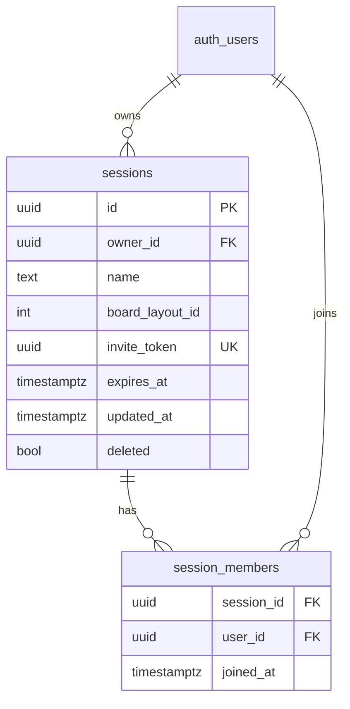

# Collaboration Sessions - Plan

**Product Contract preservation:** unchanged. All product decisions (R1–R19) are carried verbatim from the `ce-brainstorm` requirements pass; `ce-plan` added only the Planning Contract, KTDs, Implementation Units, Verification Contract, and Definition of Done. The four brainstorm Outstanding Questions were resolved as technical decisions (see Key Technical Decisions), not product changes.

## Goal Capsule

- **Objective.** Let a crew of climbers filter the catalog against *each other's* logbooks, so they can find problems that match a shared goal ("a project none of us has sent," "one Alice can coach me up"). Each person is on their own device with their own catalog view; the extended filters evaluate the ascent status of the other people invited to the session.
- **Product authority.** Product scope fixed in a grilling session (2026-07-07); enriched to implementation-ready by `ce-plan` (2026-07-07).
- **Open blockers.** None. Two prerequisites the brainstorm flagged (join-by-token RPC, status-projection RPC) are now scoped as U1.
- **Tier.** Safety-critical — creates `supabase/migrations/0007_collaboration_sessions.sql` and a cross-user data path. Plan test-first; migration/RLS/RPC units carry `Execution note` proof-first signals.

---

## Problem Frame

A real session with friends looks like this: Bob and Alice both want to work a boulder *neither has already sent*, so they can project it together. Today each filters their own catalog to "not sent," then cross-checks verbally — "have you done problem A?" — one problem at a time. It's slow and doesn't scale past two people or past the "not sent" case (they might instead want "both tried but not sent," or "one has sent so they can give beta").

The raw materials already exist: filter state is a serializable URL, problems have stable board-global IDs (`source_catalog_id`), ascent status is already a three-bucket concept (`sent / attempted / unlogged`), and a membership-based sharing substrate (`lists` / `invite_token` / `is_list_member()`) is the proven template. What's missing: (a) any way for one member to read another's send-set — `ascents` RLS is strictly owner-only (`supabase/migrations/0002_logbook_sync.sql`) — and (b) a session model plus the UI to group people and filter across their logbooks.

---

## Product Contract

### Actors

- **Session members** — signed-in users who joined the same session. Symmetric: everyone sees everyone. A member with zero ascents is valid (reads as `unlogged` everywhere).
- Signed-out / offline users browse the catalog as today but cannot start, join, or appear in a session.

### Core behavior

- **R1 — Session shape.** A session is an **ephemeral, join-by-link grouping of people**, scoped to **one board** (`board_layout_id`). Everyone keeps their own device and catalog view; the session only changes what the *filters* can target. Not a shared screen, not a friend graph, not a standing group. Backed by a real (reusable) row so a crew *can* be re-opened, but modeled as disposable.
- **R2 — N-person.** A session holds you plus any number who joined the link. Pairs are simply N=2. Soft cap ~8 (readability; not a hard limit).
- **R3 — Per-member status rows.** The catalog Filters sheet's "Ascent status" section grows **one row of `Sent / Attempted / Not logged` chips per member** — you at top, then each other member. Each row is an independent multiselect, reusing the existing chip component.
- **R4 — Combinator semantics.** **OR within a member's row**; **AND across member rows** (every *constrained* member must match); **an empty row = ignore** (that member does not participate). Worked example — "a project none of the three of us has done": set `Not logged` (or `{Not logged, Attempted}`) on all three rows → AND across → problems everyone is unsent on.
- **R5 — Your own status is member row #1.** When a session is active, your personal status filter *is* the top row of the same stack. No separate personal status control alongside it.
- **R6 — Live-ness: on-demand pull (v1).** Cross-member status refreshes on session open, pull-to-refresh, and app-foreground — **not** realtime. Staleness of seconds-to-minutes is acceptable (members are co-located). Realtime is explicit v2.

### Data sharing & privacy

- **R7 — Status-only projection.** The only cross-user data that crosses the wire is `{ source_catalog_id → status }` where status ∈ `{sent, attempted}` for the session's board. **No** comments, send dates, tries counts, grade votes, or stars.
- **R8 — Join = consent.** Joining consents to sharing that status projection with the other members, for that board, for the lifetime of membership. Stated plainly at join time. No per-problem opt-in, no separate friend approval. Leaving revokes it.
- **R9 — Honest visibility property.** Because filtering is client-side, a member can effectively see another member's *entire* sent/tried list for the board (not only aggregate matches). Accepted — it's what climbing partners tell each other out loud.
- **R10 — `ascents` RLS is not relaxed.** Cross-user reads go through a membership-gated `SECURITY DEFINER` projection RPC; the owner-only `ascents` policy stays intact.

### Membership lifecycle

- **R11 — Membership is global, persistent app state.** You stay joined as you navigate anywhere, close and reopen the app — until you explicitly exit or the session expires. **Leaving the catalog screen does *not* leave the session.**
- **R12 — Global session surface.** A **slim persistent pill in the app chrome**, on every route, tappable to a panel with roster, share link/QR, and **Leave**. Leave is one deliberate tap, never an accident of navigation.
- **R13 — In-context surface.** The catalog carries a richer session bar (name, avatars, Share, ⋯/Leave). Per-member filter rows live in the Filters sheet (R3).
- **R14 — Persist chip selections.** Per-member chip selections persist with the active session across navigation.
- **R15 — Invite & join.** Any member shares an invite link **and** a QR code. Open link → sign in if needed → member, landed in that board's catalog with the session active.
- **R16 — Leaving.** "Leave session" removes membership and stops sharing status **server-side immediately**; your row drops from each peer's stack on their next pull (foreground/refresh, or when their cached projection hits its max-age — KTD-5/KTD-12), not necessarily the same instant. Others continue.
- **R17 — Expiry.** Session persists while live, **auto-expires after 24h of inactivity**; owner may end it explicitly. Invite links die with the session.
- **R18 — Naming.** Auto-default name (e.g. "Mini 2025 · Jul 7"), renameable.
- **R19 — Roster.** Static member list (handle/initials; avatars deferred). Online-now presence is realtime → v2.

### Scope Boundaries

**Deferred for later (v2, per brainstorm):**
- Realtime cross-member updates and online-now presence.
- Shared problem list ("crew projects") — nearly free later since sessions are their own row, but not v1.
- Friend graph / standing groups.
- Multi-board sessions (one board per session; a second board = a second session).
- iOS (web PWA only).
- Member avatars (column reserved; upload pipeline deferred repo-wide).

**Outside this product's identity:**
- Any relaxation of `ascents` owner-only RLS. Cross-user reads are *always* the bounded projection RPC.

**Deferred to Follow-Up Work (plan-local):**
- Scheduled hard-delete sweep of expired sessions (e.g. `pg_cron`). v1 makes expired sessions inert via RPC guards; physical cleanup is a follow-up.
- `invite_token` **rotation** (regenerate the token to invalidate a leaked link while keeping the session). v1 revokes only by ending the session or owner-removing a member (KTD-11).

---

## Success Signals

- Three climbers land on a shared list of problems none of them has sent, in under a minute, with no verbal cross-checking.
- An empty row for a non-participating member leaves the others' results unchanged (no zero-result footgun).
- A member's comments, dates, and tries are never observable by another member — only sent/attempted status.
- Navigating out of and back into the catalog preserves both membership and per-member chip selections; only explicit Leave (or 24h expiry) ends membership.

---

## Planning Contract

### Consolidated Research

- **Backend template — collaborative lists** (`supabase/migrations/0003_collaborative_lists.sql`): the exact pattern to mirror. `invite_token uuid not null unique default gen_random_uuid()`; `is_list_member()` `SECURITY DEFINER … set search_path = '' … stable` with the `revoke all … from public; grant execute … to authenticated;` pair; `add_owner_as_member()` `SECURITY DEFINER` trigger to seat the creator (member tables have **no member-facing INSERT policy** — joins go only through a DEFINER RPC); RLS policy names are human sentences, all `to authenticated`, gated through the membership helper.
- **Privacy wall** (`supabase/migrations/0002_logbook_sync.sql`): `ascents` RLS is owner-only (quartet of `user_id = auth.uid()` policies). 0003's header is explicit that cross-user status must go through a minimal-projection DEFINER RPC, never by relaxing this wall. Shared `set_updated_at()` trigger + `deleted` tombstone are the sync spine (do not redefine `set_updated_at`).
- **Roster source** (`supabase/migrations/0001_profiles.sql`): `profiles` is world-readable to authenticated users (`for select … using (true)`); `{ id, handle, display_name, avatar_url }`. `delete_user()` shows the canonical DEFINER grant form; CASCADE FKs mean account-deletion needs no RPC change.
- **Migrations**: applied in filename order via dashboard SQL editor or `supabase db push` (`docs/social-accounts-login-SETUP.md`). No `config.toml`. `0003`–`0005` are reserved for the in-flight collaborative-lists branch (per `0006`'s header, and `0003`'s own references to its `0004` `join_list_by_token()` RPC) — claim the next free slot **`0007`** to avoid a merge collision. Every migration ends with an "Account deletion / Manual step" footer.
- **Client store template** (`web/src/lists/`): three-file split — `listsTypes.ts` (pure Row/domain types, `fromRow`, `LIST_COLUMNS` projection constant that **omits `invite_token`**, KTD-I10, never `select('*')`), `listsSync.ts` (IndexedDB + high-water-mark delta pull, `cacheGeneration` identity-switch guard, `clearListsCache` bumps generation first), `listsStore.ts` (module `state` + `Set` of listeners + `useSyncExternalStore`, optimistic CRUD with temp-id→server-row reconcile, `'offline'` status). Identity switch wired from `AuthProvider.onAuthStateChange` via `syncListsIdentity`.
- **RPC on the client**: one existing call — `AuthProvider.tsx` calls `client.rpc('delete_user')` (nullable-client guard, `{ error }` destructure, throw on error). Mirror that shape for the session RPCs. Client entry `web/src/supabase/client.ts` exports a nullable `supabase` (every store guards `if (!supabase)`).
- **Filter frontend** (`web/src/catalog/`): status chips are a `STATUS_KEYS.map(...)` block of shadcn `Toggle`s in `FilterControls.tsx` (~169-217), entangled in one flat row with global Benchmarks/Favorites/rating — must be extracted into a per-member section. `filters.ts` holds `FilterState.statusFilters: StatusKey[]`, the `matchesStatus(id, keys, sentIds, loggedIds)` predicate (already parameterized on a Set-pair → reusable per member), and the single `.filter()` pipeline (~150-171). `catalogSearch.ts` encodes `status` as a comma-joined URL param with default-stripping. `CatalogScreen.tsx` (~68-101) wires URL↔filters via `navigate({search, replace:true})`, derives self `sentIds`/`loggedIds` from the ascents store, and gates on `statusReady = signedIn && ascentsStatus === 'loaded'`.
- **App chrome**: `web/src/shell/AppLayout.tsx` wraps the root `<Outlet/>` (`router.tsx`), so a self-gating pill mounted in its header/banner stack (copy `BleBrowserBanner`'s `if (!condition) return null` shape) shows on every route. Catalog in-context bar mounts in `CatalogScreen.tsx` (~195) as a sibling of `UnaddedBoardBanner` above `<CatalogList>`.
- **Gaps (net-new)**: no batch profiles fetch (`.in('id', memberIds)` — only self today); no other-user ascents on the client (`useEnsureAscentsLoaded` is self+current-board only); no QR lib, no `navigator.share`/`clipboard` usage anywhere.

### Key Technical Decisions

- **KTD-1 — Dedicated `sessions` + `session_members` tables** (not a `kind` discriminator on `lists`). Confirmed with product owner. Clean separation keeps sessions out of the Saved Lists UI and the lists IndexedDB cache, and lets the schema carry `expires_at` and session-specific RPCs without conditionals bleeding through every lists query/policy/sync path.
- **KTD-2 — Cross-member reads via a `SECURITY DEFINER` projection RPC** (`session_member_ascents(session_id)`) returning **status-only** rows (`{ user_id, source_catalog_id, status }`, status ∈ `{sent, attempted}`) for the session's board, gated on caller membership. **The projection is a pure read — it performs no `UPDATE` and does not bump `expires_at`** (see KTD-6). `ascents` RLS is untouched (R10). Satisfies R7 by projecting, not by widening access.
- **KTD-3 — `join_session_by_token(token)` `SECURITY DEFINER` RPC is the only sanctioned membership INSERT.** `session_members` gets SELECT (roster, member-gated) + DELETE policies (self-leave, **and owner-removes-member** — see KTD-11) but **no INSERT policy** — mirroring the lists pattern. The creator is seated by an owner-seat trigger. The RPC validates the session is **live** (`deleted = false AND expires_at > now()`) before seating.
- **KTD-4 — Per-member session filter state lives in a session-local store, NOT the catalog URL.** Member user-ids are meaningless/leaky in a shareable deep-link and collide with the `status=''` default-stripping machinery. The existing single-user `?status=` param stays working for the no-session case; when a session is active, the per-member stack (including self, R5) is driven from the session store. **Persistence backing for R14 is explicit: `memberStatus` (`Record<userId, StatusKey[]>`) is written to `localStorage` keyed by session id and rehydrated on load in the same path as `activeSessionId`** — it is not left in volatile module state, or a reload silently resets every chip and the session clause becomes a no-op.
- **KTD-5 — No realtime.** The projection is pulled on session-open, app-foreground, and manual refresh (R6). Keeps v1 on the existing pull-on-load architecture; realtime is v2. **Consequence for revocation (R16):** peers hold a last-good projection map until their next pull, so a departed member stays filterable on a peer's device until that peer next foregrounds/refreshes. Bound this: the cached projection carries a **max-age (e.g. 5 min)** after which it is dropped even without a successful refetch, so the exposure window is bounded rather than unbounded-if-backgrounded (see KTD-12).
- **KTD-6 — Expiry model: `expires_at` bumped only on explicit intent, never on passive reads.** `expires_at timestamptz not null default now() + interval '24 hours'`; **`create` and `join` bump it inline; manual refresh and `rename` bump it via a dedicated member-gated `touch_session(session_id)` `SECURITY DEFINER` RPC (U1); the projection RPC does NOT** (KTD-2). The bump cannot be a direct client `UPDATE` — sessions RLS grants `UPDATE` to the owner only, so non-owner members must go through the `SECURITY DEFINER` `touch_session` path or their activity would never keep the session alive. Liveness = `deleted = false AND expires_at > now()`. Expiry is **per-session** — any member's explicit activity keeps the session alive for everyone (documented tradeoff: a still-active member can keep a quiet member exposed; the 24h backstop only fires once *all* members stop acting). If passive-foreground bumped expiry, a re-foregrounded PWA would reset the clock forever and the privacy backstop would never fire. Define the 24h interval once (a comment/constant) since it appears in the table default and each bumping RPC — divergence changes liveness semantics silently. Physical delete of expired rows is a deferred follow-up.
- **KTD-7 — Session client store mirrors the `web/src/lists/` conventions**: `web/src/sessions/` three-file split, `SESSION_COLUMNS` projection constant that **omits `invite_token`**, never `select('*')`, `cacheGeneration` identity-switch guard cleared on auth change. **invite_token retrieval carve-out (resolves the "no client path" gap):** `SESSION_COLUMNS` and the sync cache never carry `invite_token`; instead `createSession` returns it transiently via the insert's `RETURNING` (held in volatile store state, never written to IndexedDB), and a member-gated `session_invite_token(session_id)` `SECURITY DEFINER` RPC lets any current member re-fetch it on demand to build the share URL/QR. The secret still never lands in the cache.
- **KTD-8 — `supabase.rpc()` usage** mirrors the existing `AuthProvider.tsx` `client.rpc('delete_user')` call: nullable-client guard, `{ error }` (or `{ data, error }`) destructure, throw on error.
- **KTD-9 — Roster via a new batch `profiles.select(…).in('id', memberIds)` fetch.** Avatars are deferred repo-wide → rows render handle/initials. A roster placeholder (neutral initials/skeleton keyed by member count) shows while profiles load; raw user-ids are never rendered; a member whose profile row is missing falls back to deterministic initials.
- **KTD-10 — QR/share is greenfield.** Add a small self-contained QR library to `web/`; share via `navigator.share` with `navigator.clipboard.writeText` fallback.
- **KTD-11 — Revocation model.** The `invite_token` is a **bearer capability**: anyone holding the link/QR can join. v1 revocation paths are (a) **owner ends the session** (`deleted = true`) — which, with the KTD-2/KTD-6 liveness fix, immediately makes both RPCs refuse — and (b) an **owner-only "remove member"** `DELETE` policy on `session_members`. Self-leave (R16) revokes only the leaver's own sharing. **Token rotation** (regenerating `invite_token` to invalidate a leaked link while keeping the session) is a deferred follow-up. U9 documents the token as an unrevocable-except-by-ending bearer secret.
- **KTD-12 — Server is the authority on liveness; the client check is a soft hint.** The RPC's refusal is the single source of expiry truth. The client's `expires_at <= now()` comparison (used to drop the pill) is only a UI hint with a small skew margin, so a wrong device clock cannot authoritatively drop a still-live session or retain a server-expired one.

### High-Level Technical Design

**Data model (new tables, migration 0007):**



`ascents` and `profiles` are **read** by the RPCs/roster but are not modified and gain no new columns.

**Cross-member filter data path (the core flow):**

```mermaid
sequenceDiagram
    participant Dev as Bob's device
    participant Store as sessions store
    participant RPC as session_member_ascents() (DEFINER)
    participant DB as ascents (owner-only RLS)
    Dev->>Store: open session / foreground / pull-to-refresh
    Store->>RPC: rpc(session_id)
    RPC->>RPC: assert is_session_member(caller) && deleted=false && expires_at > now()
    RPC->>DB: read members' rows (runs as definer, board-scoped)
    RPC-->>Store: [{user_id, source_catalog_id, status}]  (status-only; pure read, no expiry bump)
    Store->>Store: seed per-member {sentIds, loggedIds} from roster, fill from rows
    Store-->>Dev: FilterContext per-member Set-pairs
    Note over Dev: predicate: members.every(m => keys[m]==∅ || matchesStatus(id, keys[m], sets[m]))
```

**Join flow:** open `/session/join/$token` → (if signed-out) sign-in gate → consent notice (R8) → `join_session_by_token(token)` → activate session in store → redirect into that board's catalog with the session bar live.

---

## Implementation Units

### U1. Migration `0007_collaboration_sessions.sql` — tables, RLS, helper, trigger, RPCs

- **Goal.** Create the entire backend substrate: `sessions` + `session_members` tables, the membership helper, owner-seat trigger, RLS policies, and all four RPCs (`join_session_by_token`, `session_member_ascents`, `session_invite_token`, `touch_session`).
- **Requirements.** R1, R2, R7, R8, R10, R15, R16, R17; KTD-1, KTD-2, KTD-3, KTD-6, KTD-7, KTD-11.
- **Dependencies.** None (foundation).
- **Files.** `supabase/migrations/0007_collaboration_sessions.sql` (new); `docs/social-accounts-login-SETUP.md` (add 0007 to the migration list).
- **Approach.**
  - **Tables.** `sessions` (`id` uuid PK `gen_random_uuid()`, `owner_id` → `auth.users` CASCADE, `name text not null default ''` with `constraint session_name_len check (char_length(name) <= 60)` (mirrors the lists `MAX_LIST_NAME` cap; the client also trims/caps — KTD is server-authoritative), `board_layout_id int not null default 7`, `invite_token uuid not null unique default gen_random_uuid()`, `expires_at timestamptz not null default now() + interval '24 hours'`, `created_at`, `updated_at`, `deleted`). `session_members` (composite PK `(session_id, user_id)`, both FK CASCADE, `joined_at`). Aligned-column house style, `comment on table`, indexes (`sessions_owner_idx`, member lookup), `set_updated_at` trigger on `sessions` (reuse existing function). Define the 24h interval once (a comment naming the canonical value) since the table default and each bumping RPC repeat it (KTD-6).
  - **Helper.** `is_session_member(s uuid, u uuid)` — `SECURITY DEFINER`, `set search_path = ''`, `stable`, schema-qualified, `revoke all … from public; grant execute … to authenticated;` (verbatim shape from `is_list_member`).
  - **Owner-seat trigger.** `add_owner_as_session_member()` `SECURITY DEFINER` after-insert on `sessions`, `on conflict do nothing`.
  - **RLS.** `sessions`: members read (`owner_id = auth.uid() or is_session_member(id, auth.uid())`), owner insert/update/delete. `session_members`: SELECT (member-gated roster) + **DELETE gated `user_id = auth.uid()` (self-leave) OR caller is the session owner (owner-removes-member, KTD-11)**. **No INSERT policy** (KTD-3).
  - **Liveness predicate (KTD-6):** `deleted = false AND expires_at > now()` — enforced by `join_session_by_token`, `session_member_ascents`, and `touch_session`. `session_invite_token` is **membership-gated only** (it asserts `is_session_member` without the liveness check), so a still-member can retrieve the share secret even for an ended session; that is harmless because `join_session_by_token` refuses the ended token (KTD-11).
  - **`join_session_by_token(token uuid)`** — `SECURITY DEFINER`, `set search_path = ''`: look up the session by token where it is **live**; insert `(session_id, auth.uid())` `on conflict do nothing`; **bump `expires_at = now() + interval '24 hours'`** (explicit intent); return the session row **excluding `invite_token`**. Raises on unknown/ended/expired token.
  - **`session_member_ascents(p_session_id uuid)`** — `SECURITY DEFINER`, `set search_path = ''`, `stable`, returns `table(user_id uuid, source_catalog_id text, status text)`: assert `is_session_member(p_session_id, auth.uid())` **AND the session is live** else raise; **LEFT JOIN** the session's members to `public.ascents` so **every member yields at least one row** — the ascent-side filters (`board_layout_id`, `deleted = false`, `source_catalog_id is not null`) apply to the joined ascent rows only, and a member with no matching ascents emits a single **marker row `(user_id, NULL, NULL)`**; project `status = case when sent then 'sent' else 'attempted' end` for real ascent rows — **never** comment/date/tries/grade/stars. **Pure read — no `expires_at` bump** (KTD-2/KTD-6). **Because every member appears in ≥1 row (real ascent rows or the `(user_id, NULL, NULL)` marker), this single RPC also carries the session's current member set** — so U3 seeds and U4 iterates one server-consistent membership snapshot from one call, preserving U3's single-atomic-readiness invariant and closing the split-snapshot window (a just-departed member is simply absent from the result) without a second RPC or a status-only-contract violation. Grant-pair to `authenticated`.
  - **`touch_session(p_session_id uuid)`** — `SECURITY DEFINER`, `set search_path = ''`: assert `is_session_member(p_session_id, auth.uid())` **AND the session is live** else raise; set `expires_at = now() + interval '24 hours'`. This is the sanctioned expiry-bump path for manual refresh and rename (KTD-6), since sessions RLS grants `UPDATE` to the owner only and members cannot bump directly. Grant-pair to `authenticated`.
  - **`session_invite_token(p_session_id uuid)`** — `SECURITY DEFINER`, `set search_path = ''`, `stable`, returns `uuid`: assert `is_session_member(p_session_id, auth.uid())` else raise; return the session's `invite_token`. This is the sanctioned client path to the share secret (KTD-7) — the token still never enters `SESSION_COLUMNS` or the cache. Grant-pair to `authenticated`.
  - Footer: account-deletion (CASCADE, no change) + manual-apply note.
- **Execution note.** Proof-first: write the RLS/RPC test scenarios (below) against a local/branch Supabase before wiring any client. The privacy assertions are the load-bearing correctness property.
- **Rollout ordering (safety-critical).** The migration must be applied and verified in the target Supabase project **before** the client bundle calling its RPCs is deployed. Migrations are applied manually (dashboard SQL editor / `supabase db push`), decoupled from the web deploy, so a client-first deploy makes every session RPC call error for real users.
- **Patterns to follow.** `supabase/migrations/0003_collaborative_lists.sql` (helper, trigger, no-INSERT-policy, grants), `0002` (`set_updated_at`, owner-only ascents it must not touch), `0001` (`delete_user` grant form).
- **Test scenarios.**
  - Non-member calling `session_member_ascents` for a session they're not in → raises / returns zero rows (never leaks).
  - Member calling it → returns exactly `{user_id, source_catalog_id, status}` for all members, board-scoped; **no** comment/date/tries columns present in the result type.
  - A member's `sent` row → `status='sent'`; a logged-but-unsent row → `status='attempted'`; an unlogged problem → absent (unlogged is inferred client-side by absence).
  - A member with **zero** matching ascents for the board appears as a single marker row `(user_id, NULL, NULL)` — present in the membership snapshot with no ascent data (this is what makes the snapshot carry every member without a second RPC).
  - Ascents for a *different* board are excluded.
  - `join_session_by_token` with a valid live token → seats caller, returns session row **without `invite_token`**, bumps `expires_at`.
  - `join_session_by_token` with an expired (`expires_at < now()`) or `deleted` session → raises, no membership row created.
  - Owner is auto-seated by the trigger (can read roster immediately).
  - `session_members` has no INSERT policy → a direct client `insert` is rejected by RLS; only the RPC seats members.
  - Leaving (`delete from session_members where user_id = auth.uid()`) succeeds for self; a non-owner deleting another user's row is rejected; the **session owner removing another member's row succeeds** (KTD-11).
  - **Owner-ended session** (`deleted = true`) with a still-future `expires_at` → both `session_member_ascents` and `join_session_by_token` refuse (liveness includes `deleted = false`). This is the load-bearing "end session actually stops sharing" test.
  - `session_member_ascents` performs **no write** — calling it does not change the session's `expires_at` (pure read; expiry only bumps on create/join/refresh/rename).
  - `touch_session` called by a live member bumps `expires_at` to `now() + interval '24 hours'`; a non-member call raises; a call against a `deleted`/expired session raises (liveness). This backs the KTD-6 "any member's explicit activity keeps the session alive" guarantee for non-owner members.
  - `session_invite_token` returns the token to a current member and **raises for a non-member**; the token never appears in a `SESSION_COLUMNS` select.
  - Inserting/updating a session `name` longer than the cap is rejected by the check constraint.
  - Account deletion cascades: deleting a user removes their owned sessions and memberships.
- **Verification.** All scenarios pass against a real Supabase instance; a manual `rpc('session_member_ascents')` as a non-member returns nothing; the returned payload inspected to confirm status-only projection.

### U2. Sessions client store — lifecycle, active-session pointer, identity guard

- **Goal.** A `web/src/sessions/` store owning the active session, membership lifecycle (create / join / leave / rename / refresh), and the persisted global active-session pointer (R11).
- **Requirements.** R1, R11, R14, R15, R16, R17, R18; KTD-4, KTD-7, KTD-8, KTD-12.
- **Dependencies.** U1.
- **Files.** `web/src/sessions/sessionsTypes.ts`, `web/src/sessions/sessionsStore.ts` (new); `web/src/sessions/sessionsStore.test.ts` (new); wire identity clear into `web/src/auth/AuthProvider.tsx`.
- **Approach.** Mirror `web/src/lists/` conventions. `sessionsTypes.ts`: pure `SessionRow`/`Session`/`SessionMember` types, `fromRow` mappers, and a `SESSION_COLUMNS` constant that **omits `invite_token`** (KTD-7); never `select('*')`. `sessionsStore.ts`: module `state` + `Set` of listeners + `useSyncExternalStore`; `activeSessionId` **and `memberStatus` (per-member chip selections) both persisted to `localStorage` keyed by session id, rehydrated on load** (KTD-4 — R14 covers reload, not just navigation); `createSession` (insert, optimistic, temp-id→server reconcile, sets active — **captures `invite_token` from the insert `RETURNING` into volatile state, never into `SESSION_COLUMNS`/cache**, KTD-7), `joinSession(token)` (calls `join_session_by_token` RPC — mirrors the `AuthProvider` `client.rpc` shape), `getInviteToken()` (calls `session_invite_token` RPC on demand for sharing, KTD-7), `leaveSession` (delete self membership, clear active, **and remove that session id's persisted `activeSessionId`/`memberStatus` from `localStorage`**, R16), `renameSession` (**trims/caps name to the server limit**, then calls `touch_session` to bump expiry — KTD-6), `refreshActiveSession` (re-fetch session + roster; on a *manual* refresh also call `touch_session` to bump expiry — KTD-6; drop active only as a soft client hint per KTD-12, letting the RPC refusal be authoritative). Roster fetched via batch `profiles.select(...).in('id', memberIds)` (KTD-9), with a **placeholder while it loads and never rendering raw user-ids**. Identity-switch clear (`clearSessionsCache` + `cacheGeneration`) wired from `AuthProvider.onAuthStateChange`, matching `syncListsIdentity`. On a detected session end/expiry, the same session-id-keyed `localStorage` entries (`activeSessionId`/`memberStatus`) are cleared so orphaned per-session chip maps do not accumulate (KTD-4). **Detection also runs locally on rehydrate/load: evaluate the cached `expires_at` against the client clock (KTD-12 hint + skew margin) without a fetch, so an offline or never-refetching client still retires an expired session (cleanup + pill-drop) instead of presenting it as active indefinitely.** Guard `if (!supabase)`.
- **Patterns to follow.** `web/src/lists/listsStore.ts` (optimistic CRUD, listener Set), `listsSync.ts` (identity generation guard), `listsTypes.ts` (column constant omitting the secret).
- **Test scenarios.**
  - `createSession` sets `activeSessionId`, reconciles temp id to server row, persists pointer across a simulated reload.
  - `joinSession(token)` on success activates the session; on RPC error (expired) surfaces error and leaves no active session.
  - `leaveSession` clears the active pointer and stops exposing the session.
  - `leaveSession` (and a detected end/expiry) removes the session id's `activeSessionId`/`memberStatus` from `localStorage` — no orphaned entries accumulate across many sessions (KTD-4).
  - `refreshActiveSession` (manual) and `renameSession` call `touch_session`, bumping `expires_at` (KTD-6).
  - On load with a cached `expires_at` already in the past, the session is retired locally (localStorage cleared, pill dropped) with no network fetch (offline path, KTD-12).
  - `refreshActiveSession` drops the active session when `expires_at <= now()`.
  - Auth identity switch clears the cache/pointer (generation bumped first); same-user restore preserves it.
  - Store no-ops gracefully when `supabase` is null (unconfigured build).
  - `SESSION_COLUMNS` never includes `invite_token` (asserted); `getInviteToken()` returns the token from the RPC and it is never written to persisted storage.
  - `memberStatus` survives a simulated reload: set chips, rehydrate, selections restored (R14 reload case, KTD-4).
  - `renameSession` trims and caps an over-long name before persisting.
- **Verification.** Hook renders active session reactively; join/leave round-trips against U1's RPCs; pointer survives reload.

### U3. Member-ascents projection store — per-member Set-pairs

- **Goal.** Fetch the status-only projection for the active session and expose per-member `{ sentIds, loggedIds }` Set-pairs, refreshed on open / foreground / manual pull (R6).
- **Requirements.** R6, R7, R9, R16; KTD-2, KTD-5, KTD-8, KTD-12.
- **Files.** `web/src/sessions/memberAscentsStore.ts` (new), `web/src/sessions/memberAscentsStore.test.ts` (new); foreground hook in `web/src/sessions/` or reuse an existing visibility listener.
- **Dependencies.** U1, U2.
- **Approach.** `fetchMemberAscents(sessionId)` calls `session_member_ascents` RPC and builds `Record<userId, { sentIds: Set, loggedIds: Set }>`. **Seed the map from the *server-consistent* membership snapshot returned by `session_member_ascents` (U1), not the separately-fetched roster: every member id gets an entry with empty Sets by default, then rows fill them** (a `sent` row → both sets; an `attempted` row → `loggedIds` only; a `(user_id, NULL, NULL)` marker row → member present with empty Sets, no id added), matching how `CatalogScreen` derives self Sets. This is load-bearing: `unlogged` is inferred by absence-of-rows, so a zero-ascent or fully-unlogged member arrives only as the `(user_id, NULL, NULL)` marker row — seeding keeps them present with empty Sets rather than silently missing, which would drop them from U4's `members.every(...)` and quietly widen results. Module store + `useSyncExternalStore`. Triggers: on active-session change, on `visibilitychange`→visible (foreground — a passive refetch that does NOT bump server expiry, KTD-6), and an exposed `refresh()` for manual refresh. **Single atomic readiness flag = "roster known AND projection fetch completed"** (member data arrives in one RPC, so there is no per-member partial-load state); U4/U5 gate on this one flag. **Cached map carries a max-age (KTD-5), enforced by BOTH a `setInterval` that re-evaluates the map's age and drops it when stale AND an age check on every read — so a continuously-foregrounded, never-refocused tab still drops the map at max-age even with no `visibilitychange`/refresh event and no successful refetch, bounding a departed member's residual exposure (R16).** Guard `if (!supabase)`.
- **Patterns to follow.** `CatalogScreen.tsx` self `sentIds`/`loggedIds` derivation; `web/src/lists/` store shape.
- **Test scenarios.**
  - Projection rows group correctly into per-member Set-pairs (`sent`→both sets, `attempted`→loggedIds only).
  - A member who returns **zero rows** (zero-ascent or fully unlogged) is present in the map with empty Sets — not absent — so a constrained `Not logged` row on them tightens the intersection instead of being skipped.
  - A member who left server-side but is momentarily still in the client's separately-fetched roster does **not** keep constraining results — seeding uses the server-consistent membership snapshot from `session_member_ascents`, so revocation is a single consistent snapshot (no split roster/projection window).
  - `refresh()` re-fetches and replaces the map.
  - Foreground (`visibilitychange`) triggers a refetch; backgrounding does not.
  - The cached map is dropped once it exceeds its max-age even without a successful refetch **and even on a foregrounded tab that never refocuses or refreshes** (timer-driven drop) (R16 bounded revocation).
  - RPC error leaves the last-good map (subject to max-age) and surfaces a non-fatal error state.
- **Verification.** Filtering a live 2-member session reflects the other member's real sends after a refresh.

### U4. Per-member filter model — `filters.ts` predicate

- **Goal.** Extend the filter model so status filtering is per-member (OR-within-row, AND-across-rows, empty-row = ignore), while the single-user `?status=` path keeps working when no session is active.
- **Requirements.** R3, R4, R5; KTD-4.
- **Dependencies.** U2 (member/id shape). **Not U3** — the predicate is pure logic over Set-pairs and its OR/AND/empty-row test table is written against synthetic Sets, so U4 can proceed in parallel with U3.
- **Files.** `web/src/catalog/filters.ts`, `web/src/catalog/filters.test.ts`.
- **Approach.** Add a session-scoped per-member selection shape (e.g. `memberStatus: Record<userId, StatusKey[]>`) carried in `FilterContext` alongside per-member Set-pairs `Record<userId, { sentIds, loggedIds }>` — **not** in `FilterState`/URL (KTD-4). Extend the status clause: when a session is active, iterate the members of the **server-consistent membership snapshot** (from U3, not a separately-fetched roster): `members.every(m => keys[m].length === 0 || matchesStatus(id, keys[m], sets[m].sentIds, sets[m].loggedIds))`. Because the Set-pair map is roster-seeded (U3), `sets[m]` is always defined for a rostered member — a zero-ascent member has empty Sets and correctly reads as unlogged-everywhere. Reuse `matchesStatus` unchanged (already Set-pair parameterized). When no session, the existing `s.statusFilters` self path runs untouched. Gate on the single atomic readiness flag from U3 (roster known AND projection fetched) — skip the whole session clause until then, so the list is never silently wrong mid-load.
- **Execution note.** Test-first — this predicate is the semantic heart (R4); write the OR/AND/empty-row table before implementing.
- **Patterns to follow.** Existing `matchesStatus` + the single `.filter()` pipeline in `filters.ts`.
- **Test scenarios.**
  - Two members both `Not logged` → only problems both are unlogged on (AND-across).
  - One member `{Attempted, Sent}` → matches problems that member has tried-or-sent (OR-within).
  - Empty row for a third member → that member ignored; results equal the two-member case.
  - All rows empty → session clause is a no-op (full list).
  - Asymmetric: `Alice: Sent`, `Me: Not logged` → problems Alice sent and I haven't (coach case).
  - Self row participates identically to other rows (R5).
  - No active session → behaves exactly as today's single-user `statusFilters`.
  - Member ascents not yet loaded → clause skipped, list not blanked.
- **Verification.** Predicate unit tests green; catalog count matches hand-computed intersections on seed data.

### U5. Per-member status rows in the Filters sheet UI

- **Goal.** Render one status chip-row per member in `FilterControls`, self at top, wired to the session-local per-member selections.
- **Requirements.** R3, R5, R13, R14.
- **Dependencies.** U2, U4.
- **Files.** `web/src/catalog/FilterControls.tsx`, a new `web/src/catalog/MemberStatusRow.tsx` (extracted chip-row), `web/src/catalog/FilterControls.test.tsx` (or existing).
- **Approach.** Extract the `STATUS_KEYS.map(...)` three-`Toggle` block + `toggleStatus` into `MemberStatusRow` (props: member label/initials, selected `StatusKey[]`, onToggle, plus a state flag). Pull status chips **out** of the shared flat "Filter" row (they're entangled with global Benchmarks/Favorites/rating) into their own "Ascent status" section. When a session is active, render one row per member (self first) driven by the session store; when no session, render the single self row backed by the existing URL `statusFilters` (unchanged behavior). The **set** of rendered member rows is keyed off the same server-consistent membership snapshot U4 iterates (from U3), **not** the lagging `profiles` roster fetch — the roster (KTD-9) supplies only display labels/initials — so the members shown and the members filtered are always the same set even while names load. **Four distinct row states, not one generic `disabled`:** (1) *loading* — while the projection is unready (U3 atomic flag), show the member label + a loading affordance (inline spinner or three skeleton chips, `aria-busy`), chips non-interactive; (2) *signed-out* — the existing disabled chips + "Sign in to filter by status" hint (unchanged); (3) *ready* — interactive chips; (4) *stale/error* — when the U3 projection fetch errors or the cached map is dropped by max-age, U4 stops applying the session clause and the list widens to the full catalog, so the section surfaces a non-blocking **"cross-member filtering paused — showing all problems; refresh to reapply"** affordance (tied to U7's refresh control) and keeps last-good chip selections. The copy must say filtering is *paused* (the list has stopped intersecting), not merely that status "may be out of date". The **self row is labeled "You"** and visually distinguished from member rows; **each row carries an accessible group name** (`aria-label`/`legend`) identifying whose status it is, so a screen reader announces the three chips as that member's. Selections persist via the session store (R14). Soft cap ~8 rows; on mobile the section scrolls within the sheet.
- **Patterns to follow.** Existing `FilterControls.tsx` Toggle block; `FilterSheet.tsx` gate threading (`statusReady`/`signedOut`).
- **Test scenarios.**
  - No session → exactly one self status row, behaving as today.
  - Active 3-member session → three rows, self labeled "You" and first.
  - Member ascents loading → rows show the loading affordance (`aria-busy`, non-interactive), visibly distinct from the signed-out disabled+hint state.
  - Projection error / max-age-dropped map → the section shows the "cross-member filtering paused — showing all" affordance and keeps last-good chip selections; the list widens to the full catalog (session clause off), matching the paused copy.
  - Each row exposes an accessible group name identifying the member.
  - Toggling a member chip updates that member's selection in the store and the visible filter result.
  - Signed-out → status section disabled with the existing sign-in hint.
  - Selections survive closing/reopening the sheet and navigating away and back (R14).
- **Verification.** Manual: open Filters in a live session, set per-member chips, see the list re-filter; selections persist across navigation.

### U6. Global session pill + panel in app chrome

- **Goal.** A slim persistent "in session" pill on every route, opening a panel with roster, share, and Leave (R12).
- **Requirements.** R11, R12, R16, R19.
- **Dependencies.** U2, U7 (consumes the shared `ShareSession` — see U7; the sessions module owns it, so no cycle).
- **Files.** `web/src/shell/SessionPill.tsx` (new), `web/src/shell/AppLayout.tsx` (mount it).
- **Approach.** Self-gating component (`if (!activeSession) return null`) reading the sessions store, mounted in `AppLayout`'s header/banner stack so it renders outside `<Outlet/>` on every route. **Pill suppresses itself on the catalog route** where U7's richer in-context session bar already shows (avoids two concurrent "you're in a session" controls with duplicate Leave/Share on the feature's most-used screen); it shows on all other routes (logbook, settings, board list, etc.). Pill shows name + member count; tap opens a panel (shadcn Drawer/Popover) with the roster (handle/initials with the loading placeholder, R19/KTD-9), the shared **`ShareSession`** affordance, and **Leave** (one deliberate tap → `leaveSession`, R16). **When the current user is the session owner, each *other* roster row carries a "remove" control (owner-removes-member, KTD-11) → the owner-only `session_members` DELETE policy; this is the UI consumer that keeps that policy from being dead backend surface. It ejects a currently-unwanted member from the roster; it does **not** revoke a leaked invite link — the token is unchanged and the removed holder can rejoin with the same link until the session is ended (or, in v2, the token is rotated). The leaked-link remedy remains end-session.** Drops itself when the store marks the session expired (soft hint, KTD-12).
- **Patterns to follow.** `web/src/shell/BleBrowserBanner.tsx` (self-gating chrome), `AccountMenu` placement in `AppLayout`.
- **Test scenarios.**
  - No active session → pill renders nothing.
  - Active session → pill visible on logbook and settings routes; **hidden on the catalog route** (session bar owns that surface).
  - Leave from the panel clears the session and hides the pill everywhere.
  - Owner sees a "remove" control on each other member's roster row; a non-owner sees none; removing drops that member server-side (owner-removes-member, KTD-11).
  - Expired session → pill disappears on next refresh.
- **Verification.** Manual: join a session, confirm the pill follows across routes and Leave works from any screen.

### U7. Session bar, start-session, share link + QR

- **Goal.** The in-context catalog session bar, the "Start session" affordance, and the share surface (link + QR).
- **Requirements.** R6, R13, R15, R18; KTD-7, KTD-10.
- **Dependencies.** U2. (**Not U6** — `ShareSession` lives in the sessions module and is consumed by both U6 and U7, so there is no cycle.)
- **Files.** `web/src/catalog/SessionBar.tsx` (new), `web/src/sessions/ShareSession.tsx` (new, owned here, consumed by U6), `web/src/catalog/CatalogScreen.tsx` (mount the bar), `web/package.json` (add a self-contained QR library).
- **Approach.** `SessionBar` mounts in `CatalogScreen` (~line 195, sibling of `UnaddedBoardBanner`, above `CatalogList`): name (rename inline, R18), member avatars/initials (with roster placeholder), Share, a **manual refresh control** (R6 — since PWA pull-to-refresh isn't a native gesture, expose an explicit refresh button that calls the U3 `refresh()` and shows an in-progress spinner), and ⋯/Leave. "Start session" affordance (when none active) creates a session for the current board and opens Share. `ShareSession`: get the `invite_token` via `getInviteToken()` (the `session_invite_token` RPC, KTD-7 — never from cache), build the join URL, render a QR via the new lib, and a Copy/Share button (`navigator.share` → `navigator.clipboard.writeText` fallback, KTD-10). **Defined states:** copy-success confirmation on the clipboard-fallback path (transient "Copied" / toast, since silent copy reads as failure); QR render failure → fall back to showing the copyable text link. **Start session:** idle → pending (spinner, disabled) → success (Share opens) → error (inline "couldn't start — retry"), guarding against a double-tap creating duplicate sessions. **Inline rename (R18):** tap-to-edit seeded with the current name, commit on blur/Enter, cancel on Escape, a hard `maxLength` of 60 so the cap is visible rather than a silent post-hoc trim, empty → falls back to the auto-default. **ShareSession token fetch:** loading skeleton while `getInviteToken()` resolves and an error/retry state — without the token neither the QR nor the copyable link exists, so the QR-fail→text-link fallback is conditional on the token having loaded.
- **Patterns to follow.** `UnaddedBoardBanner` (in-context catalog banner), `web/src/lists/` for store calls.
- **Test scenarios.**
  - Start session on a board → creates a session carrying that `board_layout_id`, opens Share.
  - Share renders a scannable QR encoding the join URL and copies the link; the clipboard-fallback path shows a copy-success confirmation.
  - QR generation failure → the copyable text link is shown instead (no dead Share sheet).
  - Manual refresh control triggers a projection refetch and shows an in-progress state (R6).
  - Rename updates the name in the bar, pill, and roster.
  - Bar shows all members; reflects a member leaving.
  - `invite_token` is fetched on demand via `getInviteToken()` and never persisted to IndexedDB.
- **Verification.** Manual: start a session, scan the QR on a second device, confirm it opens the join route.

### U8. Join-by-link route + consent flow

- **Goal.** A `/session/join/$token` route that signs the user in if needed, shows the consent notice, joins, and lands them in the board's catalog with the session active.
- **Requirements.** R8, R15; KTD-3.
- **Dependencies.** U2, U7.
- **Files.** join route registered in `web/src/router.tsx` via a `createRoute({ path: '/session/join/$token' })` call inside `buildRouteTree()` and added to `rootRoute.addChildren` (the router is **code-based** — there is no `web/src/routes/` file-route directory, so a file there would never register), `web/src/sessions/JoinSession.tsx` (new).
- **Approach.** Route reads the `$token`. If signed-out → sign-in gate (existing auth UI). **Returning to the join route after auth is net-new work, not an existing `AppLayout` behavior:** persist the pending `$token` (and intended route) before sign-in and resume it on the `AuthProvider` auth event (`INITIAL_SESSION`/`onAuthStateChange`), or pass the join URL as the OAuth `redirectTo` — today `signInWithOAuth` uses `window.location.origin`, which drops the user at `/` and abandons the join. Without this the invitee never completes R15. Show the **consent notice**, worded to match R9's honest-visibility property — not just filter-level: e.g. "While you're in this session, the other members can see which problems you've **sent or tried** on this board (your comments, dates, and attempts stay private)." On accept → `joinSession(token)` (U2 → `join_session_by_token` RPC); on success activate and `navigate` to that board's catalog (`/board/$layoutId/catalog`) with the session live. **Onward actions on the unhappy paths:** decline → no join, route to that board's catalog (or back); expired/invalid/ended token → a clear "session expired or not found" state with a button to go to the board catalog (never a dead-end).
- **Patterns to follow.** `router.tsx` route definitions (`createRoute` in `buildRouteTree()`); `AuthProvider` sign-in flow and `onAuthStateChange` events (for pending-token resume — there is no existing `AppLayout` post-auth redirect to reuse).
- **Test scenarios.**
  - Signed-in valid token → consent → joined → landed in the correct board's catalog with the session active.
  - Signed-out → sign-in → returns to the join route → completes join.
  - Expired/invalid token → friendly failure, no membership created.
  - Declining consent → not joined, no membership row.
  - Already a member re-opening the link → idempotent (no duplicate), lands in catalog.
- **Verification.** End-to-end on two devices: device A shares, device B (signed-out) opens the link, signs in, consents, and joins.

### U9. Subsystem docs

- **Goal.** Document the collaboration-sessions subsystem and update the doc index and setup guide.
- **Requirements.** Doc discipline (CLAUDE.md: subsystem behavior change → update its `docs/` file same commit).
- **Dependencies.** U1–U8.
- **Files.** `docs/collaboration-sessions.md` (new), `docs/README.md` (index entry), `docs/social-accounts-login-SETUP.md` (0007 migration step — if not already added in U1), and a `CONCEPTS.md` entry **only if that file exists**.
- **Approach.** Describe the session model, the privacy boundary (status-only projection, owner-only `ascents` untouched), the four RPCs (`join_session_by_token`, `session_member_ascents`, `session_invite_token`, `touch_session`) and the liveness predicate (`deleted = false AND expires_at > now()`) enforced by all except the membership-only `session_invite_token`, the client store shape, and the v1/v2 boundary. **Document the security posture explicitly:** `invite_token` is a bearer capability revocable only by ending the session (`deleted = true`) or owner-removing a member — token rotation is a deferred follow-up; expiry is per-session and only bumps on explicit intent, so an active crew must Leave/end to stop sharing; a departed member's residual exposure on peers is bounded by the projection max-age. Link from `docs/README.md`.
- **Test scenarios.** `Test expectation: none — documentation only.`
- **Verification.** Links resolve; the privacy contract and RPC surface are accurately described.

---

## Verification Contract

- **Privacy (load-bearing).** A non-member cannot obtain any member's status via the RPC; the projection payload contains only `{user_id, source_catalog_id, status}` — no comments, dates, tries, grades, or stars. `ascents` RLS remains owner-only (no new cross-user SELECT policy).
- **Combinator correctness.** The per-member predicate satisfies OR-within-row, AND-across-rows, empty-row-ignored on the U4 test table and against seed data.
- **Lifecycle.** Join-by-link (incl. signed-out → sign-in → consent) seats a member; Leave revokes the leaver's sharing; **owner-end (`deleted = true`) immediately makes both RPCs refuse** (end-session actually stops sharing); an owner can remove a member; membership and per-member chip selections persist across navigation **and reload**; expiry only bumps on explicit intent, so the 24h backstop can actually fire; a departed member's residual exposure on peers is bounded by the projection max-age.
- **No-crash / no-silent-widening.** A zero-ascent or fully-unlogged member is roster-seeded with empty Sets — never `undefined`, never dropped from the AND-across predicate.
- **Gates.** `web/` typecheck + lint pass; new store/predicate unit tests green; migration applies cleanly on a fresh Supabase (`supabase db push`) and the RLS/RPC scenarios in U1 pass. The migration is applied and verified in the target Supabase project **before** the client calling its RPCs is deployed (rollout ordering, U1).

## Definition of Done

- All U1–U9 units complete with their test scenarios satisfied and the Verification Contract met.
- A crew of ≥2 signed-in users can start/join a board-scoped session by link/QR, filter the catalog with per-member status rows, and reach a shared match list — with only status crossing the wire.
- Membership is global and persists across navigation/reload; the global pill exposes Leave from any route; sessions auto-expire after 24h inactivity.
- `docs/collaboration-sessions.md` exists and is linked from `docs/README.md`; the migration is listed in the setup guide.
- No regression to the signed-out/offline catalog or the existing single-user status filter.
