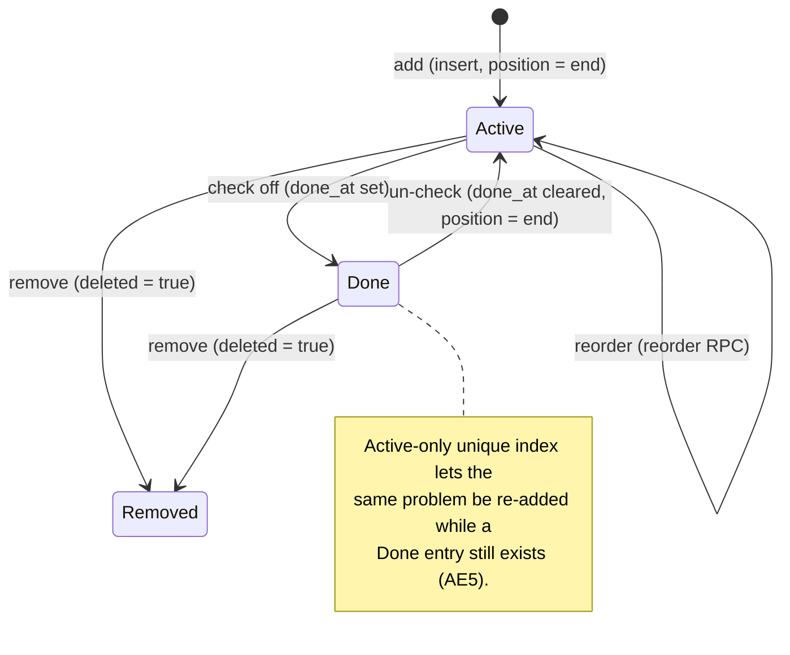
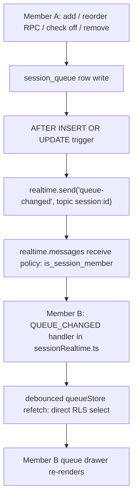

# Session Playlist Queue - Plan

## Goal Capsule

- **Objective:** Add a shared, ordered queue of problems inside a collab session, so climbs the crew decides to try aren't forgotten by the third attempt.
- **Authority:** Product Contract (R1–R11) is fixed. Planning Contract and Implementation Units are the HOW and may adapt during execution as long as the Product Contract holds.
- **Execution profile:** Deep, **safety-critical** — creates `supabase/migrations/0015_session_queue.sql` (a new cross-user data path). Plan the migration test-first at max effort; migration review is mandatory.
- **Stop conditions:** Surface a blocker instead of guessing if implementation would change product scope, relax the session-membership access boundary, or touch how `ascents`/sessions are recorded.
- **Tail:** Update `docs/collaboration-sessions.md` in the same change (queue subsystem + the KTD8 future-hard-delete dependency).

---

## Product Contract

*Product Contract preserved from the brainstorm. OQ1/OQ2/OQ3 are now resolved into Key Decisions (KTD2, KTD3, KTD9); R5 and R8 updated from open-question pointers to their resolutions. No product-scope change.*

### Summary

A shared queue lives inside an existing collab session. Any member can add a problem, reorder the list, and check items off; tapping an item opens its problem detail. Changes broadcast to the other members in real time over the session's existing channel. The queue is the crew's short-term memory for "what's next" — it does not replace the session's record of what got sent.

### Problem Frame

Deciding what to climb next is a verbal, in-the-moment thing. Two people browse the catalog between burns — one wants A then B, the other wants C then D — and they start on A. After a few attempts someone sends it and the group moves on, and by the third climb the earlier intentions have evaporated. D never gets tried, not because anyone changed their mind but because nobody was holding the list. Today the session tracks results (who sent what) but not intent (what we said we'd try), so that intent survives only as long as someone remembers it.

### Actors

- A1. **Session member** — any authenticated user who has joined the session. All members have identical queue rights: add, reorder, remove, check off. Roles are symmetric; the existing owner-only power (ending the session) is unchanged and out of scope.

### Requirements

**Queue contents and order**

- R1. A session has exactly one queue: an ordered list of problems referencing catalog problems on the session's board layout.
- R2. Any member can add a problem to the queue; a newly added problem appears at the end of the active order.
- R3. Any member can reorder the queue; the new order is the shared order for all members.
- R4. Any member can remove any item from the queue.
- R5. A problem can appear at most once as an *active* item. Re-adding a problem that is currently active is rejected; re-adding one that was checked off is allowed (see KTD2).

**Item lifecycle**

- R6. Any member can check off (mark done) any active item, and un-check it back to active. Check-off is the only non-removal way an item leaves the active list.
- R7. When a member logs a send of a queued problem during the session, that item displays a sent indicator identifying the sender. The item is not removed, reordered, or checked off as a result.
- R8. Checked-off items are retained in a "Done" group for the life of the session; they are not deleted on check-off.

**Navigation**

- R9. Tapping a queue item opens that problem's existing problem-detail view. Opening does not light the board; the existing manual lightbulb action is unaffected.

**Realtime collaboration**

- R10. Queue changes (add, reorder, remove, check-off) made by one member become visible to the other members without a manual refresh, using the session's existing realtime channel.
- R11. Queue state is scoped to the session and readable only by its members; the same access boundary that governs session membership governs the queue.

### Key Flows

- F1. **Add a problem.** **Trigger:** a member, in an active session, adds a problem from the open problem detail or by swiping a catalog row. **Steps:** the problem appends to the shared queue → other members see it appear in real time. **Covered by:** R2, R10, R11.
- F2. **Try the next climb.** **Trigger:** the crew finishes one problem and opens the queue. **Steps:** a member taps a queue item → the queue drawer closes and problem detail opens → the member taps the lightbulb to light the board → the crew attempts it. **Covered by:** R9.
- F3. **Send while queued.** **Trigger:** a member sends a problem currently in the queue. **Steps:** the send is logged as today → the queue item shows a sent indicator → the item stays put → a member later checks it off. **Covered by:** R6, R7, R10.
- F4. **Curate mid-session.** **Trigger:** plans change. **Steps:** a member reorders (drag handle) or removes items → other members see the update in real time. **Covered by:** R3, R4, R10.

### Acceptance Examples

- AE1. **Sent does not remove.** **Given** problem X is in the queue, **when** a member logs a send of X, **then** X remains in the active list with a sent indicator until a member checks it off. **Covers R6, R7.**
- AE2. **Check-off without a send.** **Given** the crew tried problem Y and is giving up, **when** a member checks Y off, **then** Y moves to the Done group even though no one sent it. **Covers R6, R8.**
- AE3. **Shared order is authoritative.** **Given** member M reorders the queue, **when** member N looks at the queue, **then** N sees M's order without refreshing. **Covers R3, R10.**
- AE4. **Open is not light.** **Given** a member taps a queue item, **when** problem detail opens, **then** the board is not lit until the member taps the lightbulb. **Covers R9.**
- AE5. **Re-queue after done.** **Given** problem Z is in the Done group, **when** a member adds Z again, **then** Z appears as a fresh active item while its Done-group entry remains. **Covers R5, R8.**

### Scope Boundaries

**Deferred for later**

- Sessions logbook / post-session history. Queue rows persist with the session row (KTD8), so the logbook can later read them; no history view is built here.
- Seeding the queue from a saved or collaborative list.
- Multi-day-ahead planning, bounded by the existing 24h-idle session lifetime.
- Drag-to-reorder is built (U5), but no cross-device drag animation polish beyond a working reorder.

**Outside this feature**

- iOS. Collab sessions are web-only; the queue is web-only and adds no iOS surface.
- Any change to session creation/end/expiry or to how sends/ascents are recorded.

### Dependencies / Assumptions

- Builds on the shipped collab-session substrate: `sessions` / `session_members` (`supabase/migrations/0007_collaboration_sessions.sql`), the `is_session_member` helper, and the private `session:<id>` Supabase Broadcast channel with server-side triggers (`0012`–`0014`) plus the `web/src/sessions/sessionRealtime.ts` subscriber.
- Assumes the queue's access boundary mirrors session membership (members-only read/write), consistent with how session data is gated today.
- No local Supabase; RLS/RPC changes are tested via throwaway Postgres (`supabase/migrations/tests/`, `tests/stub_realtime.sql`).

---

## Planning Contract

### Key Technical Decisions

- KTD1. **New `session_queue` table modeled on `list_problems`.** Columns mirror `list_problems` (`id`, `source_catalog_id`, `board_layout_id`, `added_by` on-delete-set-null, `created_at`/`updated_at`, `deleted`) plus a `session_id` FK, a `position` int for ordering, and lifecycle columns `done_at` / `done_by`. RLS routes through the existing `public.is_session_member(session_id, auth.uid())` helper (the recursion-safe `SECURITY DEFINER` idiom from `0007`). Attribution columns are pinned server-side: `added_by` is set on INSERT (`WITH CHECK added_by = auth.uid()`) and immutable on UPDATE; `done_by` is set to `auth.uid()` at check-off rather than accepted from the client, so a member cannot spoof who added or checked off an item.

- KTD2. **Item lifecycle: active / done / removed, with active-only uniqueness (R5, R8).** A row is *active* (`done_at IS NULL`, `deleted = false`), *done* (`done_at` set, `deleted = false`, shown in the Done group), or *removed* (`deleted = true`, soft-delete via UPDATE, no DELETE policy — mirrors `list_problems`). The partial unique index is scoped to active rows: `(session_id, source_catalog_id) WHERE deleted = false AND done_at IS NULL`. Consequence, accepted: a checked-off problem can be re-added as a fresh active item and then appears in both the Done group and the active list at once (AE5). **Un-check in the AE5 state:** un-checking a Done row whose problem is already active would create a second active row and hit the partial-unique `23505`. Resolution: `unCheck` catches `23505` (like `addProblem`) and treats it as a no-op — the problem is already active, so the Done row simply stays done and the UI surfaces "already in the queue." U2 carries a test for this.

- KTD3. **Ordering is an integer `position` among active rows; reorder is one atomic, session-scoped RPC.** `reorder_session_queue(p_session_id uuid, p_ordered_ids uuid[])` (`SECURITY DEFINER`) checks the caller is a member of `p_session_id` **and** constrains its position rewrite to `WHERE session_id = p_session_id AND id = ANY(p_ordered_ids)` — ids belonging to another session are ignored, never written (see the security rationale in KTD3a). It rewrites the matched positions in a single transaction (returns void; the store reconciles via optimistic update + refetch). Add, check-off, un-check, and remove stay direct single-row RLS writes. **Deterministic total order:** every active read uses `ORDER BY position, created_at, id`, so an interleaved add (which writes `max(position)+1` outside the reorder transaction and can momentarily collide with a renumbered row) still resolves to one identical order on every client — without the tiebreak, AE3 ("shared order is authoritative") would be violated by a transient position collision. Concurrent reorders are last-write-wins; the realtime refetch reconciles. *Fractional / gapped ranking (LexoRank-style) was considered and rejected: it makes a single move one row-write instead of a renumber, but for a handful of items the renumber + a deterministic tiebreak is simpler and avoids rebalancing logic.*

- KTD3a. **The reorder RPC's session scoping is a security boundary, not a convenience.** A `SECURITY DEFINER` RPC bypasses RLS, so checking only the *caller's* membership is insufficient: a member of session A passing row ids from session B would otherwise scramble B's order (a cross-session write past R11, and a DoS on another crew's queue). Scoping the UPDATE to `session_id = p_session_id` is what closes that hole; U1 carries a test that a member of A calling reorder with B's ids leaves B unchanged.

- KTD4. **Realtime: a data-free `queue-changed` broadcast, simpler than the ascents trigger.** An `AFTER INSERT OR UPDATE` per-row trigger on `session_queue` calls `realtime.send(event => 'queue-changed', topic => 'session:' || new.session_id, private => true)`. Because each row carries its own `session_id`, the emit helper broadcasts directly — no "loop over live sessions" step that `0012` needed for `ascents`. It reuses the existing `realtime.messages` receive policy unchanged (no new policy, like `0013`/`0014`). The client adds a `QUEUE_CHANGED` handler in `sessionRealtime.ts` that debounce-refetches the queue store — the broadcast carries no queue data. *Postgres-changes (WAL replication) was considered as the alternative: KTD5 drops the privacy constraint that forced broadcast for `ascents`, so member-readable queue rows would qualify, and its at-least-once delivery would self-heal a dropped nudge. Rejected to keep one realtime mechanism in the app (broadcast, per `0012`–`0014`); the dropped-nudge staleness that postgres-changes would have solved is instead closed by the reconcile triggers in KTD5.*

- KTD5. **Reads via direct RLS-gated `select`; no read RPC; no offline layer; explicit reconcile triggers.** Queue data has no cross-user privacy constraint (unlike owner-only `ascents`, which forced the `session_member_ascents` projection RPC), so reads and writes go direct through RLS like `list_problems`. No IndexedDB cache and no offline mutation queue: the queue is live-pull best-effort. Because Supabase Broadcast is best-effort with no replay, a dropped `queue-changed` nudge must not strand a stale queue — so the queue store refetches on the same non-realtime triggers `memberAscentsStore` uses: active-session change, `visibilitychange → visible` (foreground), and realtime reconnect. These are specified in U2/U3, not merely asserted. A dead-zone shows a stale queue and blocks a write until signal returns; the next foreground or reconnect reconciles.

- KTD6. **Sent-marker is pure reuse (R7).** The indicator reads the existing `memberAscentsStore` `sentIds` via `useMemberSenders` (`buildSenders`, keyed on `source_catalog_id`). No new data path and no coupling to check-off.

- KTD7. **Two hand-rolled touch gestures on the `usePullToRefresh` idiom, with a pointer/keyboard fallback for reorder.** No swipe/drag library exists (Base UI provides only the drawer's own swipe-to-dismiss). Catalog-row swipe-left-to-queue (U7) and drawer drag-to-reorder (U5) are built on the raw `touchstart/touchmove/touchend` + threshold pattern in `web/src/catalog/usePullToRefresh.ts`, each isolated in its own hook and unit. Both must disambiguate from vertical scroll, the existing pull-to-refresh, and tap-to-open. Because this is a PWA also used on desktop/pointer and by keyboard/AT users, the gestures are the *touch* affordance, not the only one: reorder also exposes up/down move controls on each row (wired to the same reorder RPC), so R3 is reachable without touch. Add already has a non-gesture path (U6's button), so the swipe is purely additive and needs no separate fallback.

- KTD8. **`session_id` FK uses `ON DELETE CASCADE`; a future hard-delete sweep is a flagged dependency.** Cascade matches `list_problems` and never fires today (sessions are only ever soft-deleted; expiry makes them inert but rows persist), so queue rows survive to seed the future logbook. If the deferred v2 "scheduled hard-delete sweep of expired sessions" (`docs/collaboration-sessions.md`) ever ships, it must preserve or relocate queue rows first — otherwise the cascade wipes the logbook history. Recorded in Risks & Dependencies.

- KTD9. **Tap-to-open closes the queue drawer, then opens problem detail via a shared navigation path (R9).** Tapping a queue item closes the queue drawer and opens `ProblemDetail`; the lightbulb stays a manual tap. One drawer at a time — avoids stacking two Base UI drawers (focus-trap, scroll-lock, swipe-dismiss conflicts). `useProblemDrawer.openProblem` is instantiated locally inside `CatalogScreen`/`LogbookScreen` and is not reachable from the queue drawer's entry points, and `SessionPill` renders on non-catalog routes where no `ProblemDetail` is mounted. Resolution: open the problem by navigating to the board catalog route with the `?problem=<source_catalog_id>` search param (the same history-integrated drawer, driven via the router rather than a screen-local callback). From `SessionBar` (already on the board catalog) this is a same-route search update; from `SessionPill` on another route it navigates to the session's board first, then opens the problem. U4 names the shared navigation as the mechanism.

### High-Level Technical Design

Item lifecycle (positions apply to active rows only; Done rows ordered by `done_at`):

Write → broadcast → co-member refetch (a reorder is N position writes in one RPC transaction; the per-row trigger fires N times, coalesced by the client's debounced refetch):

### Sequencing

Migration first (everything depends on the table/RLS/RPC/trigger), then the store, then the realtime wiring and UI surfaces in parallel, with drag-reorder layered onto the drawer.

---

## Implementation Units

### U1. Migration `0015_session_queue`: table, RLS, reorder RPC, broadcast trigger

- **Goal:** Persist the queue with member-scoped RLS, atomic reorder, and a realtime `queue-changed` nudge.
- **Requirements:** R1, R2, R3, R4, R5, R6, R8, R10, R11; A1.
- **Dependencies:** none.
- **Files:** `supabase/migrations/0015_session_queue.sql`; `supabase/migrations/tests/0015_session_queue_test.sql` (throwaway-Postgres RLS/RPC test, mirroring existing `tests/` + `tests/stub_realtime.sql`).
- **Approach:** Follow the `0007` structure order — table → `is_session_member` reuse → RLS → RPC → trigger. Table per KTD1 with the active-only partial unique index (KTD2). RLS quartet: SELECT/INSERT (`with check (added_by = auth.uid())` and member) / UPDATE member-gated (covers reorder, check-off, un-check, soft-remove) with `added_by` immutable and `done_by` pinned server-side per KTD1; **no DELETE policy**. `reorder_session_queue` per KTD3/KTD3a (`SECURITY DEFINER`, `set search_path = ''`, membership guard on `p_session_id`, position rewrite constrained to `where session_id = p_session_id and id = any(p_ordered_ids)`, single transaction, returns void; `revoke all ... from public; grant execute ... to authenticated`). Trigger + emit helper per KTD4, reusing the existing `realtime.messages` policy (do not add a new receive policy). `session_id ... references public.sessions(id) on delete cascade` (KTD8).
- **Execution note:** Safety-critical migration — write the RLS/RPC test first, run at max effort. No local Supabase; validate via throwaway Postgres. Seed **two** sessions in the test fixture so cross-session isolation (not just member-vs-non-member) can be asserted.
- **Patterns to follow:** `supabase/migrations/0003_collaborative_lists.sql` (`list_problems` shape, partial unique, soft-delete-no-DELETE-policy); `0007_collaboration_sessions.sql` (`is_session_member`, RLS quartet, owner-guarded RPC); `0012`–`0014` (`realtime.send` idiom, `realtime.messages` policy).
- **Test scenarios:**
  - A member can INSERT, SELECT, UPDATE (reorder/check-off/soft-remove) their session's queue rows; a non-member is denied all four. Covers R11.
  - Active-only partial unique: inserting a second *active* row for the same `(session_id, source_catalog_id)` raises `23505`; inserting one when only a *done* or *removed* row exists succeeds. Covers R5 / AE5.
  - `reorder_session_queue` rewrites positions atomically and rejects a caller who is not a member of `p_session_id`. Covers R3.
  - **Cross-session isolation:** a member of session A calling `reorder_session_queue(p_session_id => A, p_ordered_ids => [ids from session B])` leaves session B's positions unchanged. Covers R11 / KTD3a.
  - **Attribution pinning:** a member's INSERT with a forged `added_by`, and an UPDATE attempting to change `added_by` or set a foreign `done_by`, are rejected or overwritten server-side. Covers KTD1.
  - The `queue-changed` trigger emits one broadcast per affected row on the correct `session:<id>` topic (assert against the realtime stub). Covers R10.
- **Verification:** RLS/RPC test suite passes against throwaway Postgres; policies deny non-members; reorder is atomic, session-scoped, and membership-guarded; attribution columns are server-authoritative.

### U2. Queue client store

- **Goal:** A module store exposing the queue and its mutations to React.
- **Requirements:** R2, R3, R4, R5, R6, R8.
- **Dependencies:** U1.
- **Files:** `web/src/sessions/queueStore.ts`, `web/src/sessions/queueTypes.ts`, `web/src/sessions/queueStore.test.ts`.
- **Approach:** Mirror `web/src/sessions/sessionsStore.ts` — module-level state + listener `Set` + `useSyncExternalStore`, `if (!supabase)` guard, snake↔camel row mapping, generation counter for session switch. `fetchQueue` = direct RLS `select` with `ORDER BY position, created_at, id` (deterministic total order per KTD3); split into `activeItems` (`done_at IS NULL`) and `doneItems` (`done_at` set, ordered by `done_at`). Expose `refreshQueue` — the public debounced refetch wrapping `fetchQueue` that U3 nudges and the reconcile triggers call. `addProblem` = insert at `max(position)+1`; on `23505` treat as already-active (no-op). `checkOff` = UPDATE `done_at = now()`; `unCheck` = UPDATE `done_at = null`, `position` = end, **catching `23505`** (AE5 state: problem already active) and surfacing "already in the queue" instead of throwing (KTD2). `removeItem` = soft-delete UPDATE; optimistic with rollback (mirror `listsStore` add/remove). `reorder` = optimistically apply the new order, call the `reorder_session_queue` RPC (void), and on error roll back to the server order and refetch. Wire the KTD5 reconcile triggers: `refreshQueue` on active-session change, on `visibilitychange → visible`, and on realtime reconnect.
- **Patterns to follow:** `web/src/lists/listsStore.ts` (optimistic add/soft-delete + `23505` handling), `web/src/sessions/sessionsStore.ts` (store shape), `web/src/sessions/memberAscentsStore.ts` (foreground/reconnect refetch triggers).
- **Test scenarios:**
  - `addProblem` appends at end; a concurrent duplicate active add resolves to a single row without throwing. Covers R2, R5.
  - `checkOff` moves an item from `activeItems` to `doneItems`; `unCheck` returns it to the end of `activeItems`. Covers R6, R8 / AE2.
  - **Un-check while an active duplicate exists** (AE5 state): `unCheck` on a Done row whose problem is already active resolves as a no-op with "already in the queue" feedback, not a raw `23505`. Covers R6 / KTD2.
  - `removeItem` soft-deletes and drops the item from both groups; a failed write rolls back the optimistic state. Covers R4.
  - `reorder` optimistically applies the new order; on RPC error it rolls back to the server order. Covers R3.
  - Two items with colliding `position` values sort identically on repeated fetches (tiebreak by `created_at, id`). Covers R3 / AE3.
  - A `refreshQueue` fires on `visibilitychange → visible` and on active-session change (dropped-nudge reconcile). Covers R10.
- **Verification:** Store unit tests green; optimistic paths roll back on error; a foreground event reconciles a stale queue without a local mutation.

### U3. Realtime wiring: `QUEUE_CHANGED`

- **Goal:** Refetch the queue when a co-member changes it.
- **Requirements:** R10.
- **Dependencies:** U2.
- **Files:** `web/src/sessions/sessionRealtime.ts`, `web/src/sessions/sessionRealtime.test.ts` (extend existing).
- **Approach:** Add a `QUEUE_CHANGED` event constant (`'queue-changed'`, matching U1's trigger) and one more `ch.on('broadcast', { event: QUEUE_CHANGED }, …)` in `activateSessionRealtime`, calling the store's debounced `refreshQueue()` — mirror the existing `refreshMemberAscents` nudge path (debounce coalesces the N events from a reorder). On channel reconnect, trigger a `refreshQueue` so a nudge missed during the disconnect is reconciled (KTD5); the foreground/active-session reconcile triggers live in U2's store.
- **Patterns to follow:** the `ascents-changed` handler, debounce, and reconnect handling in `sessionRealtime.ts` / `memberAscentsStore.ts`.
- **Test scenarios:**
  - A `queue-changed` broadcast triggers exactly one debounced queue refetch even when several arrive in a burst. Covers R10 / AE3.
  - A channel reconnect triggers a `refreshQueue` (dropped-nudge reconcile). Covers R10 / KTD5.
  - The handler is torn down and re-established across a session switch (no stale-session refetch), following the existing `activationToken` guard.
- **Verification:** Realtime test green; burst of events yields a single refetch; reconnect reconciles.

### U4. Queue drawer UI + session entry point

- **Goal:** The drawer where the crew reads and manages the queue.
- **Requirements:** R4, R6, R7, R8, R9; A1; F2, F3.
- **Dependencies:** U2.
- **Files:** `web/src/sessions/QueueDrawer.tsx`, `web/src/sessions/QueueItemRow.tsx`, `web/src/sessions/QueueDrawer.test.tsx`; edits to `web/src/catalog/SessionBar.tsx` and `web/src/shell/SessionPill.tsx` (a "Queue" entry with an active-count badge).
- **Approach:** Bottom `Drawer` (`@/components/ui/drawer`, the `SessionPill` idiom) with an active list (each row: title, drag handle for U5, up/down move controls per KTD7, check-off toggle, remove) and a "Done" group below (ordered by `done_at`, with un-check). Sent-marker per row via `useMemberSenders` (KTD6). Interaction states, all enumerated so implementers don't invent them:
  - **Empty:** no active and no done items → a short prompt naming the two add paths ("No climbs queued yet — add one from a problem, or swipe a catalog row left"). Active-empty-but-Done-present still renders the Done group.
  - **Loading:** initial fetch on open shows a light skeleton/spinner, not the empty prompt (avoids an empty-looking flash).
  - **Failed write:** any failed queue mutation (add/reorder/check-off/remove) shows a toast/inline error ("Couldn't update the queue — check your connection") alongside the optimistic rollback, so the "writes fail loudly" promise (KTD5) is visible rather than a silent revert.
  - **Remove:** immediate soft-delete with a brief "Removed — Undo" toast (soft-delete already supports restore), since any member can remove any item including one another just added.
  - **A11y:** label the check-off/remove/move/drag controls; an `aria-live` region announces check-off and position changes (and reorders from a co-member's refetch).
  Tap a row → close the drawer, then open the problem via the shared `?problem` navigation (KTD9): a same-route search update from `SessionBar`, or navigate to the session's board first from `SessionPill`. Entry point renders only in an active session on the session's board.
- **Patterns to follow:** `web/src/shell/SessionPill.tsx` (drawer usage), `web/src/catalog/MemberStatusRow.tsx` + `useMemberSenders.ts` (sender avatars), `web/src/catalog/useProblemDrawer.ts` (the `?problem` drawer), `sonner` toasts as used elsewhere in `web/src`.
- **Test scenarios:**
  - Active items and Done items render in their two groups; the entry-point badge shows the active count. Covers R8.
  - Empty queue shows the add-paths prompt; active-empty-with-Done still shows the Done group. Covers R8.
  - Check-off moves a row to Done; un-check returns it to active. Covers R6 / AE2.
  - A failed mutation surfaces an error toast and the row reverts to its prior state. Covers R4 (error path).
  - Remove shows an Undo affordance that restores the item. Covers R4.
  - A row with a session send shows the sender indicator while remaining in place. Covers R7 / AE1.
  - Tapping a row closes the queue drawer and opens problem detail without lighting the board. Covers R9 / AE4, F2.
- **Verification:** Component tests green; drawer opens from both session surfaces; empty/loading/error states render; no board-light on open.

### U5. Drag-to-reorder in the drawer

- **Goal:** Reorder active items by dragging (touch), with up/down move controls as the pointer/keyboard path.
- **Requirements:** R3; F4.
- **Dependencies:** U4.
- **Files:** `web/src/sessions/useDragReorder.ts`, `web/src/sessions/useDragReorder.test.ts`; wiring in `web/src/sessions/QueueItemRow.tsx` / `QueueDrawer.tsx`.
- **Approach:** Hand-rolled drag handle on the `usePullToRefresh` raw-touch idiom (KTD7): a per-row handle starts a vertical drag, computes the target index by threshold, and on drop calls `queueStore.reorder` with the new id order (→ atomic RPC, U1/U2). Disambiguate the handle drag from drawer scroll and row tap; only the handle initiates a drag. Visual states: the dragged row lifts and a drop-target gap shows where it lands. The up/down (and move-to-top) controls added in U4 call the same `reorder` for pointer/keyboard/AT users (KTD7). Reorder is optimistic; on RPC failure the store rolls back to the server order (U2) and the drawer shows the same error toast as other failed writes.
- **Execution note:** Isolate the gesture in its own hook; test the index math without a real DOM drag.
- **Patterns to follow:** `web/src/catalog/usePullToRefresh.ts` (raw touch listeners + threshold + closure var).
- **Test scenarios:**
  - Dragging an item across a threshold computes the correct target index (unit-test the math). Covers R3.
  - A drop emits the new id order to `reorder`; a drop back onto the same slot is a no-op. Covers R3 / AE3, F4.
  - Up/down controls move an item one slot and call `reorder` with the new order (non-touch path). Covers R3.
  - A failed reorder rolls the visible order back to the server order and shows an error. Covers R3 (error path).
  - A tap on the handle (no movement past threshold) does not reorder and does not open the problem.
- **Verification:** Hook tests green; reorder persists via the RPC path; drag and move-controls both work; failure rolls back.

### U6. Add-to-queue from problem detail

- **Goal:** Primary add entry point.
- **Requirements:** R2; F1.
- **Dependencies:** U2.
- **Files:** `web/src/catalog/ProblemDetailAddToQueue.tsx` (or an action within `web/src/catalog/ProblemDetail.tsx`), `web/src/catalog/ProblemDetailAddToQueue.test.tsx`.
- **Approach:** An "Add to queue" action in `ProblemDetail`, visible only in an active session on the board. Calls `queueStore.addProblem(source_catalog_id, board_layout_id)`; reflects already-queued state (disabled / "In queue"). Mirror the existing add-to-list affordance placement.
- **Patterns to follow:** `web/src/lists/AddToListSheet.tsx` / `useAddToList.tsx`; lightbulb action region in `ProblemDetail.tsx`.
- **Test scenarios:**
  - The action adds the open problem to the queue and shows added/queued state. Covers R2 / F1.
  - The action is hidden outside an active session and for a different board.
  - Adding an already-active problem is a no-op with clear feedback. Covers R5.
- **Verification:** Component test green; add reflects in the store and drawer.

### U7. Catalog-row swipe-left-to-queue

- **Goal:** Quick-add while browsing the catalog.
- **Requirements:** R2; F1.
- **Dependencies:** U2.
- **Files:** `web/src/catalog/useSwipeToQueue.ts`, `web/src/catalog/useSwipeToQueue.test.ts`; wiring in `web/src/catalog/CatalogRow.tsx`; `web/src/catalog/CatalogRow.test.tsx`.
- **Approach:** Hand-rolled horizontal swipe on the `usePullToRefresh` idiom (KTD7): swipe a catalog row left past a threshold to add it to the queue, with a brief reveal/confirm affordance. Active only in a session on the board. Must yield to vertical scroll and the existing pull-to-refresh (only a dominant-horizontal gesture past threshold triggers), and must not fire on tap-to-open.
- **Execution note:** This is the higher-risk gesture (three interactions to disambiguate) — isolate it and test the direction/threshold logic directly.
- **Patterns to follow:** `web/src/catalog/usePullToRefresh.ts`.
- **Test scenarios:**
  - A dominant horizontal left-swipe past threshold adds the row's problem to the queue. Covers R2 / F1.
  - A vertical drag scrolls and does not add; a downward pull still triggers pull-to-refresh, not a queue-add.
  - A tap opens the problem and does not add. Covers R9 boundary.
  - Swipe is inert outside an active session / off-board.
- **Verification:** Hook + row tests green; no regression in scroll or pull-to-refresh behavior.

---

## Verification Contract

- **Migration (safety-critical):** RLS/RPC tests in `supabase/migrations/tests/` pass against throwaway Postgres with `tests/stub_realtime.sql` — member CRUD allowed, non-member denied, active-only partial unique enforced, `reorder_session_queue` atomic + membership-guarded, `queue-changed` emitted. Mandatory migration review.
- **Web:** from `web/`, `npm run build` (`tsc -b && vite build`) clean, `npm run test` (vitest) green, `npm run lint` (oxlint) clean. **Never** run Prettier.
- **Realtime smoke (manual, two clients):** two browser profiles in one session — an add / reorder / check-off / remove on one reflects on the other within a few seconds; backgrounding then foregrounding a client reconciles a change it missed (KTD5); swipe-left adds from the catalog; tapping a queue item closes the drawer and opens problem detail with the board unlit until the lightbulb is tapped.

---

## Definition of Done

- All units' test scenarios implemented and green; migration RLS/RPC suite green; `npm run build` / `test` / `lint` clean.
- Migration tests prove cross-session isolation (a member of A cannot reorder or read B's queue) and server-authoritative attribution (KTD3a, KTD1), using the two-session fixture.
- Two-client realtime smoke verified for add, reorder, check-off, and remove (R10); a simulated dropped nudge reconciles on foreground/reconnect (KTD5).
- Reorder is reachable by both drag and up/down controls; a failed write surfaces an error and rolls back (U4, U5).
- Done items persist in the Done group for the session; re-queue-after-done shows the problem in both groups, and un-checking that Done row is a clean no-op (R5, R8 / AE5, KTD2).
- Empty and loading states render in the queue drawer (U4).
- Sent-marker renders on queued problems a member has sent, without altering the item (R7 / AE1).
- Tapping a queue item opens problem detail without lighting the board (R9 / AE4).
- `docs/collaboration-sessions.md` updated: queue subsystem plus the KTD8 future-hard-delete dependency.
- No abandoned-attempt code left in the diff (e.g., discarded gesture experiments).

---

## System-Wide Impact

- **New cross-user data path** (like sessions/lists) → safety-critical. RLS through `is_session_member` is the guard; the queue reuses the existing private `session:<id>` channel and its `realtime.messages` receive policy, so no new authorization surface is introduced.
- **Session lifetime coupling:** queue rows live and die with the session row; they persist through soft-delete/expiry (feeding the future logbook) and are only at risk from a not-yet-built hard-delete sweep (KTD8).

---

## Risks & Dependencies

- **Two hand-rolled gestures (U5, U7)** must coexist with vertical scroll, pull-to-refresh, and tap-to-open. Mitigation: isolate each in its own hook, gate on dominant-direction + threshold, test the gesture logic directly; U7 (swipe) is the higher-risk of the two. Reorder also has the non-gesture up/down path (KTD7), so a gesture regression never blocks R3.
- **Dropped broadcast → stale queue:** Supabase Broadcast is best-effort with no replay, so a missed `queue-changed` nudge would otherwise strand a co-member on a stale queue. Mitigation: the KTD5 reconcile triggers (foreground, active-session change, reconnect) refetch independently of the nudge. This is the failure mode that made postgres-changes tempting (KTD4); the reconcile triggers close it while keeping one realtime mechanism.
- **Order determinism under interleaved add + reorder:** an add writes `max(position)+1` outside the reorder transaction and can momentarily share a position with a renumbered row. Mitigation: the deterministic `ORDER BY position, created_at, id` (KTD3) resolves ties identically on every client, preserving AE3. `position` is intentionally **not** unique — a `UNIQUE(session_id, position)` constraint would break the single-transaction renumber; keep it non-unique.
- **Session-liveness not enforced on queue writes:** like `list_problems` (but unlike the `0007` session RPCs), queue INSERT/UPDATE check membership, not liveness (`deleted = false AND expires_at > now()`). A member can mutate the queue of an expired/inert session. This is a lifecycle-correctness gap, not an access-boundary breach (still member-only); accepted for v1, noted for the implementer.
- **In-session attribution:** `added_by`/`done_by` are pinned server-side (KTD1), so who-added / who-checked-off cannot be spoofed. Beyond that, all queue writes are trusted-member inputs; no per-item rate/size cap in v1.
- **FK cascade + future hard-delete sweep (KTD8):** if the deferred v2 session hard-delete ever ships, it must preserve/relocate queue rows or the logbook loses history. Tracked as an explicit dependency on that future work.
- **No local Supabase:** migration behavior is validated via throwaway Postgres; real Supabase Broadcast delivery (and the dropped-nudge/reconnect path) is only exercised in the manual two-client smoke.
- **Bulk reorder emits N per-row broadcasts;** the client's debounced refetch coalesces them, but the trigger is per-row by design (matches `0012`).

---

## Sources / Research

- `supabase/migrations/0003_collaborative_lists.sql` — `list_problems` shape, active partial-unique, soft-delete-no-DELETE-policy (KTD1, KTD2).
- `supabase/migrations/0007_collaboration_sessions.sql` — `is_session_member`, RLS quartet, owner-guarded `SECURITY DEFINER` RPC (KTD1, KTD3, R11).
- `supabase/migrations/0012_session_realtime.sql`, `0013_session_membership_realtime.sql`, `0014_session_end_realtime.sql` — `realtime.send` idiom and the `realtime.messages` receive policy the queue reuses (KTD4).
- `web/src/sessions/sessionsStore.ts`, `web/src/sessions/sessionRealtime.ts`, `web/src/sessions/memberAscentsStore.ts` — module-store + `useSyncExternalStore` pattern, the realtime nudge/debounce path, and the `sentIds` source for the sent-marker (U2, U3, KTD6).
- `web/src/lists/listsStore.ts` — optimistic add / soft-delete with `23505` handling (U2).
- `web/src/catalog/usePullToRefresh.ts` — the raw-touch gesture idiom both new gestures mirror (KTD7, U5, U7).
- `web/src/catalog/useProblemDrawer.ts`, `web/src/catalog/MemberStatusRow.tsx`, `web/src/catalog/useMemberSenders.ts`, `web/src/shell/SessionPill.tsx` — open-problem, sender avatars, and drawer surfaces (U4, KTD9).
- `docs/collaboration-sessions.md` — session lifecycle, the deferred hard-delete sweep, and the "crew projects list" this realizes (KTD8, Scope).
- `AGENTS.md` — `supabase/migrations/**` is safety-critical; web verified with `npm run build` / `test` / `lint`, never Prettier.
