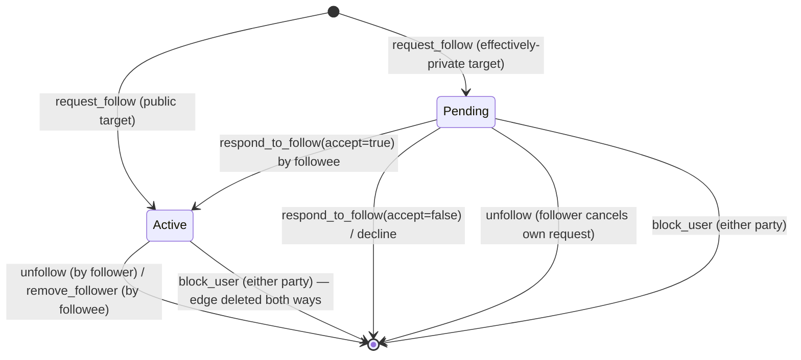
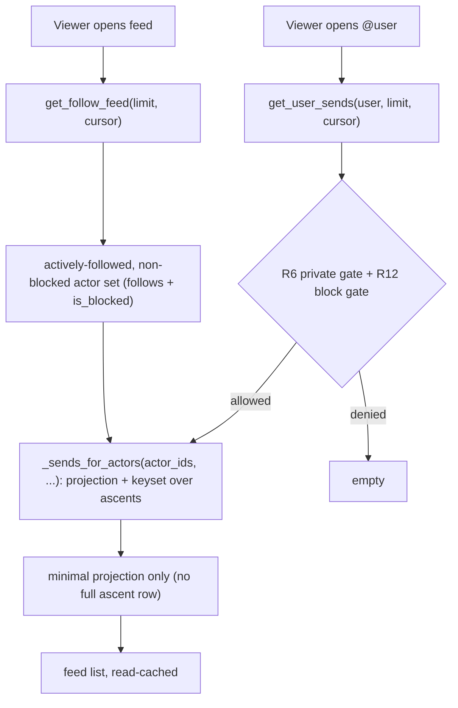

# Friends / Follow Feed - Plan

## Goal Capsule

- **Objective:** Turn the app from private-sharing (invite-token lists, QR sessions) into a *social* app with a follow graph and an activity feed of friends' sends — so climbers see what their people are climbing, not just what a shared list holds.
- **Authority:** Product Contract (R1–R24) is fixed and was resolved in a grill-me session. Planning Contract (KTDs) and Implementation Units are the HOW and may adapt during execution as long as the Product Contract holds.
- **Execution profile:** Deep, **safety-critical** — creates new cross-user data paths (`follows`, `blocks`, `notifications`, `profiles.is_private`, `ascents.first_sent_at`) and RPCs that read other users' private `ascents`. Plan the migrations test-first at max effort; migration review is mandatory.
- **Stop conditions:** Surface a blocker instead of guessing if implementation would change product scope, relax the follow/block access boundary, expose `ascents` rows beyond the minimal feed projection, or silently change any existing user's activity visibility without the explicit-choice surface (KTD9).
- **Tail:** Add `docs/social-graph.md` (the follow/feed/block subsystem) and update `docs/README.md` + `CONTEXT.md` links in the final unit. This plan is **web-first**; iOS is a later client over the same backend.

---

## Product Contract

*Resolved in a grill-me session (15 decisions). "Sends only, read-only" v1; reactions are a named fast-follow, not in scope here.*

### Summary

A user **follows** other users. Following a **public** account is instant; following a **private** account creates a request the target approves or declines. Once an edge is active, the follower sees that person's **sends** in a reverse-chronological **feed** and on the person's **profile**. The feed is **read-only** in v1 (no likes/comments). Users can **block**. Discovery is by **handle search**, **co-members** of shared lists/sessions, and **follow-back**. Every user makes an **explicit public/private choice** — new users during onboarding, existing users via a one-time notice — so no one's activity becomes followable by surprise.

### Problem Frame

The app already lets a crew share problems (collaborative lists) and climb together (sessions), but sharing is bounded to a specific list or session and evaporates when it ends. There is no persistent "these are my climbing people," and no ambient sense of what friends are sending day to day. Motivation in climbing is deeply social — seeing a friend send a grade you're projecting is the push to get on it. Today that signal doesn't exist in the app; it lives in group chats and Instagram. This feature makes the app itself the place you see your friends climb.

### Actors

- A1. **Follower** — an authenticated user who follows others and reads their feed/profile.
- A2. **Followee** — an authenticated user whose sends are visible to their active followers. Every user is both A1 and A2.
- A3. **Private followee** — a followee with `is_private = true`, who must approve each incoming follow request before the requester becomes an active follower.

### Requirements

**Follow graph (asymmetric, with private accounts)**

- R1. A user may follow another user. The relationship is **asymmetric** (follow, not mutual friendship): A following B does not imply B follows A.
- R2. Following a **public** account makes the follow **active** immediately.
- R3. Following a **private** account creates a **pending** request; the followee approves (→ active) or declines (→ edge removed). The requester cannot see the private account's sends/feed until approved.
- R4. A user may unfollow (remove their own outgoing edge) and may remove a follower (remove an incoming edge). Both are immediate.
- R5. A user may not follow themselves, and may hold at most one edge toward any given user (no duplicate edges).

**Privacy**

- R6. Each account is **public** or **private** (`is_private`). Public: any signed-in, non-blocked user may follow and see the account's sends. Private: sends/feed/stats/follower-list are visible only to **active followers** (and the account owner).
- R7. A private account's **profile card** (avatar, display name, `@handle`) remains discoverable and visible to non-followers, so it can be found and requested — only the activity *behind* the card is gated.
- R8. **New users choose** public/private during onboarding (handle selection). **Existing users** who never saw that step get a **one-time notice** offering the same choice on first launch after ship. The choice is always **explicit** — never silently defaulted in the UI (KTD9).
- R9. Toggling public↔private is forward-looking: it changes who may *newly* see activity; it does **not** retroactively scrub what a viewer has already seen (feed items are ephemeral deliveries, not a queryable archive).

**Blocking**

- R10. A user may block another user. Blocking removes any follow edges in both directions, prevents (re-)following in either direction, and hides each user's profile/sends/feed presence from the other.
- R11. A blocked user is not told they are blocked (the blocker's profile simply appears absent/empty to them).
- R12. Every social read (feed, profile, profile-sends, search, follower/following lists, notifications) excludes blocked pairs in **both** directions.

**The feed (sends only, read-only)**

- R13. The feed shows **sends** (an ascent with `sent = true`) authored by accounts the viewer **actively follows**. Attempts/tries are **excluded** in v1.
- R14. The feed is **reverse-chronological by when the server first learned of the send** (KTD3's `first_sent_at`), not by climb date and not by last-edit time. A late-synced send appears at the top when it arrives; editing an old send does **not** resurface it.
- R15. Each feed item shows: the actor (avatar, display name, `@handle`), the problem (name, grade, board), and the climb date ("sent 3 days ago"). Tapping opens the problem's existing detail view.
- R16. The feed is **read-only** in v1: no likes, comments, or reactions. (Reactions are a named fast-follow, out of scope here.)
- R17. The feed is **keyset-paginated**; there is no server-side grouping/deduplication of a burst of sends in v1.

**Profiles**

- R18. Visiting a user shows a profile: avatar, display name, `@handle`, follower/following counts, a **relationship button** whose state reflects the edge (*Follow* / *Requested* / *Following* / — on your own profile — *Edit*), and a **block** action.
- R19. A profile shows that user's **sends** (same event stream as the feed, filtered to one actor) plus a **total send count**, subject to the R6 privacy gate and R12 block gate.

**Discovery**

- R20. A user can **search** for people by `@handle`/display name (prefix match, minimum query length, bounded result count).
- R21. A user is offered **co-members** to follow — people they already share a collaborative list or session with.
- R22. When someone follows a user, that user is prompted to **follow back**.

**Notifications (in-app, no push in v1)**

- R23. A user has an in-app notifications surface showing: incoming **follow requests** (approve/decline), **new followers** (public follows), and (later) reactions. There is **no OS push** in v1.
- R24. Pending follow **requests** are sourced from the follow graph itself (approve/decline mutates the edge); fire-and-forget events (new follower, request accepted) are notification rows.

### Key Flows

- F1. **Follow a public account.** A → B's profile → *Follow* → edge active immediately → B's sends enter A's feed; B gets a "new follower" notification and a follow-back prompt. (R2, R13, R22, R23)
- F2. **Request a private account.** A → C (private) profile → *Follow* → button becomes *Requested*, edge pending → C sees the request in notifications → approves → A becomes an active follower and C's sends enter A's feed. (R3, R23, R24)
- F3. **Read the feed.** A opens the feed → reverse-chronological sends from actively-followed accounts → taps an item → the problem's detail view opens. (R13, R14, R15)
- F4. **Block.** A → D's profile → overflow → *Block* → any edges between A and D are removed, each disappears from the other's reads. (R10, R11, R12)
- F5. **Discover.** A searches `@han`, follows a result; separately, A is shown "people in *Wednesday Sesh*" and follows two of them. (R20, R21)
- F6. **Choose privacy.** New user picks Public/Private during handle onboarding; an existing user sees the one-time notice on first launch and picks. (R8)

### Acceptance Examples

- AE1. **Late upload surfaces fresh.** Given A follows B, when B (offline for a week) syncs a send climbed 6 days ago, then it appears at the **top** of A's feed on arrival (ordered by `first_sent_at`, not climb date). Covers R14.
- AE2. **Edit does not resurface.** Given a months-old send already deep in the feed, when its author re-grades or comments on it, then it does **not** move to the top. Covers R14.
- AE3. **Private gate.** Given C is private and A does not follow C, when A opens C's profile, then A sees C's card (avatar/handle/name) but **not** C's sends or counts, and the button reads *Follow* (→ *Requested* on tap). Covers R6, R7, R18.
- AE4. **Block is bidirectional and total.** Given A blocks D, then D does not appear in A's search/feed/followers, **and** A does not appear in D's — and neither can follow the other. Covers R10, R11, R12.
- AE5. **No self/duplicate edge.** Following oneself is rejected; following an already-followed user is a no-op that returns the existing edge, not a second row. Covers R5.
- AE6. **Explicit privacy for both cohorts.** A brand-new user cannot finish onboarding without a public/private selection; an existing user sees exactly one privacy notice, once. Covers R8.
- AE7. **Attempts excluded.** Given B logs an unsent attempt, then it never appears in any follower's feed. Covers R13.

---

## Planning Contract

### Key Technical Decisions

- KTD1. **`follows(follower_id, followee_id, status)` — one edge table, both-side cascade, unique edge.** Columns: `follower_id`/`followee_id` (both `references auth.users(id) on delete cascade`), `status` in `('pending','active')`, `created_at`. Primary key / unique on `(follower_id, followee_id)` (R5). A `check (follower_id <> followee_id)` blocks self-follow. **No direct INSERT policy** — creating an edge goes through `request_follow()` (KTD2), mirroring `list_members`/`join_list_by_token`. SELECT policy: a user reads edges where they are the follower or the followee (so both "following" and "followers" lists work). DELETE policy: a user may delete an edge where they are the follower (unfollow) **or** the followee (remove follower) — R4. Both FKs cascade, so `delete_user()` (0001) sweeps a deleted user's edges from both sides with no RPC change.

- KTD2. **`request_follow(target)` SECURITY DEFINER RPC sets pending vs active from the target's *effective* privacy.** The client never chooses the status. The RPC (a) rejects self-follow, (b) rejects if `is_blocked(auth.uid(), target)` in **either** direction (KTD5), (c) reads the target's *effective privacy* — `is_private = true OR privacy_choice_at IS NULL` (KTD9a: a user who has not yet made the explicit choice is private-until-chosen, so an existing user is never silently followable before their one-time notice), (d) inserts `(auth.uid(), target, status => case when effectively_private then 'pending' else 'active')` with `on conflict (follower_id, followee_id) do nothing`, (e) returns the resulting edge/status. Approve/decline is `respond_to_follow(follower, accept boolean)` — only the **followee** may call it against a **pending** edge; accept → `status='active'`, decline → delete. `unfollow(target)` / `remove_follower(follower)` delete the appropriate edge (also expressible via the DELETE policy, but RPCs keep the client surface uniform). Pinned `search_path=''`, `revoke all from public; grant execute to authenticated` — the 0004 idiom.

- KTD3. **Server-stamped `ascents.first_sent_at`, set once on the false→true `sent` transition, is the feed's sort key.** A new nullable `timestamptz` column plus an extension of the existing `set_updated_at` trigger (or a sibling `BEFORE INSERT OR UPDATE` trigger). Logic, fully server-authoritative (client value ignored, like `updated_at`): `if NEW.sent then NEW.first_sent_at := coalesce(OLD.first_sent_at, now()) else NEW.first_sent_at := NEW.first_sent_at` — i.e. stamp `now()` the first time a row is seen sent, **never move it** thereafter, and leave it null while unsent. This gives the feed all four properties at once: **fresh** (late sync appears at arrival time — AE1), **no edit-spam** (re-grade bumps `updated_at`, not `first_sent_at` — AE2), **no clock-gaming** (server clock, not user `date`), **no backfill-invisibility** (ordered by arrival, not climb date). The feed **displays** the climb `date` ("sent 3 days ago") while **sorting** by `first_sent_at`; display key ≠ sort key by design. Backfill for existing sent rows: a one-time `update ... set first_sent_at = coalesce(first_sent_at, updated_at) where sent and first_sent_at is null` in the migration, so pre-existing sends have a stable, sensible arrival stamp.

- KTD4. **One `SECURITY DEFINER` projection core serves both the feed and profile-sends; `ascents` RLS stays owner-only.** Cross-user reads of private `ascents` never relax `ascents` RLS (0002) — they go through a minimal-projection RPC, exactly like 0004's group-status RPC for lists. Internal `_sends_for_actors(actor_ids uuid[], p_limit int, p_before_first_sent timestamptz, p_before_id uuid)` returns only the feed projection — actor `id/handle/display_name/avatar_url`, `source_catalog_id`, `user_problem_id`, `problem_name`, `problem_grade`, `board_layout_id`, `date`, `first_sent_at` — `where sent = true and deleted = false and first_sent_at is not null`, `ORDER BY first_sent_at desc, id desc`, keyset via `(p_before_first_sent, p_before_id)`, `limit p_limit`. `get_follow_feed(...)` passes the caller's **actively-followed, non-blocked** actor set; `get_user_sends(target, ...)` passes a **single** actor after the R6/R12 gate (*effectively private* [`is_private OR privacy_choice_at IS NULL`, KTD9a] + not-follower + not-self → empty; blocked → empty). The block/privacy predicate lives in the two public wrappers; the projection + keyset lives once in the core. **The core is the single most load-bearing invariant of the feature, so it is `REVOKE EXECUTE ... FROM public` and granted to NO client role** — "internal" is a naming convention, not access control. The two public wrappers are `SECURITY DEFINER` owned by the same role, so they still invoke the core after the revoke; a client that tries to skip the wrappers and call `_sends_for_actors` directly (with an arbitrary `actor_ids` array, bypassing every gate) is denied at the grant layer. U2's test asserts this denial. No push architecture — this is fan-out **on read** (pull), correct for sends-only + mutable LWW ascents + climbing-app scale (Q5).

- KTD5. **`blocks(blocker_id, blocked_id)` + `is_blocked(a,b)` helper, threaded through every social read.** Both FKs cascade. `is_blocked(a,b)` (SECURITY DEFINER, STABLE, pinned search_path — the `is_list_member` idiom) returns true if a block exists in **either** direction. It is applied inside `request_follow`, `search_profiles`, `get_profile_card`, `get_follow_feed`, `get_user_sends`, `get_notifications` (the activity read — see below), and `get_follow_lists`. `block_user(target)` is a SECURITY DEFINER RPC that, in one transaction, **deletes both follow edges AND deletes any `notifications` rows between the pair in either direction** (so a stale "new follower" row can't keep rendering a now-blocked user's card), then inserts the block; `unblock_user(target)` deletes the block row. Because `notifications` is otherwise read by a plain owner-scoped RLS `select` that carries no block predicate, the activity inbox is read through a block-aware `get_notifications()` RPC (filters `is_blocked(auth.uid(), actor_id)`) — belt-and-suspenders with the purge, since a block placed after a notification is what the purge covers and a race is what the read filter covers. **Follower/following lists + counts have no naive path:** `follows` SELECT RLS only returns edges the caller is party to, so rendering *another* user's followers/following/counts (R18) requires `get_follow_lists(target)` — a SECURITY DEFINER RPC applying `is_blocked` (both directions) and the R6 effective-private gate (`is_active_follower` OR self). Block is not one feature — it is a predicate on the whole social surface (R12); the DoD asserts each read is filtered.

- KTD6. **`profiles.is_private boolean not null default false`; private granularity = card visible, activity gated — except a block hides the card too.** Default `false` at the DB level, but the **UI never sets it implicitly** (KTD9), and the gates treat *effective privacy* = `is_private = true OR privacy_choice_at IS NULL` (KTD9a). Effective-private gates sends, feed inclusion, send-count/stats, and follower/following lists behind an active edge; it does **not** gate the profile card (handle/name/avatar) for a private non-follower — R7. **A block is stronger than privacy: for a blocked pair the profile card itself must be absent (R11/R12), so the card is not read straight off world-readable `profiles`.** The `ProfileScreen` resolves handle→card through a `get_profile_card(p_handle)` SECURITY DEFINER RPC (U2 — takes the handle since the `/u/:handle` screen has no id) that returns empty when the resolved user is blocked in either direction; the R7 card exemption is scoped to *private-account non-followers*, never to blocked users. `profiles` SELECT RLS (world-readable to authenticated, 0001) stays unchanged for the base table — the block gate lives in the card RPC and the sends/feed/stats RPCs, not in a `profiles` policy — but every social read path (card, sends, feed, search, follower/following lists, notifications) routes through a block-aware RPC, never a raw `select` on `profiles`.

- KTD7. **`notifications(user_id, type, actor_id, created_at, read_at)` for fire-and-forget events; requests stay sourced from `follows`.** Types in v1: `follow` (a public follow / an approved request created an active edge → notify the followee) and `follow_accepted` (a private request was approved → notify the requester). Follow **requests** are **not** duplicated here — the pending-requests inbox is a **read over `follows` where `followee=me and status='pending'`**, and approve/decline mutates that edge (R24). Rows are inserted by the SECURITY DEFINER RPCs that create the edges (`request_follow` when it lands active; `respond_to_follow` on accept), so notification creation is server-authoritative and can't be spoofed. RLS: a user reads/updates (mark-read)/deletes (dismiss) only their own rows (`user_id = auth.uid()`); no client INSERT policy. Both `user_id` and `actor_id` cascade. **No OS push** in v1 — the table makes push later a delivery channel over existing rows, not a new data model (R23).

- KTD8. **`search_profiles(q text, p_limit int)` SECURITY DEFINER — min length, hard limit, block-filtered, prefix.** Enforces `length(trim(q)) >= 2`, prefix-matches `handle`/`display_name` (citext handle already case-insensitive), excludes self and any `is_blocked` pair (both directions), and caps at `p_limit` (default ~20). Returns the profile card + the caller's current edge status toward each result (so the list can render the right relationship button). This is also the **anti-scraping floor** (Q14): a minimum-length, hard-limited search cannot enumerate the full user table. Discovery's other two paths reuse existing data: **co-members** = a read over `list_members`/session participants the caller shares (KTD8a), **follow-back** = surfacing incoming edges (`followee=me`) not yet reciprocated.

- KTD8a. **Co-member suggestions read the warm graph already in the DB.** "People you climb with" = distinct users who share a `list_members` row or a session with the caller, minus those already followed/blocked/self. A `suggest_co_members(p_limit)` SECURITY DEFINER RPC (or a view) computes it; no new social plumbing, no contact-book import, no friend-of-friend ranking (all deferred, Q7).

- KTD9. **Explicit privacy choice for both cohorts; DB default `false` but UI always explicit.** New users: a required Public/Private step in the existing handle-selection onboarding — the profile upsert carries the chosen `is_private`, and onboarding cannot complete without a selection (AE6). Existing users (profile created before this ships): a **one-time** privacy notice on first launch, gated by a `seen_privacy_choice` marker so it shows exactly once (stored on `profiles`, e.g. `privacy_choice_at timestamptz null`; null = not yet chosen → show notice). Both cohorts make the **same** decision at first meaningful entry, staggered by join date. The DB default keeps the column non-null; the marker column is what distinguishes "defaulted" from "chosen."

- KTD9a. **Private-until-chosen: an account with `privacy_choice_at IS NULL` is treated as private by every gate, regardless of `is_private`.** The visibility gates key on *effective privacy* = `is_private = true OR privacy_choice_at IS NULL`, not on `is_private` alone. Without this, the moment `0017` lands every existing user (`is_private` defaulted `false`, `privacy_choice_at` null) is instantly followable-as-public and their sends readable — *before* they ever launch the app to see the one-time notice, silently falsifying R8's "no one's activity becomes followable by surprise." Gating on the marker closes the window: an existing user is invisible/unfollowable-as-public until they acknowledge the notice (which stamps `privacy_choice_at` and sets their real `is_private`). New users pass the same gate the instant onboarding stamps the marker. This is the enforcement half of KTD9's UI-level explicit-choice promise — KTD9 makes the choice explicit in the UI; KTD9a makes "not yet chosen" fail *closed* in the data layer. Applied in KTD2 (`request_follow` pending/active branch), KTD4 (`get_follow_feed` actor selection + `get_user_sends`/`get_profile_card`/`get_follow_lists` gates), and KTD6.

- KTD10. **Online-only actions, read-cached feed, no offline sync spine.** Follow/approve/decline/block/unblock require connectivity and **fail loudly** offline (rare, deliberate acts — no one queues a follow at the wall). The feed **caches its last successful fetch** (a single read-through cache, marked "offline — last updated X") so re-opening isn't a blank screen, but fetches nothing new and offers no actions offline. Explicitly **no** IndexedDB mirror and **no** offline mutation queue for social — that machinery (logbook sync, 0002) is for the user's **own** editable data; social is **others'** ephemeral read data (matches the "cloud-only, no offline mirror" precedent of collaborative lists, 0003). This mirrors the lists/sessions client-store shape, not the logbook sync spine.

- KTD11. **Abuse floor is lightweight, not a system (v1).** The `unique(follower_id, followee_id)` edge (KTD1) kills duplicate-edge churn; `search_profiles`' min-length + hard limit (KTD8) blocks enumeration; blocking (KTD5) handles individual harassment. **No** per-user follow-velocity rate limiter is built speculatively — it is a named later addition if abuse appears. Recorded in Risks.

- KTD12. **Migration split mirrors 0003/0004: storage first, then RPCs.** U1 = `0017_social_graph.sql` (columns, tables, helpers, trigger, RLS, backfill); U2 = `0018_social_rpcs.sql` (all SECURITY DEFINER RPCs + the projection core). Each migration is independently reviewable and test-first. Migration numbers assume no parallel branch claims 0017/0018 first — renumber on rebase if so (flagged in Risks).

### High-Level Technical Design

Follow edge state machine (public vs private target):

Feed assembly — pull / fan-out-on-read through the shared projection core, `ascents` RLS untouched:

### Sequencing

Storage migration first (everything depends on the columns/tables/trigger/helpers), then the RPC migration (the whole client surface depends on it), then the client social stores + profile page, then discovery and feed and notifications in parallel, then the onboarding/notice privacy surface as the ship-gate, then docs. U1 and U2 are the safety-critical, max-effort, test-first units.

---

## Implementation Units

### U1. Migration `0017_social_graph`: columns, tables, helpers, trigger, RLS, backfill

- **Goal:** Persist the follow graph, blocks, notifications, the privacy flag, and the `first_sent_at` sort key, with correct RLS and a bidirectional-block helper — no RPCs yet.
- **Requirements:** R1, R5, R6, R10, R12, R14, R23, R24; A1, A2, A3.
- **Dependencies:** none.
- **Files:** `supabase/migrations/0017_social_graph.sql`; `supabase/migrations/tests/0017_social_graph_rls.sql` (throwaway-Postgres RLS/trigger test, mirroring existing `tests/`).
- **Approach:** In statement order (tables/columns before the `language sql` helpers that query them, per the 0003 note): (1) `alter table profiles add column is_private boolean not null default false, add column privacy_choice_at timestamptz` (KTD6/KTD9). (2) `alter table ascents add column first_sent_at timestamptz`; then in strict order — **column → backfill → trigger** (the trigger must NOT exist during backfill, or it re-stamps every historical row to `now()`): **backfill** existing sent rows from `updated_at` (with the `0002` `updated_at` trigger disabled around the UPDATE so historical rows don't all bump and force a full re-pull), then create the `first_sent_at` trigger with the single collapsed assignment `NEW.first_sent_at := coalesce(OLD.first_sent_at, case when NEW.sent then now() end)` — client value ignored on **every** branch, stamped on the false→true transition, never moved once set (KTD3). Add the feed hot-path index `ascents (user_id, first_sent_at desc, id desc) where sent and not deleted` (KTD4 — `user_id`-leading so the multi-actor feed does per-actor index scans instead of a global-stream heap-filter). (3) `follows` table per KTD1 (both FKs cascade, unique `(follower_id, followee_id)`, self-follow check, `status` check). (4) `blocks` table per KTD5 (both FKs cascade, PK `(blocker_id, blocked_id)`). (5) `notifications` table per KTD7 (both FKs cascade; index on `(user_id, created_at desc)`). (6) `is_blocked(a,b)` SECURITY DEFINER STABLE helper (either-direction) and `is_active_follower(f,t)` for the private gate — the `is_list_member` idiom, pinned `search_path=''`. (7) RLS quartets: `follows` (SELECT where caller is follower or followee; **no INSERT**; DELETE where caller is follower or followee; no UPDATE — status change is via RPC only); `blocks` (SELECT/DELETE own blocker rows; no INSERT policy — via RPC); `notifications` (SELECT + UPDATE-for-mark-read own rows; no INSERT policy). Account deletion: all FKs cascade, so `delete_user()` (0001) is unchanged.
- **Execution note:** **Safety-critical migration — write the RLS/trigger test first, run at max effort.** No local Supabase; validate via throwaway Postgres + auth stubs (the documented pattern). Seed ≥3 users (a public, a private, a blocker/blocked pair) so both-direction block and the private gate can be asserted.
- **Patterns to follow:** `0003_collaborative_lists.sql` (helper-before-policy ordering, cascade discipline, no-INSERT-policy tables); `0002_logbook_sync.sql` (`set_updated_at` trigger shape, server-authoritative column); `0001_profiles.sql` (world-readable profile SELECT — leave unchanged).
- **Test scenarios:**
  - `first_sent_at` stamps on insert-with-sent and on false→true update; a later re-grade/comment update **does not move** it; an unsent row keeps it null; a client-supplied `first_sent_at` is ignored. Covers R14 / AE1, AE2.
  - **Gaming path:** an unsent row inserted with a spoofed future `first_sent_at` stores null while unsent, and after a flip to `sent=true` stamps `now()` — the future value never survives the transition (no feed-pinning). Covers R14 / KTD3.
  - Backfill sets `first_sent_at` for pre-existing sent rows and leaves unsent rows null.
  - `follows`: a user reads edges where they are follower or followee and no others; cannot INSERT directly; can DELETE either their outgoing or an incoming edge; self-follow and duplicate edge are rejected by constraints. Covers R1, R4, R5.
  - `is_blocked(a,b)` is symmetric (true if either direction blocks). Covers R12.
  - `blocks` / `notifications` RLS: a user sees only their own rows; cannot INSERT directly. Covers R12, R23.
  - `delete_user()` sweeps a user's follows (both sides), blocks, and notifications.
- **Verification:** RLS/trigger test suite passes against throwaway Postgres; `first_sent_at` is server-authoritative and immutable-once-set; block helper is bidirectional; direct edge/block/notification INSERT is denied.

### U2. Migration `0018_social_rpcs`: follow/block/search/feed RPCs + projection core

- **Goal:** The complete server surface the client calls — follow lifecycle, block, search, discovery, and the feed/profile-sends projection core — all block/privacy-gated.
- **Requirements:** R2, R3, R4, R6, R7, R10, R11, R12, R13, R14, R15, R17, R18, R19, R20, R21, R22, R23, R24.
- **Dependencies:** U1.
- **Files:** `supabase/migrations/0018_social_rpcs.sql`; `supabase/migrations/tests/0018_social_rpcs_rls.sql`.
- **Approach:** All public wrappers are SECURITY DEFINER, `set search_path=''`, `revoke all from public; grant execute to authenticated` (0004 idiom). **Exception — the internal `_sends_for_actors` core is `revoke all from public` and granted to NO client role (KTD4):** it carries no block/privacy gate, so a direct client call with an arbitrary `actor_ids` array would read anyone's private/blocked sends; only the two SECURITY-DEFINER wrappers (same owner) may invoke it. `request_follow(target)` per KTD2 (self/block reject, effective-private→pending / public→active, on-conflict-do-nothing, insert `follow` notification when it lands active). `respond_to_follow(follower, accept boolean)` — followee-only, pending-only; accept → active + `follow_accepted` notification to the requester; decline → delete. `unfollow(target)` / `remove_follower(follower)` (unfollow also cancels a pending request — the follower-side delete). `block_user(target)` — delete both edges, purge cross-pair notifications, insert block, in one tx (KTD5); `unblock_user(target)`. `get_profile_card(p_handle)` — block-aware handle→card resolve (takes the handle, since the `/u/:handle` screen has no id), empty for a blocked pair (KTD6). `search_profiles(q, p_limit)` per KTD8 (min length, block-filtered, prefix, returns card + caller's edge status). `suggest_co_members(p_limit)` per KTD8a. `get_follow_lists(target)` — block-gated + R6 effective-private-gated follower/following lists + counts (KTD5). `_sends_for_actors(...)` projection core + keyset (KTD4, revoked); `get_follow_feed(p_limit, p_before_first_sent, p_before_id)` (caller's active non-blocked followees) and `get_user_sends(target, p_limit, p_before_first_sent, p_before_id)` (single actor after the R6/R12 effective-private + block gate). `get_notifications(p_limit)` — activity read filtering `is_blocked(auth.uid(), actor_id)` (KTD5); `mark_notifications_read(ids uuid[])` (or a timestamp) — thin, could also be a direct RLS UPDATE.
- **Harness prerequisite (KTD8/#8):** the throwaway-Postgres `tests/stub_supabase.sql` profiles table has no `handle`/citext column (it skips 0001 to avoid the citext extension), so `search_profiles` prefix-match is untestable as-is. Before the U2 test: enable `citext` and add `handle citext unique` to `stub_supabase.sql` (postgres:16-alpine ships contrib citext), and register a `run_case` in `run_rls_test.sh` over the `0002 → 0017 → 0018` chain.
- **Execution note:** **Safety-critical — test-first, max effort.** The projection core must never return a non-projection column; the private gate and both-direction block filter are the load-bearing correctness pieces. Assert the feed excludes attempts (`sent=false`), tombstones (`deleted`), and null-`first_sent_at`.
- **Patterns to follow:** `0004`'s group-status RPC (minimal-projection cross-user read over owner-only `ascents`); `join_list_by_token` (SECURITY DEFINER membership mutation with no direct INSERT policy).
- **Test scenarios:**
  - `request_follow` on a public target → active + `follow` notification; on a private target → pending, no sends visible until `respond_to_follow(accept=true)`. Covers R2, R3, R23.
  - `request_follow` on self, on a blocked pair (either direction), and a duplicate → rejected / no-op returning the existing edge. Covers R5, R12 / AE5.
  - `respond_to_follow` callable only by the followee on a pending edge; accept flips to active + notifies requester; decline deletes. Covers R3, R24.
  - `block_user` deletes both edges and blocks re-follow both ways; `get_follow_feed`/`get_user_sends`/`search_profiles` exclude the blocked pair in both directions. Covers R10, R11, R12 / AE4.
  - `get_follow_feed` returns only active-followee sends, ordered `first_sent_at desc, id desc`, keyset-paginates without drift, excludes attempts/tombstones/null-first_sent_at, and returns only the projection columns. Covers R13, R14, R17 / AE7.
  - `get_user_sends` on a private non-followed target returns empty; on a public or followed target returns their sends + count; blocked → empty. Covers R6, R7, R19 / AE3.
  - `search_profiles` rejects <2-char queries, prefix-matches, caps at limit, excludes self/blocked, returns edge status. Covers R20.
  - `suggest_co_members` returns shared-list/session users minus already-followed/blocked/self. Covers R21.
  - **Core is unreachable directly:** an `authenticated` client calling `_sends_for_actors` with an arbitrary `actor_ids` array is denied (execute revoked); the same actors are only reachable through the gated wrappers. Covers KTD4 / the feature's load-bearing invariant.
  - **Private-until-chosen:** an account with `privacy_choice_at IS NULL` (existing user, `is_private` defaulted false) is treated as private by `request_follow` (→ pending) and by `get_user_sends`/`get_profile_card`/`get_follow_feed` (→ empty for a non-follower), until the marker is stamped. Covers R8 / KTD9a.
  - `get_profile_card` returns the card for a normal viewer but empty for a blocked pair (either direction). Covers R11, R12.
  - `get_follow_lists` returns a public account's followers/following/counts, gates a private account's lists to active followers (+ self), and excludes blocked pairs both ways. Covers R6, R18.
  - `get_notifications` filters out activity rows whose `actor_id` is blocked; `block_user` also purges cross-pair notification rows. Covers R12.
- **Verification:** RPC test suite green; the projection core is unreachable by a client; projection leaks nothing beyond the feed columns; private + block gates enforced in both directions across card/sends/feed/lists/notifications; private-until-chosen holds; keyset stable; attempts/tombstones excluded.

### U3. Client social stores + profile page + relationship button

- **Goal:** The first visible feature — visit a profile, follow/request/unfollow, block, and see that user's sends.
- **Requirements:** R1, R2, R3, R4, R6, R7, R10, R18, R19.
- **Dependencies:** U2.
- **Files:** `web/src/social/followStore.ts`, `web/src/social/socialTypes.ts`, `web/src/social/ProfileScreen.tsx`, `web/src/social/RelationshipButton.tsx`, `web/src/social/UserSendsList.tsx`, `web/src/social/*.test.ts(x)`; route wiring for `/u/:handle` (or the app's routing idiom); a profile entry point from `AccountMenu`/avatars.
- **Approach:** Module-store shape mirroring `sessionsStore`/`listsStore` (`useSyncExternalStore`, `if (!supabase)` guard, snake↔camel mapping). `followStore` exposes edge status per user + optimistic `follow`/`unfollow`/`respondToFollow`/`block`/`unblock` calling the U2 RPCs, with rollback on error and a **loud failure toast when offline** (KTD10 — online-only actions). `ProfileScreen` resolves handle→card through `get_profile_card` (not a raw `profiles` select) and renders a **"user unavailable" state when the card comes back empty (blocked pair, R11)** — the blocked viewer is never told they're blocked. Otherwise it renders the R18 header (counts from `get_follow_lists`) + `RelationshipButton` + block overflow; `UserSendsList` pages `get_user_sends` (keyset) and shows the total count, honoring the effective-private/block gate (empty state when gated — AE3). **RelationshipButton tap semantics (else the states look inert):** *Follow* → `follow`; *Requested* (pending) → taps to **cancel the request** via `unfollow` (the follower-side delete); *Following* → taps to **unfollow, behind a confirm**; own profile → *Edit* (existing avatar/handle affordances). **Block is a confirm-gated overflow action** (destructive, bilateral — severs both edges).
- **Patterns to follow:** `web/src/lists/listsStore.ts` (optimistic + rollback), `web/src/sessions/sessionsStore.ts` (store shape), `web/src/auth/AccountMenu.tsx` / `ProfileAvatarDrawer` (profile entry points), `web/src/catalog/*` sender-avatar rendering.
- **Test scenarios:**
  - Relationship button reflects each edge state and transitions optimistically (Follow→Following for public; Follow→Requested for effectively-private). Covers R2, R3, R18.
  - *Requested* taps to cancel the pending request; *Following* taps (through a confirm) to unfollow. Covers R4.
  - Unfollow / block update the button and (for block) hide the user's sends. Covers R4, R10.
  - **A blocked viewer visiting the blocker's `/u/:handle` sees the "user unavailable" state, not the card.** Covers R11, R12 / AE4.
  - A gated private profile shows the card but an empty sends region and a *Follow/Requested* button. Covers R6, R7 / AE3.
  - An action attempted offline surfaces a failure toast and rolls back (no silent queue). Covers KTD10.
  - `UserSendsList` keyset-paginates and shows the total count. Covers R19.
- **Verification:** Component/store tests green; button state machine correct; private/block gates render; offline actions fail loudly.

### U4. Discovery: search, co-member suggestions, follow-back

- **Goal:** Seed the graph from data already in the DB, so the feed can populate.
- **Requirements:** R20, R21, R22.
- **Dependencies:** U2, U3 (reuses `RelationshipButton`/`followStore`).
- **Files:** `web/src/social/SearchScreen.tsx`, `web/src/social/PeopleYouClimbWith.tsx`, `web/src/social/FollowBackList.tsx`, `web/src/social/*.test.tsx`; entry points from the profile/feed nav.
- **Approach:** Debounced handle search calling `search_profiles` (min 2 chars, results render `RelationshipButton` from the returned edge status). Enumerate the search states so an implementer doesn't leave a blank screen: **below-minimum** (<2 chars) shows a "Type at least 2 characters" hint; **in-flight** shows a loading indicator; **no results** for a valid query shows an explicit "No one found" empty state; **results** render the list. Co-member section calling `suggest_co_members`; follow-back surface = incoming active edges (`followee=me`) the caller hasn't reciprocated, each with a Follow button — both show an explicit empty state (or hide) when they have nothing. All reuse U3's store/button — no new social plumbing.
- **Patterns to follow:** existing search/list-render idioms in `web/src/catalog/`; `RelationshipButton` (U3).
- **Test scenarios:**
  - Typing ≥2 chars queries and renders results with correct per-result button state; <2 chars shows the min-length hint (not a query); a valid query with no matches shows the "No one found" empty state. Covers R20.
  - Co-member suggestions list shared-list/session users, excluding already-followed/blocked/self. Covers R21.
  - Follow-back list shows non-reciprocated incoming followers and following one reciprocates. Covers R22.
- **Verification:** Component tests green; search is debounced + bounded; suggestions and follow-back reuse the shared button/store.

### U5. The feed (read-cached)

- **Goal:** The payoff — a reverse-chronological feed of followed accounts' sends.
- **Requirements:** R13, R14, R15, R16, R17.
- **Dependencies:** U2 (shares the projection core with U3).
- **Files:** `web/src/social/feedStore.ts`, `web/src/social/FeedScreen.tsx`, `web/src/social/FeedItem.tsx`, `web/src/social/*.test.ts(x)`; feed nav entry point.
- **Approach:** `feedStore` pages `get_follow_feed` (keyset on `first_sent_at, id`), **read-through cached** to a single last-fetch snapshot (KTD10) so re-opening offline shows stale content marked "offline — last updated X" with no actions and no new fetch. `FeedItem` renders actor + problem + **climb-date** relative time (display key ≠ sort key, KTD3); tapping opens the problem via the existing `?problem=<source_catalog_id>` drawer navigation (the KTD9 idiom from the queue plan). **Same-arrival bursts collapse** (`feedGrouping.groupFeed`): a consecutive same-actor run within `BURST_WINDOW_MS` (5 min) and ≥ `BURST_MIN` (3) renders as one expandable "Ana logged N sends" entry, so a bulk logbook import can't bury everyone else — client-side presentation only, the server keyset still pages raw rows (R17 holds). Read-only — no reaction affordances (R16). Enumerate all first-open states so the headline surface isn't a guess: **first-load** (no cache yet) shows a skeleton/spinner, not the empty prompt; **online-fetch-error with no cache** shows an error + retry affordance (distinct from the offline-stale path); **offline-with-cache** shows the stale snapshot marked "offline — last updated X"; **empty graph** (viewer follows no one) → routes to discovery (U4); **populated** renders the list.
- **Patterns to follow:** `web/src/catalog/useProblemDrawer.ts` (`?problem` navigation), `memberAscentsStore` (foreground/reconnect refetch triggers for freshness when online), the read-cache shape used elsewhere in `web/src`.
- **Test scenarios:**
  - Feed renders sends from actively-followed accounts in `first_sent_at desc` order and keyset-paginates. Covers R13, R14, R17.
  - A just-arrived late send appears at the top; an edited old send does not move. Covers R14 / AE1, AE2.
  - Opening offline shows the cached last fetch marked stale, no actions. Covers KTD10.
  - Tapping an item opens problem detail without lighting the board. Covers R15.
  - Empty feed routes to discovery. Covers R13 boundary.
- **Verification:** Component/store tests green; ordering + keyset correct; offline shows stale cache; item tap opens detail; no reaction UI present.

### U6. Notifications inbox

- **Goal:** Where follow requests are approved and new followers surface.
- **Requirements:** R23, R24.
- **Dependencies:** U2, U3.
- **Files:** `web/src/social/notificationsStore.ts`, `web/src/social/NotificationsScreen.tsx`, `web/src/social/*.test.tsx`; an unread badge on the nav entry point.
- **Approach:** Two sections. **Requests** = a read over `follows where followee=me and status='pending'` (R24), each with Approve/Decline calling `respond_to_follow` (U2). **Activity** = `get_notifications` (block-aware `follow`/`follow_accepted` rows, KTD5 — a stale row whose actor is now blocked never renders), mark-read on view. **The nav badge counts pending requests + unread activity rows**, not unread rows alone — a pending request has no `read_at`, and it is the most actionable item in the inbox, so a request with zero unread activity must still show a nonzero badge or the F2 approve flow stalls silently. No push (R23) — in-app only.
- **Patterns to follow:** `listsStore`/`sessionsStore` (store shape, optimistic mutate), `RelationshipButton`/`followStore` (approve/decline reuse).
- **Test scenarios:**
  - Pending requests render with Approve/Decline; approve moves the requester to active follower and clears the request; decline removes it. Covers R3, R24.
  - New-follower and request-accepted notifications render and mark read; a stale notification whose actor is now blocked does not render. Covers R12, R23.
  - The nav badge is nonzero when a pending request exists even with zero unread activity rows. Covers R23 / F2.
  - Requests come from `follows` (pending), not duplicated notification rows. Covers R24.
- **Verification:** Component/store tests green; approve/decline mutates the edge; badge + mark-read correct; requests sourced from the graph.

### U7. Onboarding privacy step + existing-user one-time notice

- **Goal:** The ship-gate — every user makes an explicit public/private choice before their activity is followable.
- **Requirements:** R8, R9; AE6.
- **Dependencies:** U1 (the `is_private` + `privacy_choice_at` columns); ordered **last** so the graph is proven before activity is switched on.
- **Files:** edits to the handle-selection onboarding (`web/src/auth/*`), `web/src/social/PrivacyChoiceNotice.tsx`, `web/src/social/*.test.tsx`.
- **Approach:** New users: add a required Public/Private selector to the handle-selection step; the profile upsert writes the chosen `is_private` and stamps `privacy_choice_at = now()`; onboarding cannot complete without a selection (AE6). Existing users (`privacy_choice_at is null`): a one-time **non-dismissible forced-choice modal** on first launch after ship — "Your climbing activity can now be followed" with Keep public / Make private, **no backdrop/back/X close and no pre-selected default** (mirrors the onboarding step: a choice is the only exit) — writing `is_private` + `privacy_choice_at`. This is what makes the `privacy_choice_at`-stamped-only-on-choice marker guarantee both properties at once: dismissible-without-choosing would either re-show the notice (marker stays null) or silently default privacy (marker stamped on dismiss) — the forced choice avoids both. Belt-and-suspenders with KTD9a: even before the user reaches the modal, `privacy_choice_at IS NULL` makes them private-until-chosen, so nothing is exposed in the gap. A privacy toggle also lives in profile/account settings for later changes (R9 forward-looking).
- **Patterns to follow:** the existing handle-selection onboarding flow in `web/src/auth/`; existing banner/modal idioms in `web/src`.
- **Test scenarios:**
  - A new user cannot finish onboarding without selecting public/private; the choice persists and stamps `privacy_choice_at`. Covers R8 / AE6.
  - An existing user with null `privacy_choice_at` sees the notice exactly once; the modal cannot be dismissed without choosing (no backdrop/back close, no default), and choosing persists + does not show again. Covers R8 / AE6.
  - Until the choice is stamped, the existing user is private-until-chosen (their sends are not exposed even before they open the modal). Covers R8 / KTD9a.
  - The settings toggle flips `is_private` and is forward-looking (does not scrub history). Covers R9.
- **Verification:** Component tests green; both cohorts make an explicit choice; the notice is exactly-once; the settings toggle works.

### U8. Docs + navigation integration

- **Goal:** Document the subsystem and wire the feature into app navigation.
- **Requirements:** — (tail).
- **Dependencies:** U3–U7.
- **Files:** `docs/social-graph.md` (new); edits to `docs/README.md`, `CONTEXT.md` (links only, per doc discipline); `web/src/auth/AccountMenu.tsx` (nav entry points + unread badge).
- **Approach:** Write `docs/social-graph.md` covering the follow state machine, the pull-feed + projection-core design, the block predicate, `first_sent_at`, and the privacy cohorts. Link (don't restate) from `docs/README.md` and `CONTEXT.md`. **Nav:** the bottom bar is at capacity (Boards/Logbook/Lists/Settings/Search), and the social surfaces are account-scoped, so the entry points live in the **account menu** (`AccountMenu`) — Feed, Find people, Notifications, View profile — with an **unread badge on the header avatar** driven by `notificationsStore.badgeCount`. A dedicated bottom-bar Feed tab is possible future nav polish.
- **Verification:** Docs present and linked; nav reaches feed/discovery/notifications/profile; no subsystem restated across files.

---

## Verification Contract

- **Migrations (safety-critical):** RLS/RPC/trigger tests in `supabase/migrations/tests/` pass against throwaway Postgres — `first_sent_at` server-authoritative + immutable-once-set; follow/block/notification RLS deny direct INSERT and cross-user reads; `request_follow` sets pending/active correctly; block filters both directions; the projection core leaks nothing beyond the feed columns; feed excludes attempts/tombstones/null-first_sent_at; keyset stable. **Mandatory migration review** for both 0017 and 0018.
- **Web:** from `web/`, `npm run build` (`tsc -b && vite build`) clean, `npm run test` (vitest) green, `npm run lint` (oxlint) clean. **Never** run Prettier (house style).
- **Manual smoke (two accounts):** account A follows public account B → B's send appears in A's feed; A requests private account C → C approves from notifications → C's sends appear; A blocks D → mutual disappearance; A searches and finds B; A sees co-member suggestions from a shared session; new-user onboarding forces a privacy choice; an existing-user simulation shows the one-time notice once; opening the feed offline shows the stale cache.

## Definition of Done

- All units' test scenarios implemented and green; both migration suites green; `npm run build` / `test` / `lint` clean.
- Migration tests prove: `first_sent_at` never moves once set, is server-authoritative on every branch, and a spoofed future value cannot survive an unsent→sent flip (AE1, AE2, KTD3); block is bidirectional across **every** social read — card, sends, feed, search, follower/following lists, notifications (AE4, R12); the projection core is `REVOKE`d from all client roles and unreachable directly (KTD4); the core returns only feed columns and never a full `ascents` row; a blocked pair sees the profile card as absent while a private non-follower still sees the card (R7, R11); private accounts' sends/counts/follower-lists are gated (AE3); an account with `privacy_choice_at IS NULL` is private-until-chosen (R8, KTD9a); attempts and tombstones never reach the feed (AE7).
- Follow lifecycle works end-to-end for public (instant) and private (request→approve) targets, including unfollow, remove-follower, and no-self/no-duplicate edges (AE5).
- Discovery seeds the graph from search + co-members + follow-back with no contact import / FoF.
- Feed is read-only, keyset, ordered by `first_sent_at`, read-cached offline; tapping opens problem detail without lighting the board.
- Notifications inbox approves/declines requests (sourced from `follows`) and shows new-follower/accepted events; no OS push.
- Both cohorts make an explicit public/private choice; the existing-user notice is exactly-once (AE6).
- `docs/social-graph.md` added and linked from `docs/README.md` + `CONTEXT.md`; no subsystem restated across files.
- No abandoned code in the diff.

## System-Wide Impact

- **Reverses the "no friend graph" stance** of collaborative lists (0003): sharing gains a persistent, asymmetric follow axis independent of any list/session. Documented as a deliberate direction change.
- **New cross-user read of owner-only `ascents`** — like 0004's list group-status, done via a minimal-projection SECURITY DEFINER core; `ascents` RLS (0002) stays owner-only and untouched.
- **New authorization predicate (block) on the whole social surface** — threaded through every social read; the load-bearing correctness invariant.
- **Silent-visibility risk** neutralized by KTD9's explicit-choice-for-both-cohorts gate; the feature does not switch any existing user's activity on without their choice.
- **`ascents` gains a server-stamped column + trigger extension** — additive, server-authoritative, ignored by existing sync clients (they read it back like `updated_at`).

## Risks & Dependencies

- **Direction reversal:** friends reverses the collaborative-lists "membership is the unit of sharing" decision. Mitigation: the follow graph is additive — lists/sessions are unchanged; this adds an axis, it doesn't replace them.
- **Cross-user `ascents` exposure:** the whole feature hinges on never leaking a full `ascents` row. Mitigation: the single projection core (KTD4) is the only cross-user reader; migration tests assert the exact column set; `ascents` RLS is never relaxed.
- **Block completeness:** a block missed on any one read is a safety hole. Mitigation: `is_blocked` is applied in every social RPC and the DoD enumerates each; both-direction tests are mandatory.
- **`first_sent_at` interaction with existing sync:** the column is server-authoritative and must be ignored from client writes (like `updated_at`). Mitigation: the trigger derives it from `OLD`/`now()` on **every** branch (a single `coalesce(OLD, case when NEW.sent then now() end)`); a test asserts both a client-supplied value on a sent insert and a spoofed future value on an unsent-then-sent row are ignored (the earlier `if NEW.sent`-only form allowed the latter to pin a send atop every feed). Backfill uses `updated_at` for pre-existing sends and runs before the trigger exists.
- **Bulk logbook import floods the feed — RESOLVED (client-side burst collapse, U5).** A user who already has followers and then imports a large historical logbook writes many `sent=true` rows at once, each stamped `first_sent_at = now()`, so they land together atop every follower's feed. Resolution: the feed collapses a **consecutive same-actor run** whose adjacent arrival gaps are within a window (`BURST_WINDOW_MS`, 5 min) and whose length is >= `BURST_MIN` (3) into a single expandable "Ana logged N sends" entry (`feedGrouping.groupFeed`). This is **client-side presentation only** — R17's "no server-side grouping/dedup in v1" still holds; the server keyset is unchanged and pages the raw rows. Ordinary session logging (a few sends) stays as individual items.
- **Silent privacy change:** shipping default-public could expose existing users' activity by surprise. Mitigation: KTD9's one-time notice + onboarding step make the choice explicit for both cohorts; `privacy_choice_at` guarantees exactly-once.
- **Empty-feed cold start:** a follow feed launches dead without discovery. Mitigation: search + co-member suggestions + follow-back (U4) seed the graph from existing data; default-public (chosen) keeps early feeds live.
- **Abuse (follow-spam / scraping):** Mitigation: unique-edge, min-length + hard-limited search, blocking (KTD11). Follow-notification spam via a follow/unfollow loop is deduped (request_follow suppresses a `follow` notification when an unread one from the same actor already exists). A per-user follow-velocity limiter is a named later addition, not built speculatively.
- **Profile-card / search gates are UI-deep, not hard boundaries (accepted v1).** `profiles` is world-readable (`0001` `using (true)`), read directly by AuthProvider + the session-member UI, so a client can bypass `get_profile_card`/`search_profiles` and read any handle/display_name/`is_private` from PostgREST — making R11's blocked-profile-absent and KTD8's anti-scrape floor UI-deep only. Accepted because the **sends/activity gate is hard-enforced** (revoked projection core + `is_blocked` everywhere) and profile handle/name are low-sensitivity. Follow-up: narrow the `profiles` policy and route session-member + card reads through gated RPCs. See `docs/social-graph.md` "Security boundary".
- **Migration numbering (resolved):** the feature originally claimed 0016/0017, but `0016_session_resume` landed on `main` first (session resume, #92). Rebased onto `main` and renumbered to **0017_social_graph / 0018_social_rpcs**; the RLS suite (11 cases) passes with session-resume's 0016 case intact.
- **No local Supabase:** migration behavior validated via throwaway Postgres + auth stubs; real RLS/Realtime-free behavior only exercised in the two-account manual smoke.
- **Reactions fast-follow** (out of scope): the `notifications` table and projection core are shaped to accept a `reaction` type + a reactions table without a rebuild — the named next increment.

## Sources / Research

- Grill-me session, 2026-07-20 (15 resolved decisions Q1–Q15).
- `supabase/migrations/0001_profiles.sql` (identity anchor, world-readable profiles, `delete_user()` cascade discipline).
- `supabase/migrations/0002_logbook_sync.sql` (`ascents` shape, `set_updated_at` server-authoritative trigger, owner-only RLS).
- `supabase/migrations/0003_collaborative_lists.sql` + 0004 (membership-as-sharing precedent, minimal-projection cross-user RPC, helper-before-policy ordering).
- `docs/plans/2026-07-15-001-feat-web-session-queue-plan.md` (`?problem` drawer navigation idiom, store/realtime patterns, safety-critical migration test discipline).
- Memory: `social-accounts-direction` (the original "accounts → friends → shared lists" arc), `supabase-migration-local-testing`, `web-typecheck-use-tsc-b`, `web-no-prettier-use-oxlint`.
